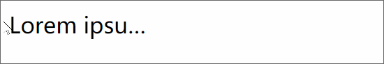

### 导航点的切换


``` html
<!DOCTYPE html>
<html lang="en">
<head>
    <meta charset="UTF-8">
    <meta name="viewport" content="width=device-width, initial-scale=1.0">
    <title>Document</title>
    <link rel="stylesheet" href="./reset.css">
    <style>
        .pointer{
            
            
        }
        .pointer a{
            float: left;
            width: 8px;
            height: 8px;
            border-radius: 50%;
            background-color: silver;
            background-clip: content-box;
            margin: 0 4px;
            border: 2px solid transparent;

        }
        .pointer a:hover{
            background-color: white;
            border: 2px solid rgba(68, 68, 68, 0.5);
        }
    </style>
</head>
<body>
    <div class="pointer">
        <a href="javascript:;"></a>
        <a href="javascript:;"></a>
        <a href="javascript:;"></a>
        <a href="javascript:;"></a>
        <a href="javascript:;"></a>
        <a href="javascript:;"></a>
        <a href="javascript:;"></a>
    </div>
</body>
</html>
```

### 省略号的设置



``` html
<!DOCTYPE html>
<html lang="en">
<head>
    <meta charset="UTF-8">
    <meta name="viewport" content="width=device-width, initial-scale=1.0">
    <title>Document</title>
    <style>
        p{
            white-space: nowrap;
            overflow: hidden;
            width: 100px;
            text-overflow: ellipsis;
        }
    </style>
</head>
<body>
    <p>Lorem ipsum dolor sit amet consectetur, adipisicing elit. Id facere error sint laborum fugit, ea, maxime eos quo quidem, qui optio iste labore similique veritatis unde adipisci illum doloribus nulla?</p>
</body>
</html>
```

