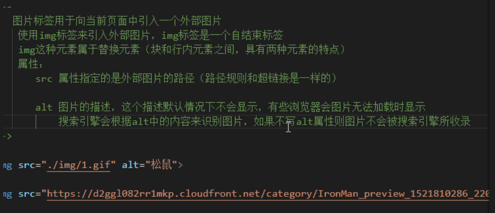

# html

### 基本介绍

软件分两种 C/S 和**B/S(网页) 前者开发成本高，后者开发成本低，我们主要开发B/S**

浏览器的作用是渲染网页

网页中使用的语言 html，css，JavaScript
浏览器是用来渲染网页，呈现网页的前端工程师负责编写网页的源代码
因为网页是在浏览器中呈现的，所以相同的网页在不同的浏览器中呈现的效果可能不同现在这种影响已经很小了
万维网联盟（W3C） 指定网页开发的标准

+ HTML用于描述页面的结构
+ CSS用于控制页面中元素的样式
+ JavaScript用于响应用户操作

HTML（ Hypertext Markup Language）
超文本标记语言

**我们写的代码都是在纯文本编辑器里面写的**

标签的作用:标识出网页中不同的内容
网页中==有且只有一个==根标签
所有网页中的内容都应该写在根标签中

标签的分类:
	自结束标签
		``
	成对出现的标签
		`<p></p><div></div>`

html的注释:
	`<!-- 这是注释的内容 -->`
	`注释的内容不能嵌套（所有语言都是），浏览器自上而下编译`

属性书写的要求：

* `属性是一个名值对结构(x=y)`
* `属性用来设置标签中内容如何显示`
* `属性和标签名或其他属性应该使用空格隔开`
* `属性不能瞎写,应该根据文档中的规定来编写`
* `有些属性有属性值,有些没有属性值。有些属性值需要用引号引起来,有些则不需要。`

进制：
		

### 字符集

编码：将字符转换为二进制码的过程
解码：将二进制码转换为字符的过程
字符集(charset):
			编码和解码所采用的规则称为字符集
乱码问题:
			编码和解码所采用的字符集不同就会出现乱码问题
常见的字符集:

   + 字符集
        + ASCII（128个 美国的）
        + ISO88591(256个 欧洲扩充了美国的）
        + GB2312(中国）
        + GBK（中国 扩展）
        + UTF-8(万国码，在开发时一般都是用这个）

标签就是元素，元素就是标签
网页中的所有内容都要写在根元素里面

### 网页的基本结构

​	head标签里的面都内容基本上都是给浏览器看的

```html
<!DOCTYPE html>      <!--文档声明，告诉浏览器当前网页是html5版本的->
<html lang="en">	<!--根标签,lang="en" 打开浏览器时会弹出是否翻译，lang="zh"就是中文网站-->
<head>
    <meta charset="UTF-8"> <!--meta标签用来设置网页的元数据，这里charset用来设置网页的字符集，避免乱码-->
    <meta name="viewport" content="width=device-width, initial-scale=1.0">
    <title>网页的标题</title>
</head>
<!-- body是html的子元素，表示网页的主体，网页中所有的可见内容都应该写在body里-->
<body>
    
</body>
</html>
```

### 进制


### 实体(转义字符)

实体的语法:
		&实体的名字；
					&nbsp；空格
					&gt；大于号
					&lt；小于号
					&copy；版权符号

### meta标签

​		主要用于设置网页用的一些元数据，元数据不是给用户看的
​		charset 指定网页的字符集
​		name	指定数据的名称
​		content 指定该数据的内容
​		http-equiv 将页面重定向到另一个网站（页面跳转用的）

`<meta name="keywords" content="HTML,前端,CSS">`
		keywords值 表示网站的关键字，可以同时指定多个关键字，关键字使用逗号(,)隔开，主要用于搜索引擎的搜索
`<meta name="description" content="这是一个非常不错的网站">`
		description值 用于指定网站的描述，最后显示讲就是红色圈圈里的内容
	


`<title>亚马逊(网络电子商务公司)_百度百科</title>`
title标签的内容会作为搜索结果的超链接上的文字显示

以及标题栏出现


`<meta http-equiv="refresh" content="3;url=https://www.baidu.com">`
       将页面重定向到另一个网站（就是跳转页面用的） 在3秒后 跳转到“url”的页面

### html的标签

标题标签(块元素)
h1~h6共有六级标签，重要性逐级递减，h1最重要
标题标签（块元素）       
h1~h6共有六级标签，重要性逐级递减，h1最重要       
h1在网页中的重要性仅次于tittle标签，一般情况下一个页面中只有一个h1      
一般情况下只会使用h1-h3       
在页面中独占一行的元素称为块元素（block element）,标题元素就是块元素

#### p元素(块元素)
也是一个块元素，表示页面中的一个段落

#### hgroup元素


#### blockquote(块元素)


#### em元素(行内元素)


#### strong元素（行内元素）


#### q(行内元素)


#### br(自结束数标签)


#### 布局标签


div和span还是主要使用的布局标签 其他都是h5里面加的header和nav

#### audio 标签

​	属性 controls             
​			autoplay           
​			loop           
​			.......  这些属性都没有值


现在一般都是用 source这种方法了 因为可以兼容几乎所有浏览器

#### vedio 标签


### 块元素和行内元素


浏览会在内存中纠正网页代码的错误
查看内存中的代码右击页面空白处→检查→elements

### 列表

html列表一共三种

1. 有序列表 ol
2. 无序列表 ul
3. 定义列表 dl

有序列表和无序列表都是用 li 来创建列表项

定义列表，使用dl标签来创建一个定义列表
		使用dt来表示定义的内容
		使用dd来对内容进行解释说明

列表之间可以相互嵌套


### 超链接

超链接之间的跳转


相对路径


在当前网页跳转到其他网页或者打开一个新的网页


页面不发生跳转 而是直接回到顶部


点击超链接跳转到页面指定位置


在第21行设置 a标签
在第41行设置 a标签

点击 **去底部** 就可以去第41行了

id属性的属性值 区分大小写

在开发中一般可以使用#作为**href**属性的值 当做占位符用
javascript:;作为**href**属性值的时候 点击它什么也不会发生

### 图片

img是替换元素（介于块和行内元素之间）

``` html

src 写的是路径
alt 当图片不显示时，会显示这个文字（有些浏览器不支持）
搜索引擎 会根据alt去识别图片
```


width 图片的宽度(单位是像素)
height 图片的高度
	\- 宽度和高度中如果只修改了一个，另一个会等比例缩缩放

注意：
		一般情况在pc端，不建议修改图片大小，需要大多的图片就裁多大
		但是在移动端，经常需要对图片进行缩放（大图缩小）

图片的格式：
		

网页向浏览器发送请求，先将网页加载完毕，然后再向服务器发送请求把图片加载出来
base64的作用是 将网页和图片同时加载，从而加快图片加载速度，但这样的话 其他的加载速度
就会变慢 因为网速是固定的

### 内联框架

``` html
<iframe frameborder="0" src="https://v.qq.com/txp/iframe/player.html?vid=i0024ihpojs" allowFullScreen="true" width="500" height="500"></iframe>
```

iframe标签 将其他网页中的视频 插入到你的网页中（替换元素）


iframe 的属性
		src				链接
		width			宽度
		height		  高度
		frameborder		边框

一般很少使用

### 音频

audio 标签用来向页面中引入一个外部的音频文件
		  引入时默认情况不允许用户自己控制播放停止	

​	属性：
​		controls 没有属性值， 是否允许用户控制播放
​		autoplay 没有属性值，是否自动播放
​				\- 如果设置了autoplay 则音乐在打开页面时会自动播放
​					但是目前来讲大部分浏览器都不会自动对音乐进行播放
​		loop 音乐是否循环播放	

``` html
<audio src="" controls autoplay loop></audio>
```

除了使用src来指定外部文件的路径以外，还可通过source来指定文件

``` html
<audio controls>
    浏览器不兼容，请升级 //当以下三种方法不都不行时出现这个，但是ember 会直接出现这段文字
	<source src="./xxxx/xxx.mp3">  //mp3格式
	<source src="./xxxx/xxx.ogg">  //ogg格式
	<ember src="./xxxx/xxx.mp3" type="audio/mp3" width="100" height="50" ></ember> //兼容ie9以下但是一般都不用去兼容了，以防以外吧
</audio>
```


### 视频


\<iframe frameborder="0" src="https://v.qq.com/txp/iframe/player.html?vid=i0024ihpojs" allowFullScreen="true" width="500" height="500"\></iframe>

iframe标签 将其他网页中的视频 插入到你的网页中

