## javascript

+++

### 概念

#### 理论

* 现在使用的javascript都是遵循**ECMAS cript**（欧洲计算机协会定义的js标准）
* 不同的浏览器使用的引擎是不一样的，Chrome的**v8**引擎 执行网页快
* javascript包含 **ECMAScript**,**DOM**,**BOM**
* js的特点


#### js代码书写的位置

①js代码写在<head></head> 里面

```html
<head>
    <script type="text/javascript">
        alert("aaaa");//控制浏览器弹出警告框
        document.write("哈哈哈哈哈"); //向body中输出一个内容
        console.log("控制台");//控制台输出内容
    </script>
</head>

```

②js代码写到标签里(虽然代码可以写在标签的属性中，但是他们属于结构与行为耦合，**不方便维护，不建议使用**)

* 可以将js代码编写到标签的onclick属性中       

  当我们点击按钮时，js代码才会执行(双引号里面不能 再加双引号，要变成单引号才行，因为不能嵌套）

```html
<button onclick="alert('不要点我啊');">千万不要点我</button>
```

* 可以将js代码写在超链接的href属性中(有格式要求)，这样当点击超链接时，会执行js代码

  ```html
  <a href="javascript:alert('就不要点啦');">你还点是吧</a>
  ```

③将js代码编写到外部js文件中，然后通过script标签引入（推荐使用)

```html
<script type="text/javascript" src="./js/index.js"></script>
```

④script标签一旦**用于引入外部文件**，就**不能编写代码**了，即使编写了也会被浏览器忽略 如果需要则可以创建一个新的script标签用于编写内部代码


​			**js代码是从上往下执行的**

#### js的基本语法

1. js中严格区分大小写
2. js中每一条语句以分号（;)结尾               -如果不写分号，浏览器会自动添加，但是会消耗一些系统资源，                     而且有些时候，浏览器会加错分号，所以在开发中分号必须写         3.js中会忽略多个空格和换行，所以我们可以利用空格和换行对代码进行格式化 

#### 字面量

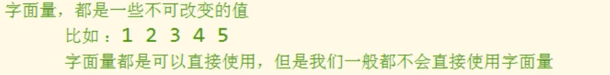

#### 变量


​			变量的**声明**和**赋值**


#### 标识符


#### **数据类型**

​			数据类型指的就是字面量的类型
​			在js中一共有六种数据类型

* String 字符串
* Number 数值
* Boolean 布尔值
* Null 空值
* Undefined 未定义
* Object 对象

String，Number，Boolean，Null，Undefined都属于基本数据类型
Object属于引用数据类型


##### String字符串


* 在字符串中我们可以使用\作为转义字符，当表示一些特殊符号时可以使用\进行转义		

  

##### Number数值

​		在js中所有的数值都是Number类型，包括整数和浮点数（小数）

​		js中可以表示的

​					数字的最大值

​					Number.MAX_VALUE

​					大于0的最小值

​					Number.MIN_VALUE			

如果使用Number表示的数字超过了最大值，则会返回一个

​	Infinity 表示正无穷         

​	-Infinity 表示负无穷

​	使用typeof检查Infinity也会返回number

==NaN==是一个特殊的数字，表示Not A Number

​		使用typeof检查一个NaN也会返回number

**注意**
		在JS中证书的运算基本可以确保精确
		但是，如果使用JS进行浮点运算，可能得到一个不精确的结果
		所以千万不要使用JS进行对精确度要求比较高的运算

##### Boolean 布尔值


##### Null（空值）

​			类型的值只有一个，就是null


##### Undefined（未定义）

​			类型的值只有一个，就是undefined（有声明变量，但没有赋值）


##### 强制类型转换


###### 其他数据类型转换为String

​			方式一： toString()方法
			

​			方式二：String()


###### 其他数据类型转为Number

​			方式一:Number()函数


​			方式二:parseInt()  parseFloat()

	

​			**parseInt()**可以将一个字符串中的有效的整数内容取出来
​			从左往右开始取，遇到非数字就停止，如果一开始就遇到字符，那么结果就是NaN
​			**parseFloat()**作用和parseInt()类似，不同的是它获取的是有效的小数

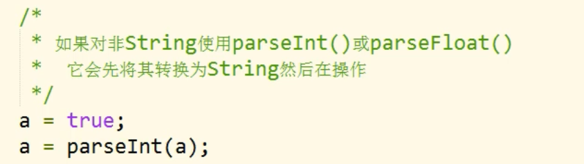

​			 此时 console.log(a)的值为 NaN

###### 其他数据类型转换为Boolean

​			方式一：Boolean()函数


​			**方式二（隐式类型转换）：**

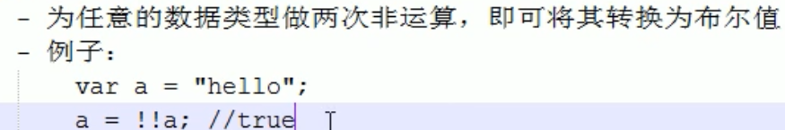

##### 数字的进制


十六进制：a=0x10;	八进制：a=070；	二进制：0b10；


可以在parseInt()中传递第二个参数，来指定数字的进制

var a=0x10;

a=parseInt(a,10); //十进制

#### 运算符

概念：通过运算符可以对一个或多个值进行运算，并获取运算结果      
			比如:typeof就是运算符，可以来获得一个值的类型           
			他会将这个值以字符串的形式返回
			返回值：number,string,boolean,null,undefined,object

###### typeof

typeof是一个运算符
可以使用运算符**typeof** 来检查一个变量的类型


###### 算数运算符

​			当对非Number类型的值进行运算时，会将这些值转换为Number然后在运算
​			(除了做加法运算时 与字符串进行相加；做其他做算时都遵循这句话)

1. +

   ①+可以对两个值进行加法运算，并将结果返回
   ②如果对两个字符串进行加法运算，则会做拼串，将两个字符串拼接位一个字符串并返回
   ③任何值和字符串做加法运算，都会先转换为字符串，然后再和字符串做拼串的操作
   ④可以将任意的数据类型转换为String,只需要在变量后+ 一个“” 就可以将其转换为String                         这是一种隐式的类型转换，由浏览器自动完成，实际上它也是调用String（）函数。
   ⑤+ 换行依旧有效果，“” 换行将失去效果

2. -

   可以对两个值进行减法运算，并将结果返回
   任何数对与NaN进行运算，结果都是NaN

3. *

   可以对两个值进行乘法运算

4. /
   可以对两个值进行除法运算

5. %

   取模运算（取余数）


###### 一元运算符

​		只需要一个操作数
​		\+ 正号：
​					正号不会对数字产生任何影响
​		\- 负号：
​					负号可以对数字进行负号的取反
​		对于非Number类型的值


			这也是一种隐式类型转换

​		**++ 自增** 	

			

​		**-- 自减**

			

###### **三种逻辑运算符**

①   ！非


②   && 与


​			true && alert("看我出不出来！！");  //会检查第二个值
​			false && alert("看我出不出来!!")； //不会检查第二个值 

③  ||  或


④&& || 运算非布尔值的情况 （其他语言里好像没有）
			——对于非布尔值进行与或运算时，会先将其转换为布尔值，
					然后再运算，并且返回原值.
			——与运算：

​					
​								5&&0 返回0			
​								NaN&&0 返回NaN

​			——或运算：								

​					
​								5||0 返回5
​								NaN||0 返回NaN
​								||和&& 非布尔值的运算结果和 它的短路有关。

	###### **赋值运算符**		

​					

###### **关系运算符**

​			比较两个值之间的大小关系，关系成立返回true，不成立返回false


​			非数值的情况
​				**—— **对于非数值的情况比较是，会将其转换为数字然后在比较
​				**——** 任何值和NaN作比较都是false
​				**—— **如果符号两侧的值都是字符串时，不会将其转换为数字进行比较                           
​					   而会分别比较字符串中字符的Unicode编码
​				**——** 比较字符编码时都是一位一位进行比较，如果两位一样，则比较下一位，                           所以						可以借用它对英文进行排序
​						
​				**——** 比较中文没有意义
​				**——** 

​		

###### **相等运算符(==)**

​			如果相等会返回true，否则返回false       
​			使用==来做相等运算

​			一般情况下都转换成Number进行比较

​			其他情况：
​			①null\=\=0   //false
​			②undefined\=\=null  //true,因为undefined衍生于null
​			③NaN==NaN  //false，NaN不和任何值相等，包括它本身               
​						所以检查一个值是不是NaN的时候 使用isNaN()函数
​			

###### **不相等运算符(!=)**


###### **全等运算符（===）**

​			**——**用来判断两个值是否全等，它和相等类似，不同的是它不会做自动类型的转换             
​					如果两个值类型不同直接返回false

###### **不全等运算符（!==)**

​			**——**用来判断两个值是否不全等，它和不相等类似，不同的是它不会做自动类型的转换             如果两个					值类型不同直接返回true 

###### **条件运算符（三元运算符）**


			如果条件表达式的求值结果是一非布尔值，会将其转换为布尔值然后在计算

###### 运算符的优先级


#### Unicode编码

javascript中 在字符串中使用转义字符输入Unicode编码  \u四位编码


html中 在网页中使用Unicode编码 格式&#编码； 这里的编码需要的是10进制


#### 语句块


			**在JS中的代码块，只具有分组的作用，没有其他的用途，代码块中的内容，在外部是可见的**

#### 流程控制语句

###### ①条件判断语句

​			语法一


​			if语句后的代码块不是必须的，但是在开发中尽量写                         
​			上代码块，即使if后只有一条语句。

​			语法二
			

​			语法三


###### ②**条件分支语句(switch语句)**

​			语法：


​			执行流程：              
​			switch...case...语句              
​			在执行时会依次将case后的表达式的值和switch后的表达式的**值进行全等比较**，                   					如果比较结果为true，则从当前case处开始执行代码。                   
​					如果比较结果为false，则继续向下比较                   
​					如果所有的比较结果都为false，则只执行default后的语句		

###### **③循环语句**

​			**1.while循环**
​			

​			**2.do...while循环**
​					

​			**while和do...while区别**
​			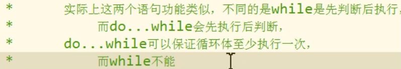

​			**3.for循环**
​			

###### **break和continue关键字**

​			**break**关键字可以用来退出switch或循环语句           	       
​			break关键字会立即终止离他最近的那个循环语句

​			可以为循环语句创建一个label，来标识当前的循环           
​			label：循环语句           
​			使用break语句时，可以在break后跟一个label;           
​			这样break将会结束指定的循环，而不是最近的


​			**continue**关键字可以跳过当次循环           
​			同样continue也是默认只会对离他最近的循环起作用**prompt()函数**

#### 暂未分类的函数

###### **prompt()函数** 提示框

​			该函数可以弹出一个提示框，该提示框中会带有一个文本框，
​			用户可以在文本框中输入一段内容，该函数需要一个字符串作为参数，
​			该字符串将会作为提示框的提示文字

​			==用户输入的内用将会作为函数的返回值返回==，可以定义一个变量来接受该内容           
​			 **返回的内容是字符串**，所以如果要进行数字的比较需要 将其转换位数字

``` javascript
 var score=prompt("小明的身高");
```


###### **console.time()** 开启计时器指令

​		可以用来测试程序的性能         
​		在程序执行前，开启计时器         
​		console.time("计时器的名字")可以用来开启一个计时器         
​		**他需要一个字符串作为参数**，这个字符串将会作为计时器的标识

###### **console.timeEnd()** 终止计时器指令

​		console.timeEnd() 用来停止一个计时器，需要一个**计时器的名字作为参数**

​		

###### Math.sqrt() 开根号

​		**——**对一个进行开方

#### **对象的分类**

##### ①内建对象

​	— 由ES标准中定义的对象，在任何ES的实现中都可以使用
​	— 比如：Math String Number Boolean Function Object....

##### ②宿主对象

​	— 由JS的运行环境提供的对象，目前来讲主要指由浏览器提供的对象
​	— 比如BOM    DOM

##### ③**自定义对象**

​	— 由开发人员自己创建的对象

###### 创建对象

①使用new关键字

``` javascript
var object=new Object();
```

​	使用new关键字调用的函数，是构造函数constructor         
​	构造函数是专门用来创建对象的函数         
​	使用typeof检查一个对象时，会返回object

②使用==对象字面量==（创建对象的常用方式）

​	使用对象字面量来创建一个对象

``` javascript
var obj={};
```

​	使用对象字面量，可以在创建对象时，直接指定对象中的属性
​	**语法：{属性名：属性值，属性名：属性值.....}**
​		对象字面量的属性名可以加引号也可以不加，建议不加，
​		如果要使用一些特殊的名字，则必须加引号

​		属性名和属名值是一组一组的名值对结构
​		名和值之间使用：(冒号)连接，两个名值对之间使用**,**(逗号)隔开
​		如果一个属性之后没有其他属性了，就不要写，(逗号)
​		

###### 向对象添加属性

​	语法：**对象.属性名=属性值；**

​	

###### 属性名

​	**——** 对象的属性名**不强制要求遵守标识符的规范**
​		 什么乱七八糟的名字都可以使用
​	**——** 但是我们使用时还是尽量遵守标识符的规范
​			

​	如果要使用特殊的属性名，不能采用.的方式操作	
​	需要使用另一种方式：
​	语法：==**对象["属性名"]=属性值**==

​	

​	使用[]这种形式去操作属性更加灵活，
​	在[]中可以直接==传递一个变量==，这样变量值是多少就会读取那个属性


###### **属性值**	

​	**——** JS对象的属性值，可以是任意的数据类型

###### 读取对象的属性

​	语法：**对象.属性名**
​	如果读取对象中没有该属性，不会报错而是会返回undefined
​	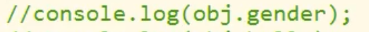

###### 修改对象的属性值

​	语法：**对象.属性名=新值**
​	

###### 删除对象的属性

​	语法：**delete 对象.属性名**
​	

###### in运算符

​	\- 通过该运算符可以检查一个对象中是否含有指定的属性             
​	  如果有则返回true，没有则返回false

​	\- 语法：             
​				 “属性名” in 对象
​						

##### 枚举对象中的属性

​	使用for...in 语句
​	
​	for...in语句 对象中有几个属性，循环体就会执行几次
​	每次执行时，会将对象中的一个属性的名字赋值给变量

​	取出对象的属性名，属性值  完整版
​	

#### 基本数据类型和引用数据类型

**JS中的变量都是直接在栈内存中存储的**

* **基本数据类型的值直接在栈内存中存储,**
  **值与值之间是独立存在，修改一个变量不会影响其他的变量**

  

* 对象是保存到堆内存中的，每创建一个新的对象，就会在堆内存中开辟处一个新的空间，       而变量保存的是对象的内存地址（对象的引用），如果两个变量保存的是同一个对象引用，       当通过一个变量修改属性时，另一个也会受到影响。 

  

* 当比较两个基本数据类型的值时，就是比较值。      
  而比较两个引用数据类型时，它是比较的对象的内存地址           
  如果两个对象是一模一样的，但是地址不同，它也会返回false 

#### 函数function

​	函数也是一个对象
​		

​	**函数和对象有区别的，对象可以直接调用它的属性，而函数不行，默认情况下函数的当前对象是   	 window，而对象是它本身；**

##### 创建函数的方式

​	①使用构造函数来创建一个函数对象（**在开发中很少使用**）
​		

​	②使用 **函数声明** 来创建一个函数（**常用**）
​		语法：
​		
​		[]里的表示可选（可写可不写）

​	③使用 **函数表达式** 来创建一个函数
​		

##### 形参，实参

​	**形参**
​	可以在函数的（）中来指定一个或多个形参（形式参数）
​	多个形参之间使用，(逗号)隔开，声明形参就相当于在函数内部声明了对应的变量，但并不赋值

​			

​	**实参**
​	*实参可以是一个对象，也可以是一个函数，对象能做的函数都能做*
​	在调用函数时，可以在（）中指定实参（实际参数）
​	实参将会赋值给函数中对应的形参

​	

​	==注意==：调用函数时解析器不会检查实参的类型，
​			   所以要注意，是否有可能会接收到非法的实参，如果有可能则需要对参数进行类型的检查 
​			   函数的实参可以是任意的数据类型

​			   调用函数时，解析器也不会检查实参的数量
​			   多余的实参不会被赋值
​			   如果实参数量小于形参的数量，则没有对应实参的形参将是undefined

##### return 关键字

​	①return后的值将会作为函数的执行结果返回，可以定义一个变量，来接收该结果
​	②在函数中return后的语句都不会执行
​	③如果在return语句后不跟任何值，当调用函数时会返回一个undefined值	
​	    如果函数中不写return，则也会返回undefined
​	④return后可以跟任意类型的值

##### mianji()和mianji 的区别

​	mianji（）
​		-- 调用函数		
​		-- 相当于使用函数的返回值

​	mianji
​		-- 函数对象
​		-- 相当于直接使用函数对象

##### 立即执行函数

​	函数执行完，立即被调用，这种函数叫立即执行函数
​	立即执行函数往往只会执行一次

​	

​	

##### 函数与方法

​	对象的属性值可以是任何的数据类型，也可以是个函数

​	
​	函数也可以成为对象的属性，如果一个函数作为一个对象的属性保存，
​	那么我们称这个函数是这个对象的方法，调用这个方法就说调用这个对象的方法（method）

​	但它只是名称上的区别，其他没有什么不同
​	

##### 枚举对象中的属性(for... in)

​	使用for...in 语句
​	

​	for...in语句 对象中有几个属性，循环体就会执行几次         
​	每次执行时，会将对象中的一个属性的名字赋值给变量

​	获取对象的属性名，属性值
​	
​	由于==n变量是string类型== 所以可以直接使用obj[n]

#### 作用域

- 作用域指一个变量的作用范围
- 在JS中一共有两种作用域：

##### 全局作用域

​	\- 直接编写在script标签中的JS代码，都在全局作用域                     
​	\- **全局作用域在页面打开时创建，在页面关闭时销毁**                     
​	\- 在全局作用域中有一个全局对象window.                         
​		它代表的是一个浏览器的窗口，它由浏览器创建，我们可以直接使用                     

​	\- 在全局作用域中：
​		创建的变量都会作为window对象的属性保存
​		
​		创建的函数都会作为window对象的方法保存
​		

​	 \- 全局作用域中的变量都是全局变量，在页面的任意的部分都可以访问到

##### 函数作用域

- 调用函数时创建函数作用域，函数执行完毕以后，函数作用域销毁
- 每调用一次函数就会创建一个新的函数作用域，他们之间时相互独立。
 - 在函数作用域中可以访问到全局作用域的变量
          在全局作用域中无法访问到函数作用域的变量
 - 当在函数作用域操作一个变量时，它会先在自身作用域中寻找，如果有就直接使用 
          如果没有则向上一级作用域中寻找，直到找到全局作用域，
          如果全局作用域中依然没有找到，则会报错ReferenceError
 - 在函数中要访问全局变量可以使用window对象
 - 在函数作用域中也有声明提前的特性，
      使用var关键字声明的变量，会在该函数中所有的代码执行之前被声明 
 - 在函数作用域中 使用函数声明的方式创建函数，也会使函数在所有的代码执行之前创建 
 - 在函数中，不使用var声明的变量都会成为全局变量，但是需要调用函数以后这个变量才能调用
 - 定义形参就相当于在函数作用域声明了变量   

#### 变量声明提前

​	   \- 使用var关键字声明的变量，会在所有的代码执行之前被声明（但是不会被赋值），       
​		  但是如果声明变量时不使用var关键字，则变量不会被提前声明 
​		  
​		  如果使用了var 就不会报错 只是会显示a=undefined		 

#### 函数声明提前

​		 \- 使用函数声明形式创建的函数 function 函数名(){}
​		   函数会在所有的代码执行前就被创建，所以我们可以在**函数声明前**来掉调用函数

​	 	- 使用函数表达式创建的函数，函数不会被提前创建，所以不能在声明前调用

#### this关键字

       解析器在调用函数时每次都会向函数内部传递一个隐含的参数，         
       		这个隐含的参数就是this,this指向的是一个对象，         
    		这个对象我们称为函数执行的上下文对象         
    		根据函数的调用方式的不同，this会指向不同的对象
    			1.以函数的形式调用函数时，this永远都是window
    			2.以方法的形式调用函数时，this就是调用方法的那个对象。
    			3.以构造函数的型式调用时，this就是新创建的那个对象
    			4.以 函数对象.call() 或 .apply()方法调用时，this是第一个参数指定的那个对象
#### 使用工厂方法创建对象（用的不多)

​	通过该方法可以大批量创建类似的对象
​	
​	通过工厂方法创建对象
​	

#### **通过构造函数创建对象**

- 构造函数就是一个普通的函数，创建方式和普通函数没有区别，              
  不同的是构造函数**习惯上首字母大写**

- 构造函数和普通函数的区别就是调用方式的不同              
  普通函数是直接调用，而构造函数需要使用new关键字调用

- 构造函数的执行流程：

  - 1.立刻创建一个新的对象            

  - 2.将新建的对象设置为函数中this，在构造函数中可以使用this来引用新建的对象           

  - 3.逐行执行函数中的代码            

  - 4.将新建的对象作为返回值返回

    

    

- 使用同一个构造函数创建的对象，我们称为一类对象，也将一个构造函数称为一个类              我们将通过一个构造函数创建的对象，称为是该类的实例
- 使用instanceof可以检查一个对象是否是一个类的实例
  语法：           
  		对象 instanceof 构造函数名       
  如果是，则返回true，否则返回false
  
- 所有的对象都是Object的后代，       
  所以任何对象和Object做instanceof检查时都会返回true

#### 原型

因为 将函数定义在全局作用域，污染了全局作用域的空间命名  
而且定义在全局作用域中也很不安全，所以需要用到原型

- 我们所创建的每一个函数，解析器都会向函数中添加一个属性prototype             
  这个属性对应着一个对象，这个对象就是我们所谓的原型对象 

- 函数作为普通函数调用prototype时 没有任何作用             
  当函数以构造函数的型式调用时，它所创建的对象中都会有一个隐含的属性（\_\_proto\_\_）

- 该属性的值指向构造函数的原型对象，对象可以通过\_\_proto\_\_来访问该属性
  

- 原型对象就相当于一个公共的区域，所有同一个类的实例都可以访问到这个原型对象，我们可以将对象中共有的内容，统一设置到原型对象中。

- 当我们访问对象的一个属性或方法时，它会先在对象自身中寻找，如果有则直接使用，如果没有则会去原型对象中寻找，如果找到则直接使用。

- 以后我们创建构造函数时，可以将这些对象共有的属性和方法，统一添加到构造函数的原型对象中，这样不用分别为每一个对象添加，也不会影响到全局作用域，就可以使每个对象都具有这些属性和方法

  

- 原型对象也是对象，所以它也有原型
  当我们使用一个对象的属性和方法时，会在自身中寻找，       
  自身中如果有，则直接使用       
  如果没有则去原型对象中寻找，如果原型对象中有，则使用       
  如果没有则去原型的原型中寻找，直到找到Object对象的原型，       
  Object对象的原型没有原型，如果在Object中依然没有找到，则返回undefined  
  

- object 原型没有原型 所以为空
  
  

- 当我们直接在页面中打印一个对象时, 例如 alert(str)

  实际上输出的是toString()方法的返回值  alert(str.toString())
  如果我们希望在输出对象时不输出默认的写法，可以为对象或对象的原型添加一个toString()方法
  最开始的toString()方法是在Object构造函数的原型里面

#### hasOwnProperty()方法

检查对象自身中是否含有该属性，使用该方法只有当对象自身中含有属性时，才会返回true

而 in 关键字 检查对象中是否含有某个属性时，如果对象中没有但原型中有，也会返回true


#### 垃圾回收


            - 程序运行过程中也会产生垃圾，这些垃圾积攒过多以后，会导致程序运行的速度过慢。
               所以我们需要一个垃圾回收机制，来处理程序运行过程中产生的垃圾
            - 当一个对象没有任何的变量或属性对它进行引用，此时我们将永远无法操作该对象，
               此时这种对象就是一个垃圾，这种对象过多会占用大量的内存空间，导致程序运行变慢，
               所以这种垃圾必须进行清理
            - 在JS种拥有自动的垃圾回收机制，会自动将这些垃圾对象从内存种销毁，
               我们不需要也不能进行垃圾回收的操作   
#### 数组

\- 数组也是一个对象，是一个内建对象       
\- 他和我们普通对象功能类似，也是用来存储一些值得       
\- 不同的是普通对象是使用字符串作为属性名的，而数组是使用数字来作为索引操作元素的       
\- 索引：
			从0开始的整数就是索引       
\- 数组的存储性能比普通对象要好，在开发中我们经常使用数组来存储一些数据

##### 创建数组

​	①使用构造函数创建（**不常用**）
​		var arr =new Array();                 
​		var arr =new Array(1,2,3,4); 
​		
​	②使用字面量创建数组（**常用**）
​		var arr=[1,2,3,4,5];
​		

​	构造函数和字面创建数组的区别
​		arr=[10]             		会创建数组中只有一个元素10
​		arr=new Array(10)    创建一个长度为10的数组     	

##### 向数组中添加元素

​	语法：数组[索引]=值 

##### 输出数组

​	语法：console.log(arr); 

##### 读取数组中的元素

​	语法：数组[索引]       
​	如果读取不存在的索引，他不会报错而是返回undefined

##### length属性

- 可以使用length属性来获取数组的长度（元素的个数）              

  语法：数组名.length

- **对于连续的数组，使用length可以获取到数组的长度（元素的个数）**
   对于非连续的数组，使用length会获取到数组的**最大索引+1**，尽量不要创建非连续的数组

- 使用length修改元素长度
  如果修改的length大于原来的长度，则多出的部分会空出来
  如果修改的length小于原来的长度，则多出的元素会被删除

- 向数组的最后一个位置添加元素
  语法：数组名[数组名.length]=值；
  

##### 数组元素的数据类型

数组元素的数据类型 可以是任意数据类型


- 对象
  

- 函数

  

- 数组

  

##### 数组的方法（常用)

###### push()

\- 该方法可以向数组的末尾添加一个或多个元素，并返回数组的新长度
\- 可以将要添加的元素作为方法的参数传递
           这样这些元素将会自动添加到数组的末尾
\- 该方法会将数组新的长度作为返回值返回

###### **pop()**

\- 该方法可以删除数组的最后一个元素，并将被删除的元素作为返回值返回

###### **unshift()**

**\-** 向数组开头添加一个或多个元素,并返回新的数组长度

###### **shift()**

\- 可以删除数组的第一个元素，并将被删除的元素作为返回值返回

###### slice()

slice(开始索引，结束索引)
\- 可以用来从数组提取指定元素
\- 该方法不会改变原数组，而是将截取到的元素封装到一个新数组中返回
\- 参数：
                参数一：截取开始位置的索引，包含开始索引
                参数二：截取结束位置的索引，不包含结束索引
                           \- 第二个参数可以省略不写，此时会截取从开始索引往后的所有元素
                             索引可以传递一个负值，如果传递一个负值，则从后往前计算 
                                -1 倒数第一个元素， -2 倒数第二个 

###### **splice()**

splice(开始索引，数量，新的元素)
\- 可以用于删除数组中的指定元素
\- 使用splice()会影响到原数组，会将指定元素从原数组中删除
        并将被删除的元素作为返回值返回
\- 参数:
          第一个，表示开始位置的索引
          第二个，表示删除的数量
          第三个及以后。。
					可以传递一些新的元素，这些元素将会自动插入到开始位置索引前边
					
					**表示插入到沙和尚和唐僧之间**

##### 数组的其他方法

###### **concat()**

​			\- 可以连接两个或多个数组（也可以添加其他元素），并将新的数组返回
​            \- 该方法不会对原数组产生影响
​			

###### **join()**

​       \- 该方法可以将数组转换为一个字符串       
​	   \- 该方法**不会对原数组产生影响**，而是将转换后的字符串作为结果返回       
​	   \- 在join()中可以指定一个字符串作为参数，这个字符串将会称为数组中元素的连接符
​		
​		

###### reverse()

​		\- 该方法用来反转数组（前边的取后边，后边的去前边）       
​		\- 该方法会**直接修改原数组**

###### **sort()**

​		\- 可以用来对数组中的元素进行排序       
​		\- 也会**影响原数组**，默认会按照Unicode编码进行排序                         

​		对于纯数字的数组，使用sort()排序时，也会按照Unicode编码来编码排序，             
​		所以对数字进行排序时，可能会得到错误的结果。

​		==我们可以自己来指定排序的规则==                 
​		可以在sort()添加一个回调函数，来指定排序规则，                     
​				回调函数中需要定义两个形参                     
​				浏览器将会分别使用数组中的元素作为实参去调用回调函数                     
​				使用哪个元素调用不确定，但是肯定的是在数组中a一定在b前面                 
​		\- 浏览器会根据回调函数的返回值来决定元素的顺序                     
​				如果返回一个大于0的值，则元素会交换位置                     
​				如果返回一个小于0的值，则元素位置不变                         
​				如果返回的值等于，则元素位置也不变                    
​		\- 如果需要升序排列，则返回 a-b                   
​		  如果需要降序排列，则返回 b-a                     
​		**里面的算法就不要去深究了，每个浏览器都不一样，记住结论就好了**
​		

##### 数组的遍历

①用for循环遍历数组
	for(var i=0;i<arr.length;i++){
   	console.log(arr[i]) 
  	 }
②forEach()方法

\- 这个方法只支持IE8以上的浏览器
\- 将一个函数作为该方法的参数
\- 像这种函数，由我们创建但不由我们调用的，我们称为回调函数
\- 数组中有几个元素函数就会执行几次，每次执行时，浏览器都会将遍历到的元素
             以实参的形式传递进来，我们可以来定义形参，来读取这些内容
\- 浏览器会在回调函数中传递三个参数:
             第一个参数，就是当前正在遍历的元素
             第二个参数，就是当前正在遍历的元素的索引
             第三个参数，就是正在遍历的数组

例: 
	数组名.forEach(函数)
	

##### 判断是否为一个数组

①第一种方法
	对象名 instanceof Array  //返回ture就是数组
②第二种方法
	Array.isArray(对象名); //返回ture就是数组

#### 函数对象方法allpy()和call()

\- 这两个方法都是函数对象的方法，需要通过函数对象来调用
	例:
			function fun{};         
			fun.apply();
 \- 当对函数调用call()和apply()都会调用函数执行
 \- 在调用call()和apply()可以将一个对象指定为第一个参数，此时这个对象将成为函数         
	执行时的this（原来的this为window)

``` 
function fun(){
  this.name;
};       
var obj={
 name:"孙悟空"
}
fun();		    //此时上边的this指的是window
fun.apply(obj); //此时上边的this指的是obj
```

 \- call()方法可以将实参在对象后依次传递
		 

 \- apply()方法需要将实参封装到一个数组中统一传递
	

```
function fun(a,b){
  this.name;
};       
var obj={
 name:"孙悟空"
}
fun.call(obj,2,3); //第一个参数后 传递实参，逐个传递
fun.apply(obj,[2,3]); //第一个参数后 传递实参，需要放到数组内统一传递
```

\- this情况：           
		1.以函数形式调用时,this永远都是window           
		2.以方法的形式调用时，this都是调用方法的对象           
		3.以构造函数的形式调用时，this是新创建的那个对象           
		4.使用call()和apply()调用时，this是第一个参数指定的那个对象

#### 隐含参数arguments

函数的上下文对象 this
封装实参的对象 arguments

	- arguments是一个**类数组对象**(类似于数组但又不是数组),它也可以通过索引来操作数据，也可以获取长度
	- 在调用函数时，我们所传递的实参都会在arguments中保存
	- arguments.length可以用来获取实参的长度
 - 我们即使不定义形参，也可以通过arguments来使用参数,只不过比较麻烦
      arguments[0] 表示第一个参数       
      arguments[1] 表示第二个参数
 - arguments里面有一个属性叫做callee,
   这个属性对应一个函数对象，就是当前正在执行的函数对象
   

#### Data对象

##### 创建Data对象

- 创建一个Date对象 如果直接使用构造函数创建一个Date对象，
  则会封装为当前代码执行的时间(就是你电脑左下角的时间)
  

- 创建一个指定时间的对象
  需要在构造函数中传递一个表示时间的字符串作为参数       
  日期的格式 月份/日/年 时:分:秒
  
  

##### Data对象的方法

- **getDate()**

  \- 获取当前日期对象是第几日;(30天中的某一天)

- **getDay()**

  \- 获取当前日期对象是周几

  \- 会返回一个0-6的值
  	0 表示周日
  	1 表示周一

- **getMonth()**
  \- 获取当前时间对象的月份
  \- 会返回一个0-11的值
       0 表示1月       
       1 表示2月       
       11 表示 12月 

- **getFullYear()**
  \- 获取当前日期对象的年份

- getHours(),getMinutes(),getSeconds(),getMillseconds()
  \- 获取对象的小时，分钟，秒，毫秒

- **getTime()**

  \- 获取当前日期对象的时间戳
  \- 时间戳，指的是从格林威治标准时间的1970年1月1日，0时0分0秒           
  	到当前日期所花费的毫秒数(1秒=1000毫秒)
  \- 计算机底层在保存时间时使用的都是时间戳

  因为时区的不同 ，结果不会是0，会有时差(东八区时间比格林威治时间晚8小时)
  
  

- now()
  获取当前时间的时间戳
  var time=Date.now();  //1970年1月1日，0时0分0秒 到这行代码执行所花费的时间

#### Math工具类

\- Math和其他的对象不同，它不是一个构造函数         
  它属于一个工具类不用创造对象，它里面封装了数学运算相关的属性和方法

##### 属性

Math.PI 表示圆周率
。。。。。。

##### 方法

​				①
​                    Math.abs(); 用来计算一个数的绝对值
​                ②
​                    Math.ceil(); 可以对一个数进行向上取整，小数位只要有值就自动进1
​                ③
​                    Math.floor(); 可以对一个数进行向下取整，小数部分会被舍掉
​                ④
​                    Math.round(); 可以对一个数进行四舍五入取整
​                ⑤
​                    Math.random(); 
​                    - 可以用来生成一个0-1之间的随机数
​                                        - 生成一个x-y 之间的随机数
​                        Math.round(Math.random()*(y-x)+x)
​                                ⑥
​                                        Math.max(10,20,30); 可以获取多个数中的最大值
​                                ⑦
​                                        Math.min(50,20,10,60); 可以获取多个数中的最小值
​                                ⑧
​                                        Math.pow(x,y); 返回x的y次幂
​                                ⑨
​                                        Math.sqrt(x); 用于对一个数进行开方运算

#### 包装类

在JS中为我们提供了三个包装类，通过这三个包装类可以将基本数据类型的数据转换为对象         String（）           
		\- 可以将基本数据类型字符串转换为String对象         
Number（）           
		\- 可以将基本数据类型的数字转换为Number对象         
Boolean（）           
		\- 可以将基本数据类型的布尔型转换为Boolean对象

但是注意：我们在**实际应用中==不会==**使用基本数据类型的对象               
				  如果使用基本数据类型的对象，在做一些比较时可能会带来一些不可预期的结果

**方法和属性能添加给对象，不能添加给基本数据类型**
当我们对一些基本数据类型的值去调用属性和方法时
**浏览器会临时使用包装类将其转换为对象，然后在调用对象的属性和方法**       
调用完以后，在将其转换为基本数据类型

``` 
var bool=new Boolean(true);
var bool2=true;
console.log(bool==bool2); //true  bool做了一个自动类型转换
console.log(bool===bool2); //false
```

#### 字符串相关的方法

- 字符串在底层是以字符数组的形式保存的
  ，所以数组相关的操作，字符串都可以做

##### charAt()

​	\- 可以返回字符串中指定位置的字符       
​	\- 根据索引获取指定的字符

​	其实用str[6] 更容易一些

##### charCodeAt()

​	\- 获取指定位置字符的字符编码（Unicode编码）
​	

##### String.formCharCode()  

​	\- 该方法是构造函数的方法
​	\- 可以根据字符编码去获取字符
​	

##### concat()

​	\- 可以用来连接两个或多个字符串
​	\- 作用和+一样

##### indexOf()

​	\- 该方法可以检索一个字符串中是否含有指定内容
​	\- 如果字符串中含有该内容，则会返回其第一次出现的索引         
​	  如果没有找到指定的内容，则返回-1 
​	\- 可以指定一个第二个参数，指定开始查找的位置

##### lastIndexOf（）

​	\- 该方法的用法和indexOf()一样，
​	  不同的是indexOf是从前往后找，
​	  而lastIndexOf是从后往前找的
​	\- 也可以指定开始查找的位置 

##### slice()

​	\- 可以从字符串中截取指定的内容
​	\- 不会影响原字符串，而是将截取到的内容返回
​	\- 参数：           
​				第一个，开始位置的索引（包括开始位置）           
​				第二个，结束位置的索引（不包括结束位置）               
​							\- 如果省略第二个参数，则会截取到后边所有的                
​							\- 也可以传递一个负数作为参数，负数的话将会从后边计算  

##### substring()

​	\- 可以用来截取一个字符串，和slice()类似
​	\- 参数：           
​			\- 第一个：开始截取位置的索引(包括开始位置)           
​			\- 第二个：结束位置的索引（不包括结束位置）           
​			\- 不同的是这个方法不能接受负值作为参数，             
​			  如果传递了一个负值，则默认使用0           
​			\- 而且他还自动调整参数的位置，如果第二个参数小于第一个，则自动交换

##### substr()

​	\- 用来截取字符串
​	\- 不影响原字符串
​	\- 参数：           
​				\- 第一个：开始截取位置的索引(包括开始位置)           
​				\- 第二个：结束位置的索引（不包括结束位置）           
​						\- 不同的是这个方法不能接受负值作为参数，             
​						  如果传递了一个负值，则默认使用0           
​						\- 而且他还自动调整参数的位置，如果第二个参数小于第一个，则自动交换

##### **split()**

​	\- 可以将一个字符串拆分为一个数组
​	\- 参数：         
​			\- 需要一个字符串作为参数，将会根据该字符串去拆分数组
​			
​			
​			
​			
​			\- **如果传递一个空串作为参数，则会将每个字符都拆分为数组中的一个元素**
​			
​			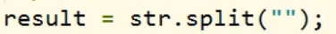
​			
​			

##### toUpperCase()

​			\- 将一个字符串转换为大写并返回

##### toLowerCase()

​			 \- 将一个字符串转换为小写并返回

#### 正则表达式

\- 正则表达式用于定义一些字符串的规则，         
	计算机可以根据正则表达式，来检查一个字符串是否符合规则，         
	或者将字符串中符合规则的内容提取出来。

##### 创建正则表达式的对象

①**使用构造函数创建（这种方式更为灵活，因为参数可以用变量）**
			语法：var 变量=new RegExp("正则表达式","匹配模式");             
					使用typeof检查正则对象，会返回object             
					在构造函数中可以传递一个匹配模式作为**第二个参数**                 
							可以是                       
											**i**  忽略大小写(ignore)                       
											**g**  全局匹配模式(global)
					
					
					忽略大小写的前提下，检查str字符串中是否有a。

​	②**使用字面量来创建正则表达式**
​				语法：var 变量=/正则表达式/匹配模式           
​						   var reg=/a/i;   这么写和上边的效果是一模一样的

##### 正则表达式的语法


- **| 表示或的意思**
  

###### 方括号

- **[] 表示或的意思**
  [] 里的内容也是或的关系
  [ab]==a|b
  [a-z] 表示任意小写字母
  [A-Z] 表示任意大写字母
  [A-z] 表示任意字母  //但是好像中间还有其他6个字符，暂时别用
  [0-9] 表示任意数字
  

  **检查一个字符串中是否含有 abc 或 adc 或 aec**
  

- **[^] 除了**
  
  **只要含有除了a或b以外的，就符合正则表达式的规则**

  
  **含有0-9，就会返回true**


###### **量词**

  **- 通过量词可以设置一个内容出现的次数**       
  **\- 量词只对它前边的内容起作用,可以添加()解决这个问题**
  **- {n}正好出现n次**
  	
  	**返回true**
  **- {m,n}出现m-n次**
  ｛m，｝表示出现m次以上
	  
  	
  	
  	
  	**三个返回的都是true**
  **-** **+** **表示至少一个，相当于{1,}**

  ​	
  ​	**返回true**
  **-** ***** **表示0个或多个，相当于{0,}**
  **-** ? **表示0个或1个，相当于{0,1}**
  **- 检查一个字符串是否以a开头**
    **^**a **表示以a开头**
  **- 检查一个字符串是否以a结尾**
    **$**a **表示以a结尾** 
  **- 如果在正则表达式中同时使用^ $则要求字符串必须完全符合正则表达式**
  ​	**//这个a必须是开头，同时也是结尾， 所以只有一个a**
  ​	
  ​	**返回false** 

  ​	**//以a开头或以a 结尾**

###### 元字符

​	\- .表示任意字符 
​	\- **\w**
​		\- 表示任意字母，数字，下划线  相当于[A-z0-9_]
​	\- \W
​		\- 表示除了任意字母，数字，下划线 相当于\[^A-z0-9]
​	\- \d
​		\- 任意的数字 相当于[0-9]
​	\- \D
​		\- 除了数字 相当于\[^0-9]
​	\- \\s
​		\- 空格
​	\- \\S
​		\- 除了空格
​	\- \\b
​		\- 单词边界 （就是单词两边不能连有其他东西）
​		
​		**返回false**
​		
​		
​		**返回true**

​	\- \\B
​		\- 除了单词边界

##### 注意转义字符

在正则表达式中使用\作为转义字符
\\.来表示.
\\\\表示\
/./  表示使用元字符.
/\\./ 表示查找是否有.这个字符
var reg =new RegExp("\\\\\."); 和 var reg=/\\./; 效果是一样的
**因为使用构造函数时，他的第一个参数是字符串,而\是字符串中的转义字符**       
**需要使用  \\\\  来表示 \\**

##### 正则表达式的方法:

​				test()       
​						\- **使用这个方法可以来检查一个字符串是否符合正则表达式的规则****，**         
​						   如果符合则返回true,否则返回false


##### 正则表达式小案例

###### **用正则表达式去 检查手机号码是否合法**


###### **用正则表达式去除 用户输入的 开头和结尾 的空格**


###### 用正则表达式去判断邮箱输入是否正确

定义一个正则表达式 都是先把一个规则说清楚再去 写正则表达式 


A-z 会包含_ 所以不要使用了 可以用A-Za-z

**常用的正则表达式网上一般都有，但是可有有些会有错误，用的时候先自己检查清楚，**       
**所以了解正则表达式的各种用法是很有必要的** 

##### 字符串和正则相关的方法

###### **split()**

\- 可以将一个字符串拆分为一个数组       
\- **方法中可以传递一个正则表达式作为参数，这样方法将根据正则表达式去拆分字符串**       
\- 这个方法即使不指定全局匹配，也会全都拆分

根据任意字母来讲字符串拆分


###### **search()**

\- 可以搜索字符串中是否含有指定内容       
\- 如果搜索到指定内容，则会返回第一次出现的索引，如果没有搜索到返回-1       
\- **它可以接受一个正则表达式作为参数，然后会根据正则表达式去检索字符串**       
\- **search()只会查找第一个，即使设置全局匹配也没用**

**所搜字符串中是否含有abc 或aec 或 afc**


###### **match()**

**-** 可以根据正则表达式，从一个字符串中将符合条件的内容提取出来       
**\-** **默认情况下我们的match只会找到第一个符合要求的内容，找到以后就停止检索**         
	**我们可以设置正则表达式为全局匹配模式，这样就会匹配到所有的内容**         
	**可以为一个正则表达式设置多个匹配模式，且顺序无所谓**       
**\- match()会将匹配到的内容封装到一个数组中返回，即使只查询到一个结果**
  
  

###### **replace()**

\- 可以将字符串中指定内容替换为新的内容      
\- 返回一个新的字符串   
\- 参数:             
			第一个参数：被替换的内容，可以接受一个正则表达式作为参数             
			第二个参数：新的内容         
\- 默认只会替换第一个


### DOM

#### 概念

- DOM（Document Object Model） 文档对象模型

- JS通过DOM对HTML文档进行操作。只要理解了DOM就可以随心所欲的操作WEB页面了。

- 文档

  \- 文档表示的就是整个的HTML网页文档

- 对象

  \- 对象表示将网页中的每一个部分都转换为一个对象

- 模型

  \- 使用模型来表示对象之间的关系，这样方便我们获取对象

#### 节点

\- 节点(Node)，是构成我们网页的最基本的组成部分，网页中的每一个部分都可以
  称为是一个节点。
\- 常用节点的分类：
		①文档节点：整个HTML文档         
		②元素节点：HTML文档中的HTML标签         
		③属性节点：元素的属性         
		④文本节点：HTML标签中的文本内容
	**节点的属性：**
	

\- **文档节点**
	浏览器已经为我们提供了文档节点这个对象，这个对象是window的属性
    可以在页面中直接使用，文档节点（document）代表的是整个网页    
\- 通过文档节点对象操作文档中的按钮
	 使用docunment获取html中某个按钮的对象
     使用getElementById()方法 获取按钮对象
     使用innerHTML属性修改 按钮标签中的文字 
	

#### 事件

\- 就是用户和浏览器之间的交互行为，       
  比如：点击按钮，鼠标移动，关闭窗口。。。

  我们可以在事件对应的属性中设置一些js代码，这样当事件被触发时，这些代码将会执行
  
  **这种写法我们称为结构和行为耦合，不方便维护，不推荐使用**

\- 可以为**按钮的对应事件绑定处理函数**的形式来响应事件       
  这样当事件被触发时，其对应的函数将会被调用 

   - 绑定一个单击事件
     像这种为单击事件绑定的函数，我们称为单击响应函数
      写在script外边的      

      写在script里边的
     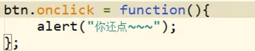

- 绑定一个双击事件
  

#### script标签位置

- 浏览器在加载一个页面时，是按照自上向下的顺序加载的，            
  读取到一行就运行一行，如果将script标签写到页面的上边，            
  在代码执行时，页面还没有加载，页面没有加载DOM对象也没有加载            
  会导致无法获取到DOM对象

- 如何解决这个问题

  1️⃣写到body标签的最下面

  2️⃣为window对象绑定一个onload事件             
  	 该事件对应的响应函数将会在页面加载完成后执行，             
  	 这样可以确保我们的代码执行时所有的DOM对象已经加载完毕了 
      

#### DOM查询

##### 获取元素节点属性

直接使用 元素.属性名
                            例子：元素.id  元素.name  元素.value
                            注意：class(class是保留字不能直接用)属性不能采取这种方式，
                                       读取class属性时需要使用 元素.className 

##### 获取元素节点

通过document对象调用方法(①②③)
①**getElementById()**
	\- 通过id属性获取一个元素节点对象
②**getElementsByTagName()**
	\- 通过标签名获取一组元素节点对象
    \- 这个方法会给我们返回一个类数组对象，所有查询到的元素都会封装到对象中 
    \- 即使查询到的元素只有一个，也会封装到数组中返回
③**getElementsByName()**
	\- 通过name属性获取一组元素节点对象
④.body
	\- 通过document中的一个属性body
	var body=document.body;    
⑤.html
	\- 通过document中的一个属性documentElement
	var html=document.documentElement;
⑥获取所有元素
	\- var all=document.all;       (已经是一个废弃属性了)
	\- var all = document.getElementsByTagName("*");   (应该还能用)
	\- 返回一个类数组对象
⑦**getElementsByClassName()**
	\- 根据元素的class属性值获取一组元素节点对象
	\- getElementsByClassName("box1")  
	\- ==但是该方法不支持IE8及以下浏览器==
⑧**querySelector()**
	\- ==该方法支持IE8及以上浏览器==
	\- 需要一个选择器的字符串作为参数，可以根据一个CSS选择器来查询一个元素节点对象
	\- 虽然IE8中没有getElementsByClassName()但是可以使用querySelector()代替
	\- 使用该方法总会返回唯一的一个元素，如果满足条件的元素有多个，那么它只会返回第一个。
	
⑨**querySelectorAll()**
	\- ==该方法支持IE8及以上浏览器==
	\- 该方法和querySelector()用法类似，不同的是它会将符合条件的元素封装到一个数组中返回
	\- 即使符合条件的元素只有一个，它也会返回数组  （返回的应该是类数组)
	

##### 获取元素节点的子节点

通过具体的元素节点调用
①**getElementsByTagName()**
	\- 方法，返回当前节点的指定标签名后代节点
②**childNodes**
	\- 属性，表示当前节点的所有子节点
    \- childNodes属性会获取包括文本节点在内的素有节点
      根据DOM标准标签间的空白也会当成文本节点     
	\- 这个方法会给我们返回一个类数组对象，所有查询到的元素都会封装到对象中
    \- 即使查询到的元素只有一个，也会封装到数组中返回
    \- 注意：在IE8及以下的浏览器中，不会将空白文本当成子节点。

③**firstChild**
	\- 属性，表示当前节点的第一个子节点
④**lastChild**
	\- **属性**，表示当前节点的最后一个子节点

##### 获取元素节点的子元素

①**children**
	\- 属性，表示当前节点的所有子元素
	\- 这个方法会给我们返回一个类数组对象，所有查询到的元素都会封装到对象中
	\- 即使查询到的元素只有一个，也会封装到数组中返回 
②firstElementChild
	\- 属性 获取当前元素的第一个子元素         
	\- **注意：该属性不兼容IE8及以下的浏览器，所以如果要兼容他们尽量不要使用**

##### 获取父节点和兄弟节点

通过具体的节点调用
①**parentNode**
	\- 属性，表示当前节点的父节点
②**previousSibling**
	\- 属性，表示当前节点的前一个兄弟节点
③**nextSibling**
	\- 属性，表示当前节点的后一个兄弟节点

##### 获取兄弟元素

**previousElementSibling**
	\- 获取前一个兄弟元素,IE8及以下不支持

##### 获取节点内的文本

①**innerHTML属性**
		\- 用于获取元素内部的HTML代码
        \- 当元素内部还有元素时，会显示尖括号
        \- 对于自结束标签，这个属性没有意义
		\- 元素对象.innerHTML
②**innerText属性**
		\- 该属性可以获取到元素内部的文本内容
		\- 它和innerHTML类似，不同的是它会自动将html标签去除
③文本节点的属性
		需要使用nodeValue属性
		
		太麻烦了一般不用，一般使用innerHTML属性或innerText属性

##### 提取成一个函数

**可以将大量重复性的代码可以提取成一个函数**
	例如：定义一个函数，专门用来为指定元素绑定单击响应函数


##### HTML对象

<input> checkbox 复选框节点的属性
	**checked**  设置或返回 checkbox 是否应被选中。
	属性值：true|false

##### this

**在事件响应函数中,响应函数是给谁绑定的this就是谁**

此时this就是checkedAllBox

#### DOM节点增删改查

#####  创造节点

createElement()
	\- 它可以用于创建一个元素节点对象
	\- 需要一个标签名作为参数，根据该标签名创建元素节点对象
	\- 并将创建好的对象作为返回值返回
	

createTextNode()
	\- 创建一个文本节点对象
	\- 需要一个文本内容作为参数，将会根据该内容创建文本节点，并将新的节点对象返回
	

##### 添加节点

appendChild()
	\- 向一个父节点中添加一个新的子节点
	\- 用法:  父节点.appendChild(子节点) 
	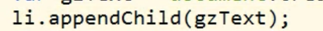

在一个节点下添加新的节点类似于appendChild()
	\- 通过innerHTML属性向一个节点中添加新的节点
	
	这种方法相当于 将之前的代码删了，然后重新进行添加，进行大改动，如果之前       
	已经在节点上绑定事件，那么现在效果会消失。
	个人理解：堆内的节点对象删了重新造对节点对象

**因为appendChild() 太麻烦 而innerHTML属性又会有问题 所以采取两者结合的方式**
	

##### 插入子节点

insertBefore()
	\- 可以在指定的子节点前插入新的子节点
	\- 语法:
			父节点.insertBefore(新节点,旧节点);
			

##### 替换子节点

replaceChild()
	\- 可以使用指定的子节点替换已有的子节点；
	\- 父节点.replaceChild(新节点，旧节点);
	

##### 移除子节点

removeChild()
	\- 可以删除一个子节点
	\- 语法：父节点.removeChild(子节点)
		**不常用**
	通过parentNode属性去找到父节点，然后再删除子节点
	这种方法更加**常用一些** 
		**常用**

#### 取消超链接默认行为

点击超链接以后，超链接会跳转页面，这个是超链接的默认行为，       
但是此时我们不希望出现默认行为，可以通过在**响应函数的最后return false**       
来取消默认行为 


#### window对象的方法

confirm()
	\- 用于弹出一个**带有确认和取消按钮的提示框**
	\- 需要一个字符串作为参数，该字符串将会作为提示文字显示出来
	\- 如果用户**点击确认则会返回true**，如果**点击取消则会返回false**

#### for循环与响应函数

​		for循环会在页面加载完成值后立即执行，
​        而响应函数会在事件触发时再执行
​        当响应函数执行时，for循环早已被执行完毕
​		
​		所以响应函数内最好用this

#### 修改css的元素样式

- 语法:**元素.style.样式名=样式值**

- 注意：如果css样式名中含有-，       
  		   这种名称在JS中是**不合法的比如background-color**            
    		   需要将这种样式名修改为驼峰命名法            
    		   去掉-，然后把-后的第一个字母大写 **backgroundColor** 

- **我们通过style属性设置的样式都是内联样式**,
  而内联样式有较高的优先级，所以通过js修改的样式往往会立即显示


  但是如果在样式中写了!important,则此时样式会有最高的优先级，       
  即使通过JS也不能覆盖该样式，此时将会导致JS修改样式失效       
  所以尽量不要为样式添加!important

#### 读取css的元素样式

 - 语法1️⃣:**元素.style.样式名**            
   注意**:通过style属性设置和读取的都是内联样式**                
   		**无法读取样式表中的样式**
 - 语法2️⃣:**元素.currentStyle.样式名** （这个属性只有ie浏览器支持，且这个样式只能读取属性值，不能设置）
                它可以用来读取当前元素正在显示的样式（内联，样式表，都可以）       
   注意:如果读取的样式没有设置，那么返回默认值
 - 语法3️⃣:**getComputedStyle()方法 （获取到的样式只能读取，不能修改，ie9以下不支持）**
                getComputedStyle()这个方法可以来获取元素当前的样式   
                这个方法是window的方法，可以直接使用   
   需要两个参数:       
                第一个:要获取样式的元素       
                第二个:可以传递一个伪元素，一般都传null
   该方法会返回一个对象，对象中封装了当前元素对应的样式
   可以通过==对象.样式==名来读取样式
   如果获取的样式没有设置，则会返回真实的值，而不是默认值。
   比如:没有设置width，它不会获取到auto，而是一个长度
   

##### 兼容性问题解决

​	**处理getComputedStyle()函数和currentStyle属性在不同浏览器的兼容问题**
​	
​	window.getComputedStyle返回 undefined或函数对象

#### **HTML DOM Element 对象的属性和方法**

就是节点的属性和方法

- clientWidth（只读属性，不能修改）

- **clientHeight**（只读属性，不能修改）
  \- 这两个属性都可以获取元素的可见宽度和高度
  \- 这些属性都是不带px的，**返回都是一个数字，可以直接进行计算**
  \- 会获取元素宽度和高度，包括**内容区和内边距**  

- offsetWidth（只读属性，不能修改）

- offsetHeight（只读属性，不能修改）
   \- 获取元素的整个宽度和高度，包括**内容区，内边距和边框**
   \- 只读 

- offsetParent（属性）
   \- **会获取到离当前元素最近的开启了定位的祖先元素**
     **如果所有的祖先元素都没有开启定位，则返回body**
    \- 只读 

- offsetLeft(属性)

  \- **当前元素相对于其定位父元素的水平偏移量**
    就是该元素左侧和父元素左侧之间的距离
   \- 只读 

- offsetTop(属性)
  \- **当前元素相对于其定位父元素的垂直偏移量**
    就是该元素上方和父元素上方之间的距离
   \- 只读 

- scrollWidth(属性)

- **scrollHeight**(属性)
   \- 可以获取元素整个滚动区域的宽度和高度
   \- 只读 

- scrollLeft(属性)
   \- 可以获取水平滚动条滚动的距离
   \- 只读 

- **scrollTop**(属性)
   \- 可以获取垂直滚动条滚动的距离

当满足**scrollHeight-scrollTop==clientHeight**时
说明 滚动条滚动到底部了

#### 鼠标滚动事件及案例

\- onscroll 
	滚动事件 
	对象.onscroll
\- disabled
	表单项 节点对象的属性 
	属性值：false(可以被选中)
				  true(不可被选中）  

**用户注册时 阅读文件，阅读到底部时，才能点击提交按钮 模块**


#### 事件对象

\- 当事件的响应函数被触发时，（**响应函数都是浏览器去调用的**）浏览器每次都会将一个
  **事件对象作为实参传进响应函数，**在事件对象中封装了当前事件相关的一切信息，比如:
  鼠标的坐标，键盘哪个按键被按下，鼠标滚轮滚动的方向。。。。
  hh.onmousemove=function(event){}  //**对象事件作为实参传递给event**  

- onmousemove事件
  \- 该事件将会在 鼠标在元素中移动时触发

- 事件对象的属性（其中四个个)
  \- clientX可以获取鼠标指针**相对于可见窗口**的水平坐标（ie8以下浏览器不会传进事件对象，但可以使用window.event.clientX)
  \- clientY可以获取鼠标指针**相对于可见窗口**的垂直坐标 
  \- pageX可以获取鼠标指针**相对于整个页面**的水平坐标 （在ie8中不支持）
  \- pageY可以获取鼠标指针**相对于整个页面**的垂直坐标 （在ie8中不支持）

-  **在IE8中，响应函数被触发时，浏览器不会传递事件对象，**
   **在IE8及一下的浏览器中，是将事件对象作为window对象的属性(window.event)保存的**

- 火狐浏览器中没有window.event

- 解决事件对象的兼容性问题

  

#### div跟随鼠标案例

因为对于鼠标而言（0，0）是在窗口左上角
而对于开启定位后的元素而言（0，0）是在页面的左上角
拉动滚动条，页面会网上移，使得页面和窗口的（0，0）点不再重合
所以需要解决滚动条的问题 //第35行


因为现在谷歌浏览器也认为 页面的滚动条是html的（以前谷歌认为滚动条是body的），所以不用再处理兼容性问题，以前处理兼容性 st=document.docmentElement.scrollTop||document.body.scrollTop;

#### 事件的冒泡

\- 所谓的冒泡指的就是事件的向上传导，当后代元素上的事件被触发时，其**祖先元素的相同事件**也会被触发
\- 在开发中大部分情况冒泡都是有用的，**如果不希望发生事件冒泡可以通过事件对象来取消冒泡**
  **将事件对象的cancelBubble属性值设置为true**
\- 对象名.cancelBubble=true;

#### 事件的委派

\- 指将事件统一绑定给元素共同的祖先元素，这样当后代元素上的时间触发时，会一直冒泡到祖先元素，从而通过祖先元素的响应函数来处理事件 
\- 事件的委派是利用了冒泡，通过委派可以减少事件绑定的次数，提高程序的性能。

##### event的target属性

\- **event中的target属性**
\- 返回触发此事件的元素


#### 事件绑定的规则

对象.事件=函数的形式绑定响应函数
它只能同时为一个元素的一个事件绑定响应函数；
**不能**绑定多个，如果绑定了多个，则后边会覆盖掉前边的

addEventListener()方法
\- 通过这个方法也可以为元素绑定响应函数
\- 参数:
		参数一：事件的字符串，**不要带on**
		参数二：回调函数，当事件触发时该函数会被调用
		参数三：是否在捕获阶段触发事件，需要一个布尔值，一般都传false

**使用addEventListener()可以同时为**一个元素的相同事件同时绑定多个响应函数，
这样当事件被触发时，响应函数将会按照函数的绑定顺序执行
**这个方法不支持IE8及以下的浏览器**


**attachEvent() 方法**
\- 在IE8中可以使用attachEvent()来绑定事件
\- 参数：
		参数一：**事件的字符串，要on**
		参数二：回调函数

\- 这个方法也可以同时为一个事件绑定多个处理函数，
  不同的是它是后绑定的先执行，执行顺序和addEventListener()相反 
 

##### 解决兼容性问题

解决**addEventListener()**和 **attachEvent()**兼容性问题
**注意：**
		**addEventListener()中回调函数this，是绑定事件的对象**
		**attachEvent()中回调函数的this，是window** 
		**需要统一两个方法**
		**方法是：在匿名函数中去调用call()方法 来改变this的值，**
		**如果不统一this的话容易出问题**


#### 事件的传播


#### 拖拽


- 当我们拖拽一个网页中的内容时，浏览器会默认去搜索引擎中搜索内容
  此时会导致拖拽功能的异常，这个是浏览器提供的默认行为
  如果不希望发生这个行为，则可以**通过return false来取消默认行为** （**但是对ie8不起作用**） 

- **setCapture()**方法（支持ie，火狐不报错，但是chrome报错）
  当一个元素调用这个方法以后，这个元素将会把下一个所有的鼠标按下相关的事件捕获到
  自己身上（就是无论按什么地方，只要按下了就相当于 触发这个元素上的事件）

- releaseCapture()方法（支持ie，火狐不报错，但是chrome报错）
  取消对事件的捕获

##### 解决浏览器的兼容性问题

##### 1️⃣
  return false不用改变；
  **setCapture() 和** **releaseCapture()**
 

2️⃣（更常用一些）
 return false不用改变；
 **setCapture()和** **releaseCapture()**
 

``` html
<!--拖拽代码案例-->
<!DOCTYPE html>
<html>
    <head>
        <meta charset="UTF-8">
        <title></title>
        <style type="text/css">
            
            #box1{
                width: 100px;
                height: 100px;
                background-color: red;
                position: absolute;
            }
            
            #box2{
                width: 100px;
                height: 100px;
                background-color: yellow;
                position: absolute;
                
                left: 200px;
                top: 200px;
            }
            
        </style>
        
        <script type="text/javascript">
            
            window.onload = function(){
                /*
                 * 拖拽box1元素
                 *  - 拖拽的流程
                 *      1.当鼠标在被拖拽元素上按下时，开始拖拽  onmousedown
                 *      2.当鼠标移动时被拖拽元素跟随鼠标移动 onmousemove
                 *      3.当鼠标松开时，被拖拽元素固定在当前位置   onmouseup
                 */
                
                //获取box1
                var box1 = document.getElementById("box1");
                var box2 = document.getElementById("box2");
                var img1 = document.getElementById("img1");
                
                //开启box1的拖拽
                drag(box1);
                //开启box2的
                drag(box2);
                
                drag(img1);
                
                
                
                
            };
            
            /*
             * 提取一个专门用来设置拖拽的函数
             * 参数：开启拖拽的元素
             */
            function drag(obj){
                //当鼠标在被拖拽元素上按下时，开始拖拽  onmousedown
                obj.onmousedown = function(event){
                    
                    //设置box1捕获所有鼠标按下的事件
                    /*
                     * setCapture()
                     *  - 只有IE支持，但是在火狐中调用时不会报错，
                     *      而如果使用chrome调用，会报错
                     */
                    /*if(box1.setCapture){
                        box1.setCapture();
                    }*/
                    obj.setCapture && obj.setCapture();
                    
                    
                    event = event || window.event;
                    //div的偏移量 鼠标.clentX - 元素.offsetLeft
                    //div的偏移量 鼠标.clentY - 元素.offsetTop
                    var ol = event.clientX - obj.offsetLeft;
                    var ot = event.clientY - obj.offsetTop;
                    
                    
                    //为document绑定一个onmousemove事件
                    document.onmousemove = function(event){
                        event = event || window.event;
                        //当鼠标移动时被拖拽元素跟随鼠标移动 onmousemove
                        //获取鼠标的坐标
                        var left = event.clientX - ol;
                        var top = event.clientY - ot;
                        
                        //修改box1的位置
                        obj.style.left = left+"px";
                        obj.style.top = top+"px";
                        
                    };
                    
                    //为document绑定一个鼠标松开事件
                    document.onmouseup = function(){
                        //当鼠标松开时，被拖拽元素固定在当前位置   onmouseup
                        //取消document的onmousemove事件
                        document.onmousemove = null;
                        //取消document的onmouseup事件
                        document.onmouseup = null;
                        //当鼠标松开时，取消对事件的捕获
                        obj.releaseCapture && obj.releaseCapture();
                    };
                    
                    /*
                     * 当我们拖拽一个网页中的内容时，浏览器会默认去搜索引擎中搜索内容，
                     *  此时会导致拖拽功能的异常，这个是浏览器提供的默认行为，
                     *  如果不希望发生这个行为，则可以通过return false来取消默认行为
                     * 
                     * 但是这招对IE8不起作用
                     */
                    return false;
                    
                };
            }
            
            
        </script>
    </head>
    <body>
        
        我是一段文字
        
        <div id="box1"></div>
        
        <div id="box2"></div>
        
        
    </body>
</html>
```

#### 鼠标上下滚动事件及案例

##### 老方法

老方法还没试过，但最好还是不要用了(但是老方法可以兼容ie8)
毕竟事件已经弃用

- onmousewheel事件 （火狐无法兼容，并且已经弃用)
- DOMMouseScroll 事件(火狐兼容)
  该事件要通过addEventListener()函数来绑定

实现两者的兼容


属性：**wheelDelta**
		   事件对象(event)的属性 （火狐中不能用，返回undefined）	
		   event.wheelDelta 的值来判断滚轮滚动的方向
		   向上滚为正值，向下滚为负值

​	   	**detail**
​		   事件对象(event)的属性  （火狐中使用)
​		   event.detail 来获取滚动方向
​		   向上滚为负值，向下滚为正值

注意：**当滚动条滚动时，如果浏览器有滚动条，滚动条会随之滚动，**       
 	  	**这是浏览器的默认行为，如果不希望发生，则可以取消默认行为**
	       return false;

​	   	**使用addEventListener()方法绑定响应函数，取消默认行为时不能使用return false**
​		   需要使用event来取消默认行为event.preventDefault()；
​		   但是IE8不支持event.preventDefault(); 如果直接使用会报错
​		   所以需要使用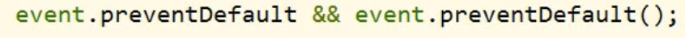

```html
<!DOCTYPE html>
<html>
	<head>
		<meta charset="UTF-8">
		<title></title>
		<style type="text/css">
			
			#box1{
				width: 100px;
				height: 100px;
				background-color: red;
			}
			
		</style>
		<script type="text/javascript">
			
			window.onload = function(){
				
				
				//获取id为box1的div
				var box1 = document.getElementById("box1");
				
				//为box1绑定一个鼠标滚轮滚动的事件
				/*
				 * onmousewheel鼠标滚轮滚动的事件，会在滚轮滚动时触发，
				 * 	但是火狐不支持该属性
				 * 
				 * 在火狐中需要使用 DOMMouseScroll 来绑定滚动事件
				 * 	注意该事件需要通过addEventListener()函数来绑定
				 */
				
				
				box1.onmousewheel = function(event){
					
					event = event || window.event;
					
					
					//event.wheelDelta 可以获取鼠标滚轮滚动的方向
					//向上滚 120   向下滚 -120
					//wheelDelta这个值我们不看大小，只看正负
					
					//alert(event.wheelDelta);
					
					//wheelDelta这个属性火狐中不支持
					//在火狐中使用event.detail来获取滚动的方向
					//向上滚 -3  向下滚 3
					//alert(event.detail);
					
					
					/*
					 * 当鼠标滚轮向下滚动时，box1变长
					 * 	当滚轮向上滚动时，box1变短
					 */
					//判断鼠标滚轮滚动的方向
					if(event.wheelDelta > 0 || event.detail < 0){
						//向上滚，box1变短
						box1.style.height = box1.clientHeight - 10 + "px";
						
					}else{
						//向下滚，box1变长
						box1.style.height = box1.clientHeight + 10 + "px";
					}
					
					/*
					 * 使用addEventListener()方法绑定响应函数，取消默认行为时不能使用return false
					 * 需要使用event来取消默认行为event.preventDefault();
					 * 但是IE8不支持event.preventDefault();这个玩意，如果直接调用会报错
					 */
					event.preventDefault && event.preventDefault();
					
					
					/*
					 * 当滚轮滚动时，如果浏览器有滚动条，滚动条会随之滚动，
					 * 这是浏览器的默认行为，如果不希望发生，则可以取消默认行为
					 */
					return false;
					
					
					
					
				};
				
				//为火狐绑定滚轮事件
				bind(box1,"DOMMouseScroll",box1.onmousewheel);
				
				
			};
			
			
			function bind(obj , eventStr , callback){
				if(obj.addEventListener){
					//大部分浏览器兼容的方式
					obj.addEventListener(eventStr , callback , false);
				}else{
					/*
					 * this是谁由调用方式决定
					 * callback.call(obj)
					 */
					//IE8及以下
					obj.attachEvent("on"+eventStr , function(){
						//在匿名函数中调用回调函数
						callback.call(obj);
					});
				}
			}
			
		</script>
	</head>
	<body style="height: 2000px;">
		
		<div id="box1"></div>
		
	</body>
</html>
```

##### 新方法（无法兼容ie8）
事件:**onwheel**
					

网友测试属性:
					

所以使用deltaY属性去判断鼠标滚轮方向比较好

```html
<!DOCTYPE html>
<html lang="en">
<head>
    <meta charset="UTF-8">
    <meta http-equiv="X-UA-Compatible" content="IE=edge">
    <meta name="viewport" content="width=device-width, initial-scale=1.0">
    <title>Document</title>
    <style>
        #box{
            width: 100px;
            height: 200px;
            background-color: #bfa;
        }
    </style>
    <script>
        window.onload=function(){
            // 事件的绑定
            function bind(obj,strEvent,fun){
                if(obj.addEventListener){
                    obj.addEventListener(strEvent,fun,false);
                    
                }else{
                    obj.attachEvent("on"+strEvent,function(){
                        fun.call(obj);
                    });
                }
                
            }
            // 获取#box元素
            var box=document.getElementById("box");
            // 给#box元素 绑定鼠标滚轮事件
            bind(box,"wheel",function(event){
                // event兼容性
                event=event||window.event;
                // 判断鼠标滚轮滚动方向，<0向上滚
                if(event.deltaY<0){
                    // #box 变小
                    box.style.height=box.clientHeight-10+"px";
                }else{
                    // #box 变大
                    box.style.height=box.clientHeight+10+"px";
                }
                // 取消浏览器的默认行为
                event.preventDefault();
                
                
            });
           
        }
    </script>
</head>
<body style="height: 1000px;">
    <div id="box"></div>
</body>
</html>
```

#### 键盘事件

键盘事件一般都会绑定给一些**可以获取到焦点的对象（表单项）**或者是**document（文档对象）**
获取焦点就是鼠标光标可以出现的

**onkeydown:**
\- **按键被按下**
\- 对于onkeydown来说如果一直按着某个按键不松手，则事件会一直触发
\- 当onkeydown连续触发时，第一次和第二次之间会间隔稍微长一点，其他
  的会非常的快，这种设计是为了防止误操作的发生。 

**onkeyup:**
\- 按键被松开

**keyCode：**
**-** event.keyCode
**-** 如果是onkeydown和onkeyup事件内 返回键的代码。
   如果是onkeypress事件 返回键的值的字符代码（即ASCII码）
   返回的好像都是数字
**-** 通过它可以判断哪个按键被按下
\- 除了keyCode，事件对象还提供了几个属性
	**altKey**
	**ctrlKey**
	**shiftKey**
	\- 这是三个用来判断alt，ctrk和shift是否被按下
	  如果按下则返回true，否则返回false
判断y和ctrl是否同时被按下
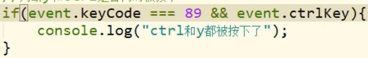

**注意：**
	**如果在文本框中输入内容，属于onkeydown的默认行为**
	**如果在onkeydown中取消了默认行为，则输入的内容，不会出现在文本框中**
	
	**使文本框中不能输入数字**
	

### BOM

#### 概括

\- 浏览器对象模型
\- BOM可以使我们通过JS来操作浏览器
\- 在BOM中为我们提供了一组对象，用来完成对浏览器的操作
\- BOM对象
		**Window**
			\- 代表的是整个浏览器的窗口，同时window也是网页中的全局对象
		**Navigator**
			\- 代表当前浏览器的信息，通过该对象可以来识别不同的浏览器
		**Location**
			\- 代表当前浏览器的地址栏信息，通过Location可以获取地址栏信息，或者操作浏览器跳转页面
			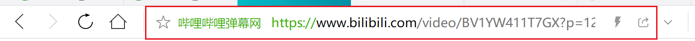

​		**History**
​			\- 代表浏览器的历史记录，可以通过该对象来操作浏览器的历史记录
​			  由于隐私原因，该对象不能获取到具体的历史记录，只能操作浏览器向前或向后翻页
​			  而且该操作只在当次访问时有效，关闭浏览器就无效了
​		Screen（移动端用的较多）
​			\- 代表用户的屏幕的信息，通过该对象可以获取到用户的显示器相关的信息

这些BOM对象在浏览器中都是作为window对象的属性（相当于是全局对象）保存的，
可以通过window对象来使用，也可以直接使用 。

#### Navigator

- 代表当前浏览器的信息，通过该对象可以来识别不同的浏览器

- 由于历史原因，Navigator对象中的大部分属性都已经不能帮助我们识别浏览器了

- **userAgent属性**

  一般我们只会使用userAgent（在一些书中 相当于浏览器）来判断浏览器的信息
  userAgent属性返回的是一个字符串，这个字符串中包含有用来描述浏览器信息的内容，不同
  的浏览器会有不同的userAgent

- **如何判断是哪一种浏览器**
  使用**navigator**对象的**userAgent**属性;
  **IE11 不能通过userAgent去判断** 可以通过if("ActiveXObject" in window){} 
  判断，该属性是否在这个对象里面
  
  

#### History(书写时小写history)

- length 

  属性，可以获取到当前访问的链接数量
  

- back()

  方法，可以用来回退到上一个页面，作用和浏览器的回退按钮一样
  

- forward()

  方法，可以跳转到下一个页面，作用和浏览器的前进按钮一样

- go()
  可以用来跳转到指定的页面
  它需要一个整数作为参数
         1:表示向前跳转一个页面 相当于forward()
         2:表示向前跳转两个页面
        -1:表示向后（往回）跳转一个页面
        -2:表示向后（往回）跳转两个页面

#### Location(location)

- **location 是对象** 
  **如果直接打印location，则可以获取到地址栏的信息(当前页面的完整路径)**
  

- **如果直接将location属性修改为一个完整的路径，或相对路径 则我们页面会自动跳转到该页面**
  **并生成相应的历史记录**

- **assign（）**
  \- 方法
  \- 参数为字符串，里面放路径
  \- 用来跳转到其他的页面，作用和直接修改location一样
  \- 有历史记录(就是可以回退)

- **reload（）**
  \- 方法
  \- 用于重新加载当前页面，作用和浏览器的刷新按钮一样
  \- 如果在方法中传递一个true作为参数，则会强制清空缓存刷新页面
    有时候如果没有参数true，那么文本框内的内容在刷新后还会存在
    

- **replace（）**
  \- 方法
  \- 可以使用一个新的页面替换当前页面，调用完毕后也会跳转页面
    功能和直接修改location对象或者调用assign()方法类似，但是
    不会生成历史记录（不能回退），不能使用浏览器的回退按钮回退 

#### Window

##### setlnterval()
\- 定时调用，开启定时器
\- 可以将一个函数，每隔一段时间执行一次
\- 参数：
		参数1. **回调函数，该函数会每隔一段时间被调用一次**
		参数2. **每次调用间隔的事件，单位是毫秒**
\- 返回值:
		**返回一个Number类型的数据**
		**这个数字用来作为定时器的唯一标识**
		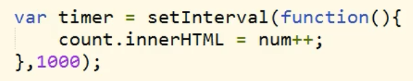
**注意：在开启定时器前需要 关闭该元素上的其他定时器，不然多个**
	  	 **定时器操作同一个元素会出现问题。**

##### **clearInterval()**
\- 可以用来关闭一个定时器
\- **方法中需要一个定时器的标识作为参数**，这样将关闭标识对应的定时器
  
\- 如果参数是一个有效的定时器的标识，则停止对应的定时器
\- 如果参数不是一个有效的标识，则什么也不做（也不会报错)

##### **setTimeout()**

**-** 延时调用，延时调用一个函数不马上执行，而是**隔一段时间以后在执行，而且只会执行一次**
**-** **延时调用和定时调用的区别，定时调用会执行多次，而延时调用只会执行一次**
**-** 延时调用和定时调用实际上可以互相代替的，在开发中可以根据自己需要去选择
\- 也是会返回一个标识的
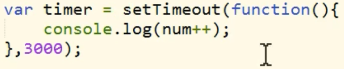

##### **clearTimeout()**

\- 使用clearTimeout()来关闭一个延时调用


##### 定时器案例1

```html

<!-- 实现点击按钮，div元素向右移动到指定位置-->


<!DOCTYPE html>
<html lang="en">


<head>
    <meta charset="UTF-8">
    <meta name="viewport" content="width=device-width, initial-scale=1.0">
    <title>Document</title>
    <style>
        * {
            padding: 0;
            /* border: none; */
            margin: 0;
        }


        .line {
            top: 0;
            width: 0;
            height: 500px;
            background-color: black;
            border: 1px solid black;
            position: absolute;
            left: 800px;
        }


        #box1 {
            position: absolute;
            width: 100px;
            height: 100px;
            background-color: yellow;
        }
    </style>
    <script>
        window.onload = function () {
            // 定义一个函数，用来获取指定元素的当前的样式
            //  * 参数：
            //  *       obj 要获取样式的元素
            //  *       name 要获取的样式名,name为字符串
            function getStyle(obj, name) {


                if (window.getComputedStyle) {
                    //正常浏览器的方式，具有getComputedStyle()方法
                    return getComputedStyle(obj, null)[name];
                } else {
                    //IE8的方式，没有getComputedStyle()方法
                    return obj.currentStyle[name];
                }


                //return window.getComputedStyle?getComputedStyle(obj , null)[name]:obj.currentStyle[name];


            }
            //定义定时器的标识 timer
            var timer
            //点击按钮 实现div元素向左移动到实线
            //获取div元素
            var box1 = document.getElementById("box1");
            //获取按钮对象
            var btn = document.getElementById("btn");
            btn.onclick = function () {
                //开启定时器前 关闭该元素的其他定时器
                clearInterval(timer);
                //开启定时器 , 并得到定时间的标识
                     timer = setInterval(function () {
                    //获取box1 的left值
                    var oldValue = parseInt(getStyle(box1, "left"));
                    //left=left+10px
                    var newValue = oldValue + 11;
                    if (newValue > 800) {
                        newValue = 800;
                    }
                    box1.style.left = newValue + "px";
                    if (newValue == 800) {
                        clearInterval(timer);
                    }
                }, 30);


            }
        }


    </script>
</head>


<body>
    <button id="btn">向左边移动</button>
    <div id="box1"></div>
    <div class="line"></div>


</body>


```

##### 定时器案例2

这个案例是将上面的案例中的功能提取成一个函数

```html
<!DOCTYPE html>
<html lang="en">

<head>
    <meta charset="UTF-8">
    <meta http-equiv="X-UA-Compatible" content="IE=edge">
    <meta name="viewport" content="width=device-width, initial-scale=1.0">
    <title>Document</title>
    <style>
        *{
            margin: 0;
            padding: 0;
        }
        #box {
            position: absolute;
            width: 100px;
            height: 100px;
            background-color: #bfa;
        }
    </style>
    <script>
        // 定义定时器标识
        var timer;
        // 参数1 被控制的对象
        // 参数2 目标位置
        // 参数3 速度
        function run(obj,target,speed) {
            // 取消以前的定时器
            clearInterval(timer);
            // 当前位置大于目标位置 速度为负
            // 当前位置小于目标位置 速度为正
            if(parseInt(getStyle(obj, "left"))>target){
                speed=-speed;
            }
            // 设置定时器
            timer = setInterval(function () {
                // 获取#box的左偏移量
                var oldLeft = parseInt(getStyle(obj, "left"));
                var newLeft = oldLeft + speed;
                // 当前位置大于目标位置，速度大于0  或  当前位置小于目标位置以及速度小于0
                if ((newLeft >= target&&speed>0)||(newLeft<=target&&speed<0)) {
                    newLeft = target;
                }
                obj.style.left = newLeft + "px";
                if (newLeft == target) {
                    clearInterval(timer);
                }
            }, 30);
        }
        function getStyle(obj, name) {
            if (window.getComputedStyle) {
                return getComputedStyle(obj, null)[name];
            } else {
                return obj.currentStyle[name];
            }
        }
        window.onload = function () {
            // 点击#btn按钮 #box标签 向右移动至800px停下

            // 给#btn按钮绑定单击响应函数
            var btn = document.getElementById("btn");
            
            btn.onclick = function () {
                // 获取#box
                var box = document.getElementById("box");
                run(box,800,10);
            }
            // 点击#btn0按钮 #box0标签 向左移动至0停下

            // 给#btn0按钮绑定单击响应函数
            var btn0 = document.getElementById("btn0");
            
            btn0.onclick = function () {
                // 获取#box
                var box = document.getElementById("box");
                run(box,0,10);
            }
        }
        
    </script>
</head>

<body>
    <button id="btn">向右移动</button>
    <button id="btn0">向左移动</button>
    <br />
    <br />
    <div id="box"></div>
    <div style="top:0;position: absolute;left: 800px;height: 1000px;border-left: red 1px solid;"></div>
</body>

</html>
```

##### 定时器案例3

定时器案例2的增强版，可以对一个标签对象进行left top width height 等样式进行动画改变

```html
<!DOCTYPE html>
<html lang="en">

<head>
    <meta charset="UTF-8">
    <meta http-equiv="X-UA-Compatible" content="IE=edge">
    <meta name="viewport" content="width=device-width, initial-scale=1.0">
    <title>Document</title>
    <style>
        *{
            margin: 0;
            padding: 0;
        }
        #box {
            position: absolute;
            width: 100px;
            height: 100px;
            background-color: #bfa;
        }
        #box0 {
            top: 300px;
            position: absolute;
            width: 100px;
            height: 100px;
            background-color: rgb(121, 124, 120);
        }
    </style>
    <script>
        // 定义定时器标识
        var timer;
        // 参数1 被控制的对象   
        // 参数2 要执行动画的样式 (字符串) "left" "top" "height" "width" 等等
        // 参数3 目标位置   (数字)
        // 参数4 速度    (数字)
        // 参数5 回调函数,该函数将会在动画执行完毕后执行
        function run(obj,attr,target,speed,callback) {
            // 取消以前的定时器
            clearInterval(obj.timer);
            // 当前位置大于目标位置 速度为负
            // 当前位置小于目标位置 速度为正
            if(parseInt(getStyle(obj,attr))>target){
                speed=-speed;
            }
            // 设置定时器
            obj.timer = setInterval(function () {
                // 获取#box的左偏移量
                var oldLeft = parseInt(getStyle(obj, attr));
                var newLeft = oldLeft + speed;
                // 当前位置大于目标位置，速度大于0  或  当前位置小于目标位置以及速度小于0
                if ((newLeft >= target&&speed>0)||(newLeft<=target&&speed<0)) {
                    newLeft = target;
                }
                obj.style[attr] = newLeft + "px";
                if (newLeft == target) {
                    clearInterval(obj.timer);
                    callback&&callback();
                }
            }, 30);
        }
        function getStyle(obj, name) {
            if (window.getComputedStyle) {
                return getComputedStyle(obj, null)[name];
            } else {
                return obj.currentStyle[name];
            }
        }
        window.onload = function () {
            // 点击#btn按钮 #box标签 向右移动至800px停下

            // 给#btn按钮绑定单击响应函数
            var btn = document.getElementById("btn");
            
            btn.onclick = function () {
                // 获取#box
                var box = document.getElementById("box");
                run(box,"left",800,10);
            }
            // 点击#btn0按钮 #box标签 向左移动至0停下

            // 给#btn0按钮绑定单击响应函数
            var btn0 = document.getElementById("btn0");
            
            btn0.onclick = function () {
                // 获取#box
                var box = document.getElementById("box");
                run(box,"left",0,10);
            }
            // 点击#btn1按钮 #box0标签 
    
            // 给#btn1按钮绑定单击响应函数
            var btn1 = document.getElementById("btn1");
            
            btn1.onclick = function () {
                // 获取#box0
                var box0 = document.getElementById("box0");
                run(box0,"height",800,10,function(){
                    run(box0,"width",400,10);
                });
            }
         
        }
        
    </script>
</head>

<body>
    <button id="btn">向右移动</button>
    <button id="btn0">向左移动</button>
    <button id="btn1">测试</button>
    <br />
    <br />
    <div id="box"></div>
    <div id="box0"></div>
    <div style="top:0;position: absolute;left: 800px;height: 1000px;border-left: red 1px solid;"></div>
</body>

</html>
```

##### tool.js

```javascript
//尝试创建一个可以执行简单动画的函数
/*
 * 参数：
 * 	obj:要执行动画的对象
 * 	attr:要执行动画的样式，比如：left top width height
 * 	target:执行动画的目标位置
 * 	speed:移动的速度(正数向右移动，负数向左移动)
 *  callback:回调函数，这个函数将会在动画执行完毕以后执行
 */
function move(obj, attr, target, speed, callback) {
	//关闭上一个定时器
	clearInterval(obj.timer);

	//获取元素目前的位置
	var current = parseInt(getStyle(obj, attr));

	//判断速度的正负值
	//如果从0 向 800移动，则speed为正
	//如果从800向0移动，则speed为负
	if(current > target) {
		//此时速度应为负值
		speed = -speed;
	}

	//开启一个定时器，用来执行动画效果
	//向执行动画的对象中添加一个timer属性，用来保存它自己的定时器的标识
	obj.timer = setInterval(function() {

		//获取box1的原来的left值
		var oldValue = parseInt(getStyle(obj, attr));

		//在旧值的基础上增加
		var newValue = oldValue + speed;

		//判断newValue是否大于800
		//从800 向 0移动
		//向左移动时，需要判断newValue是否小于target
		//向右移动时，需要判断newValue是否大于target
		if((speed < 0 && newValue < target) || (speed > 0 && newValue > target)) {
			newValue = target;
		}

		//将新值设置给box1
		obj.style[attr] = newValue + "px";

		//当元素移动到0px时，使其停止执行动画
		if(newValue == target) {
			//达到目标，关闭定时器
			clearInterval(obj.timer);
			//动画执行完毕，调用回调函数
			callback && callback();
		}

	}, 30);
}

/*
 * 定义一个函数，用来获取指定元素的当前的样式
 * 参数：
 * 		obj 要获取样式的元素
 * 		name 要获取的样式名
 */
function getStyle(obj, name) {

	if(window.getComputedStyle) {
		//正常浏览器的方式，具有getComputedStyle()方法
		return getComputedStyle(obj, null)[name];
	} else {
		//IE8的方式，没有getComputedStyle()方法
		return obj.currentStyle[name];
	}

}
```

##### 轮播图

```html
<!DOCTYPE html>
<html>
	<head>
		<meta charset="UTF-8">
		<title></title>
		
		<style type="text/css">
			*{
				margin: 0;
				padding: 0;
			}
			
			/*
			 * 设置outer的样式
			 */
			#outer{
				/*设置宽和高*/
				width: 520px;
				height: 333px;
				/*居中*/
				margin: 50px auto;
				/*设置背景颜色*/
				background-color: greenyellow;
				/*设置padding*/
				padding: 10px 0;
				/*开启相对定位*/
				position: relative;
				/*裁剪溢出的内容*/
				overflow: hidden;
			}
			
			/*设置imgList*/
			#imgList{
				/*去除项目符号*/
				list-style: none;
				/*设置ul的宽度*/
				/*width: 2600px;*/
				/*开启绝对定位*/
				position: absolute;
				/*设置偏移量*/
				/*
				 * 每向左移动520px，就会显示到下一张图片
				 */
				left: 0px;
			}
			
			/*设置图片中的li*/
			#imgList li{
				/*设置浮动*/
				float: left;
				/*设置左右外边距*/
				margin: 0 10px;
			}
			
			/*设置导航按钮*/
			#navDiv{
				/*开启绝对定位*/
				position: absolute;
				/*设置位置*/
				bottom: 15px;
				/*设置left值
				 	outer宽度  520
				 	navDiv宽度 25*5 = 125
				 		520 - 125 = 395/2 = 197.5
				 * */
				/*left: 197px;*/
			}
			
			#navDiv a{
				/*设置超链接浮动*/
				float: left;
				/*设置超链接的宽和高*/
				width: 15px;
				height: 15px;
				/*设置背景颜色*/
				background-color: red;
				/*设置左右外边距*/
				margin: 0 5px;
				/*设置透明*/
				opacity: 0.5;
				/*兼容IE8透明*/
				filter: alpha(opacity=50);
			}
			
			/*设置鼠标移入的效果*/
			#navDiv a:hover{
				background-color: black;
			}
		</style>
		
		<!--引用工具-->
		<script type="text/javascript" src="js/tools.js"></script>
		<script type="text/javascript">
			window.onload = function(){
				//获取imgList
				var imgList = document.getElementById("imgList");
				//获取页面中所有的img标签
				var imgArr = document.getElementsByTagName("img");
				//设置imgList的宽度
				imgList.style.width = 520*imgArr.length+"px";
				
				
				/*设置导航按钮居中*/
				//获取navDiv
				var navDiv = document.getElementById("navDiv");
				//获取outer
				var outer = document.getElementById("outer");
				//设置navDiv的left值
				navDiv.style.left = (outer.offsetWidth - navDiv.offsetWidth)/2 + "px";
				
				//默认显示图片的索引
				var index = 0;
				//获取所有的a
				var allA = document.getElementsByTagName("a");
				//设置默认选中的效果
				allA[index].style.backgroundColor = "black";
				
				/*
				 	点击超链接切换到指定的图片
				 		点击第一个超链接，显示第一个图片
				 		点击第二个超链接，显示第二个图片
				 * */
				
				//为所有的超链接都绑定单击响应函数
				for(var i=0; i<allA.length ; i++){
					
					//为每一个超链接都添加一个num属性
					allA[i].num = i;
					
					//为超链接绑定单击响应函数
					allA[i].onclick = function(){
						
						//关闭自动切换的定时器
						clearInterval(timer);
						//获取点击超链接的索引,并将其设置为index
						index = this.num;
						
						//切换图片
						/*
						 * 第一张  0 0
						 * 第二张  1 -520
						 * 第三张  2 -1040
						 */
						//imgList.style.left = -520*index + "px";
						//设置选中的a
						setA();
						
						//使用move函数来切换图片
						move(imgList , "left" , -520*index , 20 , function(){
							//动画执行完毕，开启自动切换
							autoChange();
						});
						
					};
				}
				
				
				//开启自动切换图片
				autoChange();
				
				
				//创建一个方法用来设置选中的a
				function setA(){
					
					//判断当前索引是否是最后一张图片
					if(index >= imgArr.length - 1){
						//则将index设置为0
						index = 0;
						
						//此时显示的最后一张图片，而最后一张图片和第一张是一摸一样
						//通过CSS将最后一张切换成第一张
						imgList.style.left = 0;
					}
					
					//遍历所有a，并将它们的背景颜色设置为红色
					for(var i=0 ; i<allA.length ; i++){
						allA[i].style.backgroundColor = "";
					}
					
					//将选中的a设置为黑色
					allA[index].style.backgroundColor = "black";
				};
				
				//定义一个自动切换的定时器的标识
				var timer;
				//创建一个函数，用来开启自动切换图片
				function autoChange(){
					
					//开启一个定时器，用来定时去切换图片
					timer = setInterval(function(){
						
						//使索引自增
						index++;
						
						//判断index的值
						index %= imgArr.length;
						
						//执行动画，切换图片
						move(imgList , "left" , -520*index , 20 , function(){
							//修改导航按钮
							setA();
						});
						
					},3000);
					
				}
				
				
			};
			
		</script>
	</head>
	<body>
		<!-- 创建一个外部的div，来作为大的容器 -->
		<div id="outer">
			<!-- 创建一个ul，用于放置图片 -->
			<ul id="imgList">
				<li></li>
				<li></li>
				<li></li>
				<li></li>
				<li></li>
				<li></li>
			</ul>
			<!--创建导航按钮-->
			<div id="navDiv">
				<a href="javascript:;"></a>
				<a href="javascript:;"></a>
				<a href="javascript:;"></a>
				<a href="javascript:;"></a>
				<a href="javascript:;"></a>
			</div>
		</div>
	</body>
</html>

```


#### 类的操作

通过style属性来修改元素的样式，每修改一个样式，浏览器就需要重新渲染一次页面
这样执行的性能是比较差的，而且这种形式当我们要修改多个样式时，也不太方便 

**我们可以通过修改元素的class属性来间接的修改样式**
这样一来，我们只需要修改一次，即可同时修改多个样式，
浏览器只要重新渲染页面一次，性能比较好，
并且这种方式，可以使表现和行为进一步的分离  


```javascript
//尝试创建一个可以执行简单动画的函数
/*
 * 参数：
 * 	obj:要执行动画的对象
 * 	attr:要执行动画的样式，比如：left top width height
 * 	target:执行动画的目标位置
 * 	speed:移动的速度(正数向右移动，负数向左移动)
 *  callback:回调函数，这个函数将会在动画执行完毕以后执行
 */
function move(obj, attr, target, speed, callback) {
	//关闭上一个定时器
	clearInterval(obj.timer);

	//获取元素目前的位置
	var current = parseInt(getStyle(obj, attr));

	//判断速度的正负值
	//如果从0 向 800移动，则speed为正
	//如果从800向0移动，则speed为负
	if(current > target) {
		//此时速度应为负值
		speed = -speed;
	}

	//开启一个定时器，用来执行动画效果
	//向执行动画的对象中添加一个timer属性，用来保存它自己的定时器的标识
	obj.timer = setInterval(function() {

		//获取box1的原来的left值
		var oldValue = parseInt(getStyle(obj, attr));

		//在旧值的基础上增加
		var newValue = oldValue + speed;

		//判断newValue是否大于800
		//从800 向 0移动
		//向左移动时，需要判断newValue是否小于target
		//向右移动时，需要判断newValue是否大于target
		if((speed < 0 && newValue < target) || (speed > 0 && newValue > target)) {
			newValue = target;
		}

		//将新值设置给box1
		obj.style[attr] = newValue + "px";

		//当元素移动到0px时，使其停止执行动画
		if(newValue == target) {
			//达到目标，关闭定时器
			clearInterval(obj.timer);
			//动画执行完毕，调用回调函数
			callback && callback();
		}

	}, 30);
}

/*
 * 定义一个函数，用来获取指定元素的当前的样式
 * 参数：
 * 		obj 要获取样式的元素
 * 		name 要获取的样式名
 */
function getStyle(obj, name) {

	if(window.getComputedStyle) {
		//正常浏览器的方式，具有getComputedStyle()方法
		return getComputedStyle(obj, null)[name];
	} else {
		//IE8的方式，没有getComputedStyle()方法
		return obj.currentStyle[name];
	}

}

//定义一个函数，用来向一个元素中添加指定的class属性值
/*
 * 参数:
 * 	obj 要添加class属性的元素
 *  cn 要添加的class值
 * 	
 */
function addClass(obj, cn) {

	//检查obj中是否含有cn
	if(!hasClass(obj, cn)) {
		obj.className += " " + cn;
	}

}

/*
 * 判断一个元素中是否含有指定的class属性值
 * 	如果有该class，则返回true，没有则返回false
 * 	
 */
function hasClass(obj, cn) {

	//判断obj中有没有cn class
	//创建一个正则表达式
	//var reg = /\bb2\b/;
	var reg = new RegExp("\\b" + cn + "\\b");

	return reg.test(obj.className);

}

/*
 * 删除一个元素中的指定的class属性
 */
function removeClass(obj, cn) {
	//创建一个正则表达式
	var reg = new RegExp("\\b" + cn + "\\b");

	//删除class
	obj.className = obj.className.replace(reg, "");

}

/*
 * toggleClass可以用来切换一个类
 * 	如果元素中具有该类，则删除
 * 	如果元素中没有该类，则添加
 */
function toggleClass(obj, cn) {

	//判断obj中是否含有cn
	if(hasClass(obj, cn)) {
		//有，则删除
		removeClass(obj, cn);
	} else {
		//没有，则添加
		addClass(obj, cn);
	}

}
```

### JSON

创建对象时 属性可以是字符串


\- JS中的对象只有JS自己认识，其他的语言都不认识
\- ==**JSON就是一个特殊格式的字符串**==，**这个字符串可以被任意的语言所识别**
  **并且可以转换为任意语言中的对象**，**JSON在开发中主要用来数据的交互**
\- JSON
	\- JavaScript Object Notation JS对象表示法
	\- JSON和JS对象的格式一样,只不过JSON字符串中的**属性名必须加双引号**
	  其他的和JS语法一致	

**JSON分类:** 
	①.对象{}  
	②.数组[]  

**JSON中允许的值:**
						①.字符串
                        ②.数值
                        ③.布尔值
                        ④.null
                        ⑤.对象
                        ⑥.数组
**工具类JSON**
	**在JS中，为我们提供了一个工具类，就叫JSON**
	这个对象可以帮助我们将一个JSON转换为JS对象，也可以将一个JS对象转换为JSON

**json --> js对象**
	①**JSON.parse()**     **//ie6,7兼容性不好**
			\- 可以将以JSON字符串转换为js对象
			\- 它需要一个JSON字符串作为参数，会将该字符串转换为JS对象
				

​	②eval()   //**具有安全性的隐患,不建议使用**
​			

**JS对象 --> JSON**
	**JSON.stringify()  //ie6,7兼容性不好**
		\- 可以将一个JS对象转换为JSON字符串
		\- 需要一个js对象作为参数，会返回一个JSON字符串
			

如果要兼容IE7及以下的JSON操作，则可以通过引入一个外部的js文件来处理，其他的操作和上述一致
		
以下为json2.js代码

```javascript
//  json2.js
//  2016-05-01
//  Public Domain.
//  NO WARRANTY EXPRESSED OR IMPLIED. USE AT YOUR OWN RISK.
//  See http://www.JSON.org/js.html
//  This code should be minified before deployment.
//  See http://javascript.crockford.com/jsmin.html

//  USE YOUR OWN COPY. IT IS EXTREMELY UNWISE TO LOAD CODE FROM SERVERS YOU DO
//  NOT CONTROL.

//  This file creates a global JSON object containing two methods: stringify
//  and parse. This file is provides the ES5 JSON capability to ES3 systems.
//  If a project might run on IE8 or earlier, then this file should be included.
//  This file does nothing on ES5 systems.

//      JSON.stringify(value, replacer, space)
//          value       any JavaScript value, usually an object or array.
//          replacer    an optional parameter that determines how object
//                      values are stringified for objects. It can be a
//                      function or an array of strings.
//          space       an optional parameter that specifies the indentation
//                      of nested structures. If it is omitted, the text will
//                      be packed without extra whitespace. If it is a number,
//                      it will specify the number of spaces to indent at each
//                      level. If it is a string (such as "\t" or "&nbsp;"),
//                      it contains the characters used to indent at each level.
//          This method produces a JSON text from a JavaScript value.
//          When an object value is found, if the object contains a toJSON
//          method, its toJSON method will be called and the result will be
//          stringified. A toJSON method does not serialize: it returns the
//          value represented by the name/value pair that should be serialized,
//          or undefined if nothing should be serialized. The toJSON method
//          will be passed the key associated with the value, and this will be
//          bound to the value.

//          For example, this would serialize Dates as ISO strings.

//              Date.prototype.toJSON = function (key) {
//                  function f(n) {
//                      // Format integers to have at least two digits.
//                      return (n < 10)
//                          ? "0" + n
//                          : n;
//                  }
//                  return this.getUTCFullYear()   + "-" +
//                       f(this.getUTCMonth() + 1) + "-" +
//                       f(this.getUTCDate())      + "T" +
//                       f(this.getUTCHours())     + ":" +
//                       f(this.getUTCMinutes())   + ":" +
//                       f(this.getUTCSeconds())   + "Z";
//              };

//          You can provide an optional replacer method. It will be passed the
//          key and value of each member, with this bound to the containing
//          object. The value that is returned from your method will be
//          serialized. If your method returns undefined, then the member will
//          be excluded from the serialization.

//          If the replacer parameter is an array of strings, then it will be
//          used to select the members to be serialized. It filters the results
//          such that only members with keys listed in the replacer array are
//          stringified.

//          Values that do not have JSON representations, such as undefined or
//          functions, will not be serialized. Such values in objects will be
//          dropped; in arrays they will be replaced with null. You can use
//          a replacer function to replace those with JSON values.

//          JSON.stringify(undefined) returns undefined.

//          The optional space parameter produces a stringification of the
//          value that is filled with line breaks and indentation to make it
//          easier to read.

//          If the space parameter is a non-empty string, then that string will
//          be used for indentation. If the space parameter is a number, then
//          the indentation will be that many spaces.

//          Example:

//          text = JSON.stringify(["e", {pluribus: "unum"}]);
//          // text is '["e",{"pluribus":"unum"}]'

//          text = JSON.stringify(["e", {pluribus: "unum"}], null, "\t");
//          // text is '[\n\t"e",\n\t{\n\t\t"pluribus": "unum"\n\t}\n]'

//          text = JSON.stringify([new Date()], function (key, value) {
//              return this[key] instanceof Date
//                  ? "Date(" + this[key] + ")"
//                  : value;
//          });
//          // text is '["Date(---current time---)"]'

//      JSON.parse(text, reviver)
//          This method parses a JSON text to produce an object or array.
//          It can throw a SyntaxError exception.

//          The optional reviver parameter is a function that can filter and
//          transform the results. It receives each of the keys and values,
//          and its return value is used instead of the original value.
//          If it returns what it received, then the structure is not modified.
//          If it returns undefined then the member is deleted.

//          Example:

//          // Parse the text. Values that look like ISO date strings will
//          // be converted to Date objects.

//          myData = JSON.parse(text, function (key, value) {
//              var a;
//              if (typeof value === "string") {
//                  a =
//   /^(\d{4})-(\d{2})-(\d{2})T(\d{2}):(\d{2}):(\d{2}(?:\.\d*)?)Z$/.exec(value);
//                  if (a) {
//                      return new Date(Date.UTC(+a[1], +a[2] - 1, +a[3], +a[4],
//                          +a[5], +a[6]));
//                  }
//              }
//              return value;
//          });

//          myData = JSON.parse('["Date(09/09/2001)"]', function (key, value) {
//              var d;
//              if (typeof value === "string" &&
//                      value.slice(0, 5) === "Date(" &&
//                      value.slice(-1) === ")") {
//                  d = new Date(value.slice(5, -1));
//                  if (d) {
//                      return d;
//                  }
//              }
//              return value;
//          });

//  This is a reference implementation. You are free to copy, modify, or
//  redistribute.

/*jslint
    eval, for, this
*/

/*property
    JSON, apply, call, charCodeAt, getUTCDate, getUTCFullYear, getUTCHours,
    getUTCMinutes, getUTCMonth, getUTCSeconds, hasOwnProperty, join,
    lastIndex, length, parse, prototype, push, replace, slice, stringify,
    test, toJSON, toString, valueOf
*/


// Create a JSON object only if one does not already exist. We create the
// methods in a closure to avoid creating global variables.

if (typeof JSON !== "object") {
    JSON = {};
}

(function () {
    "use strict";

    var rx_one = /^[\],:{}\s]*$/;
    var rx_two = /\\(?:["\\\/bfnrt]|u[0-9a-fA-F]{4})/g;
    var rx_three = /"[^"\\\n\r]*"|true|false|null|-?\d+(?:\.\d*)?(?:[eE][+\-]?\d+)?/g;
    var rx_four = /(?:^|:|,)(?:\s*\[)+/g;
    var rx_escapable = /[\\\"\u0000-\u001f\u007f-\u009f\u00ad\u0600-\u0604\u070f\u17b4\u17b5\u200c-\u200f\u2028-\u202f\u2060-\u206f\ufeff\ufff0-\uffff]/g;
    var rx_dangerous = /[\u0000\u00ad\u0600-\u0604\u070f\u17b4\u17b5\u200c-\u200f\u2028-\u202f\u2060-\u206f\ufeff\ufff0-\uffff]/g;

    function f(n) {
        // Format integers to have at least two digits.
        return n < 10
            ? "0" + n
            : n;
    }

    function this_value() {
        return this.valueOf();
    }

    if (typeof Date.prototype.toJSON !== "function") {

        Date.prototype.toJSON = function () {

            return isFinite(this.valueOf())
                ? this.getUTCFullYear() + "-" +
                        f(this.getUTCMonth() + 1) + "-" +
                        f(this.getUTCDate()) + "T" +
                        f(this.getUTCHours()) + ":" +
                        f(this.getUTCMinutes()) + ":" +
                        f(this.getUTCSeconds()) + "Z"
                : null;
        };

        Boolean.prototype.toJSON = this_value;
        Number.prototype.toJSON = this_value;
        String.prototype.toJSON = this_value;
    }

    var gap;
    var indent;
    var meta;
    var rep;


    function quote(string) {

// If the string contains no control characters, no quote characters, and no
// backslash characters, then we can safely slap some quotes around it.
// Otherwise we must also replace the offending characters with safe escape
// sequences.

        rx_escapable.lastIndex = 0;
        return rx_escapable.test(string)
            ? "\"" + string.replace(rx_escapable, function (a) {
                var c = meta[a];
                return typeof c === "string"
                    ? c
                    : "\\u" + ("0000" + a.charCodeAt(0).toString(16)).slice(-4);
            }) + "\""
            : "\"" + string + "\"";
    }


    function str(key, holder) {

// Produce a string from holder[key].

        var i;          // The loop counter.
        var k;          // The member key.
        var v;          // The member value.
        var length;
        var mind = gap;
        var partial;
        var value = holder[key];

// If the value has a toJSON method, call it to obtain a replacement value.

        if (value && typeof value === "object" &&
                typeof value.toJSON === "function") {
            value = value.toJSON(key);
        }

// If we were called with a replacer function, then call the replacer to
// obtain a replacement value.

        if (typeof rep === "function") {
            value = rep.call(holder, key, value);
        }

// What happens next depends on the value's type.

        switch (typeof value) {
        case "string":
            return quote(value);

        case "number":

// JSON numbers must be finite. Encode non-finite numbers as null.

            return isFinite(value)
                ? String(value)
                : "null";

        case "boolean":
        case "null":

// If the value is a boolean or null, convert it to a string. Note:
// typeof null does not produce "null". The case is included here in
// the remote chance that this gets fixed someday.

            return String(value);

// If the type is "object", we might be dealing with an object or an array or
// null.

        case "object":

// Due to a specification blunder in ECMAScript, typeof null is "object",
// so watch out for that case.

            if (!value) {
                return "null";
            }

// Make an array to hold the partial results of stringifying this object value.

            gap += indent;
            partial = [];

// Is the value an array?

            if (Object.prototype.toString.apply(value) === "[object Array]") {

// The value is an array. Stringify every element. Use null as a placeholder
// for non-JSON values.

                length = value.length;
                for (i = 0; i < length; i += 1) {
                    partial[i] = str(i, value) || "null";
                }

// Join all of the elements together, separated with commas, and wrap them in
// brackets.

                v = partial.length === 0
                    ? "[]"
                    : gap
                        ? "[\n" + gap + partial.join(",\n" + gap) + "\n" + mind + "]"
                        : "[" + partial.join(",") + "]";
                gap = mind;
                return v;
            }

// If the replacer is an array, use it to select the members to be stringified.

            if (rep && typeof rep === "object") {
                length = rep.length;
                for (i = 0; i < length; i += 1) {
                    if (typeof rep[i] === "string") {
                        k = rep[i];
                        v = str(k, value);
                        if (v) {
                            partial.push(quote(k) + (
                                gap
                                    ? ": "
                                    : ":"
                            ) + v);
                        }
                    }
                }
            } else {

// Otherwise, iterate through all of the keys in the object.

                for (k in value) {
                    if (Object.prototype.hasOwnProperty.call(value, k)) {
                        v = str(k, value);
                        if (v) {
                            partial.push(quote(k) + (
                                gap
                                    ? ": "
                                    : ":"
                            ) + v);
                        }
                    }
                }
            }

// Join all of the member texts together, separated with commas,
// and wrap them in braces.

            v = partial.length === 0
                ? "{}"
                : gap
                    ? "{\n" + gap + partial.join(",\n" + gap) + "\n" + mind + "}"
                    : "{" + partial.join(",") + "}";
            gap = mind;
            return v;
        }
    }

// If the JSON object does not yet have a stringify method, give it one.

    if (typeof JSON.stringify !== "function") {
        meta = {    // table of character substitutions
            "\b": "\\b",
            "\t": "\\t",
            "\n": "\\n",
            "\f": "\\f",
            "\r": "\\r",
            "\"": "\\\"",
            "\\": "\\\\"
        };
        JSON.stringify = function (value, replacer, space) {

// The stringify method takes a value and an optional replacer, and an optional
// space parameter, and returns a JSON text. The replacer can be a function
// that can replace values, or an array of strings that will select the keys.
// A default replacer method can be provided. Use of the space parameter can
// produce text that is more easily readable.

            var i;
            gap = "";
            indent = "";

// If the space parameter is a number, make an indent string containing that
// many spaces.

            if (typeof space === "number") {
                for (i = 0; i < space; i += 1) {
                    indent += " ";
                }

// If the space parameter is a string, it will be used as the indent string.

            } else if (typeof space === "string") {
                indent = space;
            }

// If there is a replacer, it must be a function or an array.
// Otherwise, throw an error.

            rep = replacer;
            if (replacer && typeof replacer !== "function" &&
                    (typeof replacer !== "object" ||
                    typeof replacer.length !== "number")) {
                throw new Error("JSON.stringify");
            }

// Make a fake root object containing our value under the key of "".
// Return the result of stringifying the value.

            return str("", {"": value});
        };
    }


// If the JSON object does not yet have a parse method, give it one.

    if (typeof JSON.parse !== "function") {
        JSON.parse = function (text, reviver) {

// The parse method takes a text and an optional reviver function, and returns
// a JavaScript value if the text is a valid JSON text.

            var j;

            function walk(holder, key) {

// The walk method is used to recursively walk the resulting structure so
// that modifications can be made.

                var k;
                var v;
                var value = holder[key];
                if (value && typeof value === "object") {
                    for (k in value) {
                        if (Object.prototype.hasOwnProperty.call(value, k)) {
                            v = walk(value, k);
                            if (v !== undefined) {
                                value[k] = v;
                            } else {
                                delete value[k];
                            }
                        }
                    }
                }
                return reviver.call(holder, key, value);
            }


// Parsing happens in four stages. In the first stage, we replace certain
// Unicode characters with escape sequences. JavaScript handles many characters
// incorrectly, either silently deleting them, or treating them as line endings.

            text = String(text);
            rx_dangerous.lastIndex = 0;
            if (rx_dangerous.test(text)) {
                text = text.replace(rx_dangerous, function (a) {
                    return "\\u" +
                            ("0000" + a.charCodeAt(0).toString(16)).slice(-4);
                });
            }

// In the second stage, we run the text against regular expressions that look
// for non-JSON patterns. We are especially concerned with "()" and "new"
// because they can cause invocation, and "=" because it can cause mutation.
// But just to be safe, we want to reject all unexpected forms.

// We split the second stage into 4 regexp operations in order to work around
// crippling inefficiencies in IE's and Safari's regexp engines. First we
// replace the JSON backslash pairs with "@" (a non-JSON character). Second, we
// replace all simple value tokens with "]" characters. Third, we delete all
// open brackets that follow a colon or comma or that begin the text. Finally,
// we look to see that the remaining characters are only whitespace or "]" or
// "," or ":" or "{" or "}". If that is so, then the text is safe for eval.

            if (
                rx_one.test(
                    text
                        .replace(rx_two, "@")
                        .replace(rx_three, "]")
                        .replace(rx_four, "")
                )
            ) {

// In the third stage we use the eval function to compile the text into a
// JavaScript structure. The "{" operator is subject to a syntactic ambiguity
// in JavaScript: it can begin a block or an object literal. We wrap the text
// in parens to eliminate the ambiguity.

                j = eval("(" + text + ")");

// In the optional fourth stage, we recursively walk the new structure, passing
// each name/value pair to a reviver function for possible transformation.

                return (typeof reviver === "function")
                    ? walk({"": j}, "")
                    : j;
            }

// If the text is not JSON parseable, then a SyntaxError is thrown.

            throw new SyntaxError("JSON.parse");
        };
    }
}());

```

### JavaScript高级

#### 数据类型

##### 分类

基本(值)类型：
	String   ：任意字符串
	Number：任意的数字
	Boolean：true/false
	Undefined：undefined
	Null：null	
对象(引用)类型
	Object：任意对象
	Function：一种特别的对象(可以执行)
	Array：一种特别的对象(数值下标，内部数据都是有序的)

##### 判断

typeof：返回数据类型的字符串表达
可以用来判断 Undefined/String/Number/Boolean类型/Function
不能用来判断 Null与Object与Array 因为typeof 三者都是'object'

```javascript
//判断undefined
var a;
console.log(a,typeof a===undefined,type a==='undefined',a===undefined); //undefined false true true
//判断String
a="abc";
console.log(typeof a==='string');  //ture
//判断Number
a=1;
console.log(typeof a==='number'); //true
//判断Boolean
console.log(typeof a==='number'); //true


//判断函数
a=function(){
	
}
console.log(type a==='function'); //true
```


instanceof：判断对象的具体类型

```javascript
//判断对象
var a;
a={}
console.log(a instanceof Object,a instanceof Array); //true false
//判断函数
a=function(){};
console.log(a instanceof Function,a instanceof Object); //true ture
//判断数组
a=[];
console.log(a instanceof Array,a instanceof Object);//true true
```


===:
可以用来判断Undefined和Null类型


##### 面试题

1️⃣undefined 与null的区别？
	 undefined代表定义未赋值
	 null定义并赋值了，只是值为null
2️⃣什么时候给变量赋值为null
	 变量初始化时，初始赋值，表明将要赋值为对象
	 结束前，让对象成为垃圾对象（被垃圾回收器回收）
3️⃣严格区别变量类型与数据类型
	 数据的类型
			基本类型
			对象类型
	 变量的类型(变量内存值的类型)
			基本类型：保存就是基本数据类型的数据
			引用类型：保存的是地址值

​	var a={}; //此时a是引用类型，而｛｝是对象类型

#### 内存，数据，变量

1️⃣什么是数据？
	①存储在内存中代表特定信息的'东东',本质上是0101.... 二进制代码