# vue

vue是一套用于构建用户界面的渐进式框架。

## 基础介绍

### 安装vue的方式

#### ①直接CDN引入


#### ②下载和引入


#### ③NPM安装

​	后续通过webpack和CLI的使用，我们使用该方式

### 创建vue对象

ES5 中用var
		但是有很大缺陷

ES6 中用==let==关键字去声明变量
		   用==const==关键字去声明常量

```javascript
<!DOCTYPE html>
<html lang="en">

<head>
    <meta charset="UTF-8">
    <meta http-equiv="X-UA-Compatible" content="IE=edge">
    <meta name="viewport" content="width=device-width, initial-scale=1.0">
    <title>Document</title>
</head>

<body>
    <div id="app">
        <h2> {{message}}</h2>
    </div>
    <script src="../js/vue.js"></script>
    <script>
        //let(变量)/const(常量)
        //编程范式：声明式编程
        const app = new Vue({
            el: '#app', //用于挂载要管理的元素
            data: {    //定义数据
                message: 'hello'
            }
        });
		//Vue函数的参数：对象类型

        /*工作过程 首先#app元素 交给Vue实例管理
                  然后会解析#app元素 当发现message变量时 会去date数据中寻找
        */
    </script>

</body>

</html>
```

将<script>标签放到head中时，在控制台输入app.message 会返回undefined 不知道为什么
所以暂时将<script>标签都放在<body>标签的最下面

Vue的响应式 ：当数据发生改变的时候界面会自动改变

==老师的ppt==


### 鼠标点击指令

新的属性
	methods属性，该属性用于在Vue对象中定义方法
新的指令
	@click指令，该指令用于监听某个元素的点击事件，并且需要指定当发生点击时执行的方法
	（方法通常是methods中定义的方法)	
	@click是v-on:click的**语法糖**，就是v-on:click的简写

```javascript
<!DOCTYPE html>
<html lang="en">
<head>
    <meta charset="UTF-8">
    <title>Title</title>
</head>
<body>

<div id="app">
    <h2>当前计数: {{counter}}</h2>
    <!--<button v-on:click="counter++">+</button>-->
    <!--<button v-on:click="counter--;">-</button>-->
    <button v-on:click="add">+</button>
    <button v-on:click="sub">-</button>
    <!--下面是语法糖写法-->
    <!--<button @click="sub">-</button>-->
</div>

<script src="../js/vue.js"></script>
<script>
    // 语法糖: 简写
    // proxy
    const obj = {
        counter: 0,
        message: 'abc'
    }

    new Vue()

    const app = new Vue({
        el: '#app',
        data: obj,
        methods: {
            add: function () {
                console.log('add被执行');
                this.counter++
            },
            sub: function () {
                console.log('sub被执行');
                this.counter--
            }
        },
        beforeCreate: function () {

        },
        created: function () {
            console.log('created');
        },
        mounted: function () {
            console.log('mounted');
        }
    })

    // 1.拿button元素

    // 2.添加监听事件
</script>

</body>
</html>
```

### Vue中的MVVM


计数器练习的MVVM


### Vue实例中可添加属性


在创建Vue实例的时候，传入了一个对象options
options中可以包含的选项
	详细解析：https://cn.vuejs.org/v2/api/
目前掌握这些选项：

- el:
  类型：string|HTMLElement
  作用：决定之后Vue实例会管理哪一个DOM

  例如：
  el:"#box",  或者
  document.querSelector("#box"),

- data：
  类型：Object|Function(组件当中data必须是一个函数)
  作用：Vue实例对应的数据对象

- methods：

  类型：{[key:string]:Function}
  作用：定义属于Vue的一些方法，可以在其他地方调用，也可以在指令中使用

==如果想要调用data内的数据必须使用 this.==

### 生命周期

yyx作者版本


coderwhy版本


网友版本


### Vue实例下data属性的插值操作

#### Mustache语法

将data中的数据插入到HTML中,可以通过Mustache语法

Mustache语法只能在标签内部使用，不能在标签的属性中使用

Mustache:胡子/胡须：

```html
<body>
    <div id="box">
        {{message1}}   //方式一
	    {{message1+' '+message2}}   //方式二
		{{message1}} {{message2}} //方式三
    </div>
    <script src="...."></script>  //安装vue
    <script>
    	const app=new Vue({
            el:'#box',
            data:{
                message1:'hello',
                message2:'world'
            }
        })
    </script>
    
</body>
```


#### 指令

##### v-once

不希望界面随意的跟随改变
该指令后面不需要跟任何任何表达式(比如之前的v-for后面是有跟表达式的)
该指令表示元素和组件只渲染一次，不会随着数据的改变而改变


##### v-html

某些情况下，我们从服务器请求到的数据本身就是一个HTML代码
如果我们直接通过{{}}来输出，会将HTML代码也一起输出。
但是我们可能希望的是按照HTML格式进行解析，并且显示对应的内容。

该指令后面往往会跟上一个string类型
会将string的html解析出来并且进行渲染


 

##### v-text

改指令的作用和Mustache比较相似:都是用于将数据显示在页面中
v-text通常情况下，接受一个string类型


\<h2 v-text:'message'>1111</h2>
message中的内容会把1111覆盖掉

这个指令没有Mustache实用

##### v-pre

v-pre用于跳过这个元素和它子元素的编译过程，用于显示原本的Mustache语法。


第一个p元素中的内容会被编译解析出来对应的内容
第二个p元素中会直接显示{{message}}

##### v-cloak

由于代码的解析是从上往下的，有时候可能<script>标签加载的慢了
那么可能会直接显示出为编译的Mustache标签


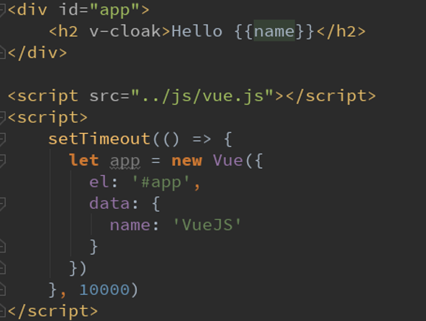

在app实例解析div标签前，h2中有的v-cloak
而在解析div标签后，h2中没有v-cloak
style 中的样式也会随之失效

#### 绑定属性

##### v-bind绑定 src，href

Mystache语法用来动态绑定内容
v-bind指令用来动态绑定属性
	比如动态绑定a元素的href属性
	img元素的src属性
使用v-bind指令
	作用：动态绑定属性
	缩写(语法糖)：:
	预期：any (with argument) | Object (without argument)
	参数：attrOrProp (optional)

v-bind用于绑定一个或多个属性值，或者向另一个组件传递props值
在开发中，图片的链接src、网站的链接href、动态绑定一些类、样式等等都需要动态绑定


v-bind的语法糖


##### v-bind绑定class

绑定方式:对象语法
	对象语法的含义是：class后面跟的是一个对象
对象语法有以下四种用法:
class='{类名:boolean}'

```html
用法一：直接通过{}绑定一个类
<h2 :class="{'active': isActive}">Hello World</h2>

用法二：也可以通过判断，传入多个值
<h2 :class="{'active': isActive, 'line': isLine}">Hello World</h2>

用法三：和普通的类同时存在，并不冲突
注：如果isActive和isLine都为true，那么会有title/active/line三个类
<h2 class="title" :class="{'active': isActive, 'line': isLine}">Hello World</h2>

用法四：如果过于复杂，可以放在一个methods或者computed中
注：classes是一个计算属性
<h2 class="title" :class="classes">Hello World</h2>

//将对象存放到data内使用好像不行
```

绑定方式：数组语法
	数组语法的含义是：class后面跟的是一个数组

```html
用法一：直接通过{}绑定一个类
<h2 :class="['active']">Hello World</h2>

用法二：也可以传入多个值
<h2 :class="['active', 'line']">Hello World</h2>
                               
用法三：和普通的类同时存在，并不冲突
<h2 class="title" :class="['active', 'line']">Hello World</h2>
                            
用法四：如果过于复杂，可以放在一个methods或者computed中
注：classes是一个计算属性
<h2 class="title" :class="classes">Hello World</h2>

//将数组存放到data内使用好像不行
```

##### v-bind绑定style

利用v-bind:style来绑定一些CSS内联样式
在写CSS属性名的时候，例如font-size
		我们可以使用驼峰式：fontSize	
		或短横线分隔(记得用单引号括起来) 'font-size'
绑定class有两种方式:
		对象语法
		数组语法

对象语法:

```javascript
:style="{key1:value1,key2:value2}"
满足这样的形式

:style="{color: currentColor, fontSize: fontSize + 'px'}"
style后面跟的是一个对象类型
	对象的key是css属性名称
	对象的value是具体赋的值，值可以来自于data中的属性
		注意：如果value的值不是一个字符串，那么被vue实例当作变量来解析

```

数组语法：

```html
<div v-bind:style="[baseStyles, overridingStyles]"></div>
style后面跟的是一个数组类型
数组类型的每一个元素内存放一个对象
多个值以，分割即可
<sctipt>
    .......{
    	el:....,
		data:{
    		baseStyles:{color:'red'},
    		overridingStyles:{fontSize:'50px'},
    	}
    }
</sctipt>

```

​		

### 计算属性

####  基本使用

我们可以通过插值语法显示一些data中的数据
但是在某些情况，我们可能需要对数据进行一些转换后再显示，或者需要将多个数据结合起来再显示
	例如：
			我们在data属性内有firstName和lastName两个变量，我们需要显示完整的名称。
			但是如果多个地方都需要显示完整的名称，我们就需要写多个{{firstName}} {{lastName}}
			我们可以将上面的代码换成计算属性，我们发现计算属性是写在实例的==computed==属性中的


虽然fullName是一个函数 但是写的时候不需要加()  后面会讲原因的
fullName(){ }   //这样直接创建函数，应该是ES6中的内容

#### 高阶操作

感觉好像也不是很高阶。。。。


#### 计算属性的set和get方法

```html
<!DOCTYPE html>
<html lang="en">

<head>
  <meta charset="UTF-8">
  <meta http-equiv="X-UA-Compatible" content="IE=edge">
  <meta name="viewport" content="width=device-width, initial-scale=1.0">
  <title>Document</title>
</head>

<body>
  <div id="app">
    <h1>{{fullName}}</h1>
  </div>
  <script src="../js/vue.js"></script>
  <script>
    const app = new Vue({
      el: "#app",
      data: {
        firstName: "chi",
        lastName: "ruofeng",
      },
      computed: {
        fullName: {
            //set方法只有在使用 app.fullName='huo guo' 时才会调用,此时'huo guo'会作为实参传给str
		   //99%的概率用不到set方法所以基本不写的
          set: function (str) {
            let name=str.split(' ');
            this.firstName=name[0];
            this.lastName=name[1];
          },
            //当直接使用 fullName属性时 会自动调用get方法
          get: function () {
            return this.firstName + " " + this.lastName;
          }
        }
          //下面这种方法是最常用的，而且使用时只需写 fullname，不需要再加括号 
         fullname:function(){
        	return this.firstName + " " + this.lastName;
    	}
      }
    })
  </script>
</body>

</html>
```

#### computed和methods

methods和computed看起来都能实现我们的功能
但是我们使用computed个频繁一些
因为计算属性会进行缓存，如果多次使用，计算属性只会调用一次，而methods会多次调用


由于this.firstName和this.lastName都没有变化
所以fullName会被vue缓存起来，执行上面代码时fullName只会被执行一次
而methods中的getFullName会被执行多次

### ES6知识的补充

#### 块级作用域

ES5之前因为if和for都没有块级作用域的概念，所以在很多时候我们都必须借助
function作用域来解决应用外面变量的问题
ES6中，加入了left，let它是有if和for的块级作用域的

```html
<!DOCTYPE html>
<html lang="en">

<head>
  <meta charset="UTF-8">
  <meta http-equiv="X-UA-Compatible" content="IE=edge">
  <meta name="viewport" content="width=device-width, initial-scale=1.0">
  <title>Document</title>
</head>

<body>
  <button>0</button>
  <button>1</button>
  <button>2</button>
</body>
<script>
  const btnList = document.getElementsByTagName("button");

 for(var i=0;i<btnList.length;i++){
   btnList[i].addEventListener("click",function(){
      console.log(i);
   },false);
 }
//最终结果无论点那个按钮 答案都是3
</script>

</html>
```

```html
<!DOCTYPE html>
<html lang="en">

<head>
  <meta charset="UTF-8">
  <meta http-equiv="X-UA-Compatible" content="IE=edge">
  <meta name="viewport" content="width=device-width, initial-scale=1.0">
  <title>Document</title>
</head>

<body>
  <button>0</button>
  <button>1</button>
  <button>2</button>
</body>
<script>
  const btnList = document.getElementsByTagName("button");
  for (let i = 0; i < btnList.length; i++) {
    btnList[i].addEventListener("click", function () {
      console.log(i);
    }, false);
  }
    //点击第一个按钮 显示0
	//   第二个按钮 显示1
	
</script>

</html>
```

只改变了声明变量时的关键字，结果却不同，是因为var没有块级作用域，而let有块级作用域

#### const

①一旦给const修饰的标识符被赋值后，不能修改
②使用const定义标识符，必须进行赋值
③const定义的对象不能修改，但是可以修改对象内部的属性

#### 属性的增强写法

```javascript
//ES5
const name="xi gua";
const age=18;
const obj={
    name:name,
    age:age,
}
//ES6
const name="xi gua";
const age=18;
const obj={
    name,
    age,
}
```

#### 函数的增强写法

```javascript
//ES5
const obj={
    run:function(){
	}
}
//ES6
const obj={
    run(){
	}
}
```

#### for循环遍历数组

```html
<!DOCTYPE html>
<html lang="en">
<head>
  <meta charset="UTF-8">
  <meta http-equiv="X-UA-Compatible" content="IE=edge">
  <meta name="viewport" content="width=device-width, initial-scale=1.0">
  <title>Document</title>
</head>
<body>
  <script>
    const moveList=["海王","海泽王","妖精的尾巴","火影忍者"];
    //老方法
    for(let i=0;i<moveList.length;i++){
      console.log(moveList[i]);
    }
   	//新方法1，index是字符串形式得
    for(let index in moveList){
      console.log(moveList[index]);
    }
    //新方法2
    for(let item of moveList){
      console.log(item);
    }
  </script>
</body>
</html>
```

#### ``反单引号

作用 定义字符串使用，与''和""的功能类似，但是它有更强大的功
它可以换行使用

```javascript
const str1="12";
const str2='12';
const str3=`1
		   2`;
```


#### 类的写法

```javascript
//es5
function Person(){
    run(){
	}
}
//es6
class Person{
  run(){
    console.log("在跑步");
  }
}
```


```javascript
//构造函数的写法 
class Person{
	constructor(name,age){
		this.name=name;
    	this.age=age;
    }
}
const p = new Person('why',18);
```


#### 箭头函数

##### 使用

```javascript
//参数的问题
//1.1两个参数
const sum = (num1,num2) =>{
    return num1+num2
}
//1.2一个参数时，括号可以省略
const power = num1 =>{
	return num1*num1
}
//代码块内代码行数
//2.1代码块内有多行，正常写
const test = () => {
	console.log("哈哈哈哈");
     console.log("呵呵呵呵呵");
}
//2.2代码块内只有一行,省略尖括号,此处也省略return,就是会自动返回num1+num2的值
const test1 = (num1,num2) => num1+num2
```

##### 箭头函数中的this

```javascript
//箭头函数中的this是如何查找的
//向外层作用域中，一层层查找this
<!DOCTYPE html>
<html lang="en">

<head>
  <meta charset="UTF-8">
  <meta http-equiv="X-UA-Compatible" content="IE=edge">
  <meta name="viewport" content="width=device-width, initial-scale=1.0">
  <title>Document</title>
</head>

<body>
  <script>
    setTimeout(
      function () {
        console.log(this); //window
      }
      , 1000);
    setTimeout(() => {
      console.log(this); //this为window
    }
      , 1000)

    const obj = {
      fun() {

        test1: setTimeout(function () {
          console.log(this); //window
        }, 1000);
        //箭头函数this的判定方法，就是在箭头函数的外层放一个this
        //判断在外边那个this指向的是谁就好了
        console.log(this);  //这个this为obj
        test2: setTimeout(() => {
          console.log(this);  //this为obj
        }, 1000)
      }
    }
    obj.fun();
  </script>
</body>

</html>
```

#### 对象的解构

```javascript
<!DOCTYPE html>
<html lang="en">
<head>
  <meta charset="UTF-8">
  <meta http-equiv="X-UA-Compatible" content="IE=edge">
  <meta name="viewport" content="width=device-width, initial-scale=1.0">
  <title>Document</title>
</head>
<body>
  <script>
    const obj={
      name:'xiaoming',
      age:18,
      heigh:1.88,
    };
    const {name,age,heigh}=obj;
    //这时候name的值为xiaoming
	//age为 18
	//heigh为 1.88
	//这些赋值不会以为顺序的改变而改变
    console.log(name,age,heigh);

  </script>
</body>
</html>
```

#### 将数组添加到数组内


### 事件监听

在前端开发中，我们需要经常和用户交互
	这个时候，我们就必须监听用户发生的的事件，比如点击，拖拽，键盘事件等等
	在Vue中使用==v-on==指令监听事件

v-on介绍
	作用：绑定事件监听器
	缩写：@
	预期：Function|Inline Statement|Object
	参数：event

#### v-on参数问题

①事件调用的方法没有参数，以下两种写法都可行

```html
<button @click="btn1Click()"></button>
<button @click="btn1Click"></button>
```

②事件调用的方法本身是需要参数的，根据写法的不同会有三种情况

```html
<!DOCTYPE html>
<html lang="en">

<head>
  <meta charset="UTF-8">
  <meta http-equiv="X-UA-Compatible" content="IE=edge">
  <meta name="viewport" content="width=device-width, initial-scale=1.0">
  <title>Document</title>
</head>

<body>
  <div id="app">
    <div>{{message}}</div>
    <button @click="btn1Click">1</button>		<!--不会报错，相当于传进去一个事件对象 event -->
    <button @click="btn1Click()">2</button>		<!--不会报错，不传参数相当于 函数声明了形参，但没有赋值													结果显示undefined-->
    <button @click="btn1Click(123)">3</button>		<!--正常显示123-->
  </div>
  <script src="../js/vue.js"></script>
  <script>
    const app = new Vue({
      el: "#app",
      data: {
        message: 0,
      },
      methods: {
        btn1Click(hhh) {
          console.log(hhh)
        }

      }
    })
  </script>
</body>

</html>
```

③方法定义时，我们需要event对象，同时又需要其他参数
	在调用方法时，实参传$event,那么对应的形参将接收到event事件对象

```html
<!DOCTYPE html>
<html lang="en">

<head>
  <meta charset="UTF-8">
  <meta http-equiv="X-UA-Compatible" content="IE=edge">
  <meta name="viewport" content="width=device-width, initial-scale=1.0">
  <title>Document</title>
</head>

<body>
  <div id="app">
    <div>{{message}}</div>
    <button @click="btn1Click(123,$event)">1</button>
 
  </div>
  <script src="../js/vue.js"></script>
  <script>
    const app = new Vue({
      el: "#app",
      data: {
        message: 0,
      },
      methods: {
        btn1Click(msg,event) {
          console.log(msg);
          console.log(event);
        }

      }
    })
  </script>
</body>

</html>
```

#### ==一种特例==
当事件调用的方法在计算属性内时，那么此时调用的计算属性就需要加上()


#### v-on修饰符

Vue提供了修饰符来帮助我们方便的处理一些事件
	①阻止事件向上冒泡
		.stop - 调用 event.stopPropagation()
	②阻止默认行为
		.prevent - 调用 event.preventDefault()。
	③特定键盘键帽的触发
		.{keyCode | keyAlias} - 只当事件是从特定键触发时才触发回调。
	④监听组件根元素的原生事件。
		.native 
	⑤只触发一次回调
		.once 
	

### 条件判断

#### v-if,v-else,v-else-if

这三个指令与JavaScript的条件语句if、else、else if类似
Vue的条件指令可以根据表达式的值在DOM中渲染或销毁元素或组件

v-if的原理
	v-if后面的条件为false时，对应的元素以及其子元素不会渲染
	p也就是根本没有不会有对应的标签出现在DOM中

以下为v-else-if案例，但是不建议在项目中这样做，代码繁琐不容易维护，
如果有以下需求一般都写在计算属性中


v-if和v-else在项目中用的比较频繁


#### 用户登录切换案例

```html
<!DOCTYPE html>
<html lang="en">
<head>
  <meta charset="UTF-8">
  <meta http-equiv="X-UA-Compatible" content="IE=edge">
  <meta name="viewport" content="width=device-width, initial-scale=1.0">
  <title>Document</title>
</head>
<body>
  <div id="app">
    <span v-if="isFalg">
      <label for="username">账号登陆</label>
      <input type="text" id="username" placeholder="账号" >
    </span>
    <span v-else>
      <label for="useremail">邮箱登陆</label>
      <input type="text" id="useremail" placeholder="邮箱" >
    </span>
    <button @click="isFalg=!isFalg">切换</button>
  </div>
  <script src="../js/vue.js"></script>
  <script>
    const app=new Vue({
      el:"#app",
      data:{
        isFalg:"true",
      }
    })
  </script>
</body>
</html>
```

\<lable>\</lable\>标签内for属性，当 for属性的属性值 与 input标签内的 id属性值相等时
点击lable内的文字，光标将会自动移到input内

上面的案例会出现一些问题，由于vue底层的virtual dom(虚拟dom) ，vue在渲染浏览器前，会将dom内的元素渲染
到虚拟dom中，然后在渲染到浏览器中。vue出于性能的考虑 尽可能地复用元素，但是会导致上述的案例中 如果在文本框内输入内容，然后再点击按钮切换 会发生先前输入的内容会出现在切换后的文本框内。
解决这个问题，在input标签中添加  key 属性，两个key的属性值不同，就可以避免这个问题，如下所示

```html
<!DOCTYPE html>
<html lang="en">
<head>
  <meta charset="UTF-8">
  <meta http-equiv="X-UA-Compatible" content="IE=edge">
  <meta name="viewport" content="width=device-width, initial-scale=1.0">
  <title>Document</title>
</head>
<body>
  <div id="app">
    <span v-if="isFalg">
      <label for="username">账号登陆</label>
      <input type="text" id="username" placeholder="账号" key="username">
    </span>
    <span v-else>
      <label for="useremail">邮箱登陆</label>
      <input type="text" id="useremail" placeholder="邮箱" key="email">
    </span>
    <button @click="isFalg=!isFalg">切换</button>
  </div>
  <script src="../js/vue.js"></script>
  <script>
    const app=new Vue({
      el:"#app",
      data:{
        isFalg:"true",
      }
    })
  </script>
</body>
</html>
```

#### v-show

v-show的用法和v-if非常相似，也用于决定一个元素是否渲染：
v-if和v-show对比
	v-if 当条件为false时，压根不会有对应的元素在DOM中
	v-show 当条件为false时，仅仅是将元素的display属性设置为none，元素还存在DOM中

开发中如何选择
	当需要在显示与隐藏之间切片很频繁时，使用v-show
	当只有一次切换时，通过使用v-if

```html
<!DOCTYPE html>
<html lang="en">
<head>
  <meta charset="UTF-8">
  <meta http-equiv="X-UA-Compatible" content="IE=edge">
  <meta name="viewport" content="width=device-width, initial-scale=1.0">
  <title>Document</title>
</head>
<body>
  <div id="app">
    <h2 v-if="isFlag">{{message}}</h2>
    <h2 v-show="isFlag">{{message}}</h2>
  </div>
  <script src="../js/vue.js"></script>
  <script>
    const app=new Vue({
      el:"#app",
      data:{
        message:"哇哈哈",
        isFlag:"true",
      }
    })
  </script>
</body>
```

### 循环遍历

#### v-for遍历数组

①在遍历的过程中，没有使用索引值（下标值）
②在遍历的过程中，获取索引值

```html
<!DOCTYPE html>
<html lang="en">
<head>
  <meta charset="UTF-8">
  <meta http-equiv="X-UA-Compatible" content="IE=edge">
  <meta name="viewport" content="width=device-width, initial-scale=1.0">
  <title>Document</title>
</head>
<body>
  <div id="app">
    <ul>
      <!-- 在遍历过程中没有使用下标索引 -->
      <li v-for="item in nameList">{{item}}</li>
    </ul>
    <ul>
      <!-- 在遍历的过程中，获取索引值 -->
      <li v-for="(item,index) in nameList">{{index+" "+item}}</li>
    </ul>
  </div>
  <script src="../js/vue.js"></script>
  <script>
    const app=new Vue({
      el:"#app",
      data:{
        nameList:["毛泽东","周恩来","邓小平","邓稼先"],
      }
    })
  </script>
</body>
</html>
```

#### v-for遍历对象

```html
<!DOCTYPE html>
<html lang="en">
<head>
  <meta charset="UTF-8">
  <meta http-equiv="X-UA-Compatible" content="IE=edge">
  <meta name="viewport" content="width=device-width, initial-scale=1.0">
  <title>Document</title>
</head>
<body>
  <div id="app">
    <ul>
      <!-- 1.在遍历对象的过程中，如果只是获取一个值，那么获取到的是value -->
      <li v-for="item in person">{{item}}</li>
    </ul>
    <ul>
      <!-- 2.获取key和value 格式(value,key)-->
      <li v-for="(value,key) in person">{{key+" "+value}}</li>
    </ul>
    <ul>
      <!-- 3.获取key和value和index 格式(value,key,index)-->
      <li v-for="(value,key,index) in person">{{key+" "+value+" "+index}}</li>
    </ul>
  </div>
  <script src="../js/vue.js"></script>
  <script>
    const app=new Vue({
      el:"#app",
      data:{
        person:{
          name:"可可",
          age:23,
          height:1.57
        }
      }
    })
  </script>
</body>
</html>
```

#### v-for遍历数字

```html
<span v-for="item in 5">{{item}}</span>   1,2,3,4,5
```


#### 组件的key属性

官方推荐我们在使用v-for时，给对应的元素或组件添加上一个:key属性。
为什么需要这个key属性呢（了解）？
	这个其实和Vue的虚拟DOM的Diff算法有关系。
	这里我们借用[React’s](https://link.zhihu.com/?target=https://calendar.perfplanet.com/2013/diff/)[ diff algorithm](https://link.zhihu.com/?target=https://calendar.perfplanet.com/2013/diff/)中的一张图来简单说明一下：

当某一层有很多相同的节点时，也就是列表节点时，我们希望插入一个新的节点
	我们希望可以在B和C之间加一个F，Diff算法默认执行起来是这样的。
	即把C更新成F，D更新成C，E更新成D，最后再插入E，是不是很没有效率？

所以我们需要使用key来给每个节点做一个唯一标识
	Diff算法就可以正确的识别此节点
	找到正确的位置区插入新的节点。

所以一句话，**key**的作用主要是为了高效的更新虚拟DOM


#### 数组中哪些方法是响应式的

- push()
- pop()
- shift()
- unshift()
- splice()
- sort()
- reverse()

响应式指的是改变数据，浏览器界面同时跟着改变
使用 vue对象名.数组名[索引]=改变的内容  数据虽然发生了改变
但是界面没有改变，是因为Vue内部没有监听这种改变的方法，所以不会
帮你重新渲染页面

Vue有一个内部实现的函数，可以用来修改数组内容(当然使用splice()也可以)
Vue.set(要修改的对象，索引值，修改后的值)

### 过滤器

过滤器（filters）是Vue实例对象的属性，和el，computed，data是同一级别的

```html
<h2>{{totalPrice|showPrice}}</h2>
//将totalPrice作为showPrice函数的参数传进去 计算
```

图书购物车中的案例

```html
<!--html代码-->
<!DOCTYPE html>
<html lang="en">

<head>
  <meta charset="UTF-8">
  <meta http-equiv="X-UA-Compatible" content="IE=edge">
  <meta name="viewport" content="width=device-width, initial-scale=1.0">
  <title>Document</title>
  <link rel="stylesheet" href="./css/改.css">
</head>

<body>
  <div id="app">
    <div v-if="books.length">
      <table>
        <thead>
          <tr>
            <th></th>
            <th>书籍名称</th>
            <th>出版日期</th>
            <th>价格</th>
            <th>购买数量</th>
            <th>操作</th>
          </tr>
        </thead>
        <tbody>
          <tr v-for="(item,index) in books">
            <td>{{item.id}}</td>
            <td>{{item.bookName}}</td>
            <td>{{item.date}}</td>
            <td>{{item.price|showPrice}}</td> <!--过滤器的使用-->
            <td>
              <button @click="creatment(index)">+</button>
              {{item.count}}
              <button @click="decreatment(index)" :disabled="books[index].count<=1">-</button> 
                <!--数量小于1的时候按钮失效-->
            </td>
            <td>
              <button @click="removeBooks(index)">移除</button>
            </td>
          </tr>
        </tbody>
      </table>
      <h2>{{totalPrice|showPrice}}</h2>
    </div>
    <h2 v-else>购物车为空</h2>
  </div>
  <script src="../js/vue.js"></script>
  <script src="./js/改.js"></script>

</body>

</html>
```

```css
/*css代码*/
/* 购物车样式 */
#app table{
  border: 1px solid black;
  border-collapse: collapse;
  border-spacing: 0;
  
}
#app table th,#app table td{
  border: 1px solid black;
  padding: 8px 4px;
}
#app table th{
  background-color: #F6F6F6;
}
```

```js
//js代码
const app = new Vue({
  el: "#app",
  data: {
    books: [
      {
        id: 1,
        bookName: "《算法导论》",
        date: "2006 - 9",
        price: 85.00,
        count: 1,
      },
      {
        id: 2,
        bookName: "《UNIX编程艺术》",
        date: "2006 - 2",
        price: 59.00,
        count: 1,
      },
      {
        id: 3,
        bookName: "《编程珠玑》",
        date: "2008 - 10",
        price: 39.00,
        count: 1,
      },
      {
        id: 4,
        bookName: "《代码大全》",
        date: "2006 - 3",
        price: 128.00,
        count: 1,
      },

    ]
  },
  methods: {
    creatment(index) {
      this.books[index].count++;
    },
    decreatment(index) {
      this.books[index].count--;
    },
    removeBooks(index){
      this.books.splice(index,1);
    }
  },
  computed: {
    totalPrice(){
      let price=0;
      for(let i=0;i<this.books.length;i++){
        price+=this.books[i].price*this.books[i].count;
      }
      return price;
    }
  },
  /* 过滤器,将过滤器前面的数作为参数传进来，return 回去的值将会代替那个传进来的参数
     并进行显示*/
  filters: {
    showPrice(price) {
      return "￥" + price.toFixed(2);
    }
  }
})
```

### 高阶函数

#### filter(参数)

filter的参数为一个回调函数，filter中的回调函数有一个要求：必须返回一个boolean值
true:当返回true时，函数内部会自动将这次回调的n加入到新的数组中
false:当返回false时，函数内部会过滤掉这次的n

这个函数的作用是过滤掉原数组中的元素，将需要的元素添加到新的数组中，原数组中的元素不会发生变化

```html
<!DOCTYPE html>
<html lang="en">
<head>
  <meta charset="UTF-8">
  <meta http-equiv="X-UA-Compatible" content="IE=edge">
  <meta name="viewport" content="width=device-width, initial-scale=1.0">
  <title>Document</title>
</head>
<body>
  <script>
    const arry=[11,22,33,111,230,99];
    let newArry=arry.filter(function(n){	//n存储的为arry中元素
      return n<100;
    })
    console.log(newArry); //结果为11，22，33，99
  </script>
</body>
</html>
```

#### map(参数)

map的参数为一个回调函数，
回调函数的返回值将会加入到新的数组的

这个函数的作用是，对原数组的元素进行操作，并将其添加到新的数组中，原数组中的元素不会发生变化

```html
<!DOCTYPE html>
<html lang="en">
<head>
  <meta charset="UTF-8">
  <meta http-equiv="X-UA-Compatible" content="IE=edge">
  <meta name="viewport" content="width=device-width, initial-scale=1.0">
  <title>Document</title>
</head>
<body>
  <script>
    const arry=[1,2,3];
    let newArry=arry.map(function(n){	//n存储的为arry中元素
      return n*2;
    })
    console.log(newArry); //结果为2，4，6
  </script>
</body>
</html>
```

#### reduce(参数一，参数二)

作用将数组中的内容进行汇总
数组.reduce(function(preValue,n){
				return 100; 
				},currentValue)
currentValue的值为preValue的初始化值
n 为数组元素的值
return 100 的值将保存在preValue

```html
<!DOCTYPE html>
<html lang="en">
<head>
  <meta charset="UTF-8">
  <meta http-equiv="X-UA-Compatible" content="IE=edge">
  <meta name="viewport" content="width=device-width, initial-scale=1.0">
  <title>Document</title>
</head>
<body>
  <script>
    const arry=[1,2,3,4,5];
    let total=arry.reduce(function(preValue,n){
      return preValue+n;
    },0)
    //第一次 preValue:0  n:1
    //第二次 preValue:1  n:2
    //第三次 preValue:3  n:3
    //第四次 preValue:6  n:4
    //第五次 preValue:10  n:5
    //total=15
    console.log(total);

    
  </script>
</body>
</html>
```

### v-model表单绑定

#### 使用和原理

Vue中使用v-model指令来实现表单元素和数据的双向绑定。
案例的解析:

- 当我们在输入框输入内容时

- 因为input中的v-model绑定了message，
  所以会实时将输入的内容传递给message，message发生改变。

- 当message发生改变时，因为上面我们使用Mustache语法，
  将message的值插入到DOM中，所以DOM会发生响应的改变。

- 所以，通过v-model实现了双向的绑定。

  
  

- 当然，我们也可以将v-model用于textarea元素
  

原理 
    v-model其实是一个语法糖，它的背后本质上是包含两个操作：
     1.v-bind绑定一个value属性
     2.v-on指令给当前元素绑定input事件
也就是说下面的代码：等同于下面的代码：

```html
<input type="text" v-model="message">
等同于
<input type="text" v-bind:value="message" v-on:input="message = $event.target.value">

```


#### v-model和radio的结合使用

```html
<!DOCTYPE html>
<html lang="en">

<head>
  <meta charset="UTF-8">
  <meta http-equiv="X-UA-Compatible" content="IE=edge">
  <meta name="viewport" content="width=device-width, initial-scale=1.0">
  <title>Document</title>
</head>

<body>
  <div id="app">
    <label for="male">
      <input type="radio" id="male" name="sex" value="男" v-model="sex">男
	  <!--name属性的作用是使得两个单选按钮互斥，不会同时可以按下-->
	  <!--因为v-model绑定的都是"sex",所以name属性可以不用写-->
    </label>
    <label for="female">
      <input type="radio" id="female" name="sex" value="女"  v-model="sex">女
    </label>
    <h2>您选择的性别是:{{sex}}</h2>
  </div>
  <script src="../js/vue.js"></script>
  <script>
    const app=new Vue({
      el:"#app",
      data:{
        sex:"男", //可以在sex属性值中输入男，这样单选按钮就会默认选中 男那个按钮
      }
    })
  </script>
</body>

</html>
```

#### v-model结合checkbox使用

```html
<!--单个复选框-->
  ①v-model即为布尔值。
  ②此时input的value并不影响v-model的值。
  ③总的来说就是，复选框打勾，v-model对应的 data属性中的变量值 为true，
<!--案例：是否同意协议-->
<!DOCTYPE html>
<html lang="en">

<head>
  <meta charset="UTF-8">
  <meta http-equiv="X-UA-Compatible" content="IE=edge">
  <meta name="viewport" content="width=device-width, initial-scale=1.0">
  <title>Document</title>
</head>

<body>
  <div id="app">
    <label for="agree">
      <input type="checkbox" id="agree" v-model="check">同意协议
    </label>
    <h2>您选择的是:{{check}}</h2>
    <button :disabled="!check">下一步</button>
  </div>
  <script src="../js/vue.js"></script>
  <script>
    const app = new Vue({
      el: "#app",
      data: {
       check: false,
      }
    })
  </script>
</body>

</html>
```

```html
<!--多个复选框-->
当是多个复选框时，因为可以选中多个，所以对应的data中属性是一个数组。
当选中某一个时，就会将input的value添加到数组中。
<!--案例：添加爱好到指定data数组中-->
<!DOCTYPE html>
<html lang="en">

<head>
  <meta charset="UTF-8">
  <meta http-equiv="X-UA-Compatible" content="IE=edge">
  <meta name="viewport" content="width=device-width, initial-scale=1.0">
  <title>Document</title>
</head>

<body>
  <div id="app">
    <label>
      <input type="checkbox" v-model="hobby" value="篮球">篮球
    </label>
    <label>
      <input type="checkbox" v-model="hobby" value="足球">乒乓球
    </label>
    <label>
      <input type="checkbox" v-model="hobby" value="羽毛球">羽毛球
    </label>
    <h2>您选择的爱好是:{{hobby}}</h2>
    
  </div>
  <script src="../js/vue.js"></script>
  <script>
    const app = new Vue({
      el: "#app",
      data: {
        hobby: [],
      }
    })
  </script>
</body>

</html>
```

#### v-model结合select使用

```html
<!-- 单选 -->
v-model绑定的是一个字符串。
当我们选中option中的一个时，会将它对应的value赋值到fruit中

<!DOCTYPE html>
<html lang="en">
<head>
  <meta charset="UTF-8">
  <meta http-equiv="X-UA-Compatible" content="IE=edge">
  <meta name="viewport" content="width=device-width, initial-scale=1.0">
  <title>Document</title>
</head>
<body>
  <!-- 只选中一个 -->
  <div id="app">
    <select name="abc" v-model="fruit">
      <option value="香蕉">香蕉</option>
      <option value="苹果">苹果</option>
      <option value="橘子">橘子</option>
    </select>
    {{fruit}}
  </div>
  <script src="../js/vue.js"></script>
  <script>
    const app=new Vue({
      el:"#app",
      data:{
        fruit:"苹果",
      }
    })
  </script>
</body>
</html>
```

```html
<!-- 多选 -->
v-model绑定的是一个数组
当选中多个值时，就会将选中的option对应的value添加到数组fruit中

<!DOCTYPE html>
<html lang="en">
<head>
  <meta charset="UTF-8">
  <meta http-equiv="X-UA-Compatible" content="IE=edge">
  <meta name="viewport" content="width=device-width, initial-scale=1.0">
  <title>Document</title>
</head>
<body>
  <!-- ctrl+左键选中多个 -->
  <div id="app">
    <select name="abc" v-model="fruit" multiple>
      <option value="香蕉">香蕉</option>
      <option value="苹果">苹果</option>
      <option value="橘子">橘子</option>
    </select>
    {{fruit}}
  </div>
  <script src="../js/vue.js"></script>
  <script>
    const app=new Vue({
      el:"#app",
      data:{
        fruit:[],
      }
    })
  </script>
</body>
</html>
```

#### 值绑定

动态的给value赋值而已：
	我们前面的value中的值，可以回头去看一下，都是在定义input的时候直接给定的。
	但是真实开发中，这些input的值可能是从网络获取或定义在data中的。
	所以我们可以通过v-bind:value动态的给value绑定值。
	这不就是v-bind吗？

```html
<!DOCTYPE html>
<html lang="en">
<head>
  <meta charset="UTF-8">
  <meta http-equiv="X-UA-Compatible" content="IE=edge">
  <meta name="viewport" content="width=device-width, initial-scale=1.0">
  <title>Document</title>
</head>
<body>
  <div id="app">
    <label v-for="item in original">
      <input type="checkbox" :value="item" v-model="fruit" >{{item}}
    </label>
    {{fruit}}
  </div>
  <script src="../js/vue.js"></script>
  <script>
    const app=new Vue({
      el:"#app",
      data:{
        fruit:[],
        original:["香蕉","苹果","橘子","火龙果"],
      }
    })
  </script>
</body>
</html>
```

#### 三个修饰符

##### lazy

默认情况下，v-model默认是在input事件中同步输入框的数据的
也就是说，一旦有数据发生改变对应的data中的数据就会自动发生改变
lazy修饰符可以让数据在失去焦点或者回车时才会更新：

```html
<!DOCTYPE html>
<html lang="en">
<head>
  <meta charset="UTF-8">
  <meta http-equiv="X-UA-Compatible" content="IE=edge">
  <meta name="viewport" content="width=device-width, initial-scale=1.0">
  <title>Document</title>
</head>
<body>
  <div id="app">
    <input type="text" v-model.lazy="message">
    <br />
    {{message}}
  </div>
  <script src="../js/vue.js"></script>
  <script>
    const app=new Vue({
      el:"#app",
      data:{
        //当鼠标光标移出，或者按下回车键以后，才将文本框内的内容传入message
        message:"",
      }
    })
  </script>
</body>
</html>
```

##### number

​	默认情况下，在输入框中无论我们输入的是字母还是数字，都会被当做字符串类型进行处理。
​	但是如果我们希望处理的是数字类型，那么最好直接将内容当做数字处理。
​	number修饰符可以让在输入框中输入的内容自动转成数字类型：

```html
<!DOCTYPE html>
<html lang="en">
<head>
  <meta charset="UTF-8">
  <meta http-equiv="X-UA-Compatible" content="IE=edge">
  <meta name="viewport" content="width=device-width, initial-scale=1.0">
  <title>Document</title>
</head>
<body>
  <div id="app">
    <input type="number" v-model.number="message">
    <br />
    {{typeof message}}
  </div>
  <script src="../js/vue.js"></script>
  <script>
    const app=new Vue({
      el:"#app",
      data:{
        //将值转化为数字以后，再传入message中
        message:0,
      }
    })
  </script>
</body>
</html>
```

##### trim

如果输入的内容首尾有很多空格，通常我们希望将其去除
trim修饰符可以过滤内容左右两边的空格

```html
<!DOCTYPE html>
<html lang="en">
<head>
  <meta charset="UTF-8">
  <meta http-equiv="X-UA-Compatible" content="IE=edge">
  <meta name="viewport" content="width=device-width, initial-scale=1.0">
  <title>Document</title>
</head>
<body>
  <div id="app">
    <input type="text" v-model.trim="message">
    <br />
    {{message}}
  </div>
  <script src="../js/vue.js"></script>
  <script>
    const app=new Vue({
      el:"#app",
      data:{
        //过滤掉两边的空格，再将字符串传入在data中的messsage属性内
        message:"",
      }
    })
  </script>
</body>
</html>
```

## 组件化

组件(component)的使用分成三个步骤：
	1️⃣：创建组件构造器
	2️⃣：注册组件
	3️⃣：使用组件
	

### 组件的基本使用

标签的命名不要使用驼峰命名(弹幕网友说的)

```html
<!DOCTYPE html>
<html lang="en">
<head>
  <meta charset="UTF-8">
  <meta http-equiv="X-UA-Compatible" content="IE=edge">
  <meta name="viewport" content="width=device-width, initial-scale=1.0">
  <title>Document</title>
</head>
<body>
  <div id="app">
    <!-- 3.在Vue实例管理的范围内 使用组件 -->
    <my-cpn></my-cpn>
    <my-cpn></my-cpn>
    <my-cpn></my-cpn>
  </div>
  <script src="../js/vue.js"></script>
  <script>
    // 1.创建组件构造器对象
    const cpnC=Vue.extend({
        //使用``可以进行换行
      template:`
          <div>
            <h2>娃哈哈</h2>
            <p>aaaaaaaa</p>
          </div>
          `
    });
    //2.注册组件
    // Vue.component(待会儿要使用的标签名,第一步创建的构造器对象)
    Vue.component("my-cpn",cpnC);
    const app=new Vue({
      //挂载#app标签，一定要写的
      el:'#app'
    });
  </script>
</body>
</html>
```

### 全局组件和局部组件

全局组件
	当我们通过调用Vue.component()注册组件时，组件的注册是全局的
	全局组件可以在挂载任意Vue对象的标签下使用

```html
<!DOCTYPE html>
<html lang="en">
<head>
  <meta charset="UTF-8">
  <meta http-equiv="X-UA-Compatible" content="IE=edge">
  <meta name="viewport" content="width=device-width, initial-scale=1.0">
  <title>Document</title>
</head>
<body>
  <div id="app1">
    <cpn></cpn>
    <cpn></cpn>
  </div>
  <div id="app2">
    <cpn></cpn>
    <cpn></cpn>
  </div>
  <script src="../js/vue.js"></script>
  <script>
    // 创建组件构造器
    const cpnC=Vue.extend({
      // 模板
      template:`
        <div>
          <h2>嘿嘿</h2>
          <h2>呵呵</h2>
          <h2>哈哈</h2>
        </div>
      `
    });
    // 注册组件,此时注册的是全局组件，只要挂载了Vue实例的标签，都可以使用这个组件
    Vue.component("cpn",cpnC);
    // Vue实例
    const app1=new Vue({
      el:"#app1",
    })
    const app2=new Vue({
      el:"#app2",
    })
  </script>
</body>
</html>
```

局部组件
	如果我们注册的组件是挂载在某个实例中, 那么就是一个局部组件
	该局部组件只能 挂载该实例的标签下使用

```html
<!DOCTYPE html>
<html lang="en">
<head>
  <meta charset="UTF-8">
  <meta http-equiv="X-UA-Compatible" content="IE=edge">
  <meta name="viewport" content="width=device-width, initial-scale=1.0">
  <title>Document</title>
</head>
<body>
  <div id="app1">
    <cpn></cpn>
    <cpn></cpn>
  </div>

  <script src="../js/vue.js"></script>
  <script>
    // 创建组件构造器
    const cpnC=Vue.extend({
      // 模板
      template:`
        <div>
          <h2>嘿嘿</h2>
          <h2>呵呵</h2>
          <h2>哈哈</h2>
        </div>
      `
    });

    // Vue实例
    const app1=new Vue({
      el:"#app1",
      components:{
        // 注册局部组件，该局部组件只能 挂载该实例的标签下使用
        cpn:cpnC,
      }
    })


  </script>
</body>
</html>
```

### 父组件和子组件

子组件需要在父组件内注册
子组件只能在父组件内被识别，如果将子组件以标签的型式 放到dom里面会被浏览器忽略的

```html
<!DOCTYPE html>
<html lang="en">
<head>
  <meta charset="UTF-8">
  <meta http-equiv="X-UA-Compatible" content="IE=edge">
  <meta name="viewport" content="width=device-width, initial-scale=1.0">
  <title>Document</title>
</head>
<body>
  <div id="app">
    <!-- 不能在此处使用cpn1标签，因为cpnC1组件没有在实例对象下注册 -->
     <!-- cpn2标签的使用过程，先在实例对象中内寻找有无对应的局部组件，再去寻找全局组件 -->
    <cpn2></cpn2>

  </div>
  <script src="../js/vue.js"></script>
  <script>
    //  子组件
    const cpnC1=Vue.extend({
      template:`
        <div>
          <h2>222</h2>  
          <h2>222</h2>  
        </div>
      `
    });
    //父组件
    const cpnC2=Vue.extend({
      template:`
      <div>
          <h2>111</h2>  
          <h2>222</h2>  
          <cpn1></cpn1>
      </div>
      `,
      //子组件在父组件内注册
      components:{
        cpn1:cpnC1,
      }

    })
    //实例对象可以看做是root组件，所有组件的祖宗
    const app=new Vue({
      el:"#app",
      components:{
        // 父组件在实例对象内注册
        cpn2:cpnC2,
      }
    })
   
  </script>
</body>
</html>
```

### 组件语法糖的型式

语法糖的型式
省略了 创建组件构造器时 extend()的调用
Vue.extend()省略了，用{}代替掉直接注册组件了

局部组件语法糖

```html
<!DOCTYPE html>
<html lang="en">

<head>
  <meta charset="UTF-8">
  <meta http-equiv="X-UA-Compatible" content="IE=edge">
  <meta name="viewport" content="width=device-width, initial-scale=1.0">
  <title>Document</title>
</head>

<body>
  <div id="app1">
    <cpn></cpn>
    <cpn></cpn>
  </div>

  <script src="../js/vue.js"></script>
  <script>

    // Vue实例
    const app1 = new Vue({
      el: "#app1",
      components: {
        // 局部组件语法糖的调用
        cpn: {
          template: `
            <div>
              <h2>嘿嘿</h2>
              <h2>呵呵</h2>
              <h2>哈哈</h2>
            </div>
          `
        },
      }
    })


  </script>
</body>

</html>
```

```html
<!--全局组件的语法糖-->
<!DOCTYPE html>
<html lang="en">

<head>
  <meta charset="UTF-8">
  <meta http-equiv="X-UA-Compatible" content="IE=edge">
  <meta name="viewport" content="width=device-width, initial-scale=1.0">
  <title>Document</title>
</head>

<body>
  <div id="app1">
    <cpn></cpn>
    <cpn></cpn>
  </div>
  <cpn></cpn>
  <script src="../js/vue.js"></script>
  <script>
    //全局组件的语法糖调用
    Vue.component("cpn", {
      template: `
            <div>
              <h2>嘿嘿</h2>
              <h2>呵呵</h2>
              <h2>哈哈</h2>
            </div>
          `
    })
    // Vue实例
    const app1 = new Vue({
      el: "#app1",

    })


  </script>
</body>

</html>
```

### 模板的分离写法

将template内的html代码分离出来，然后挂载到对应的组件上
Vue提供了两种方案来定义HTML模块内容
使用\<script\>标签
使用\<template\>标签

①script标签

​	

​	②template标签

​	

### 组件的data属性

组件不能访问Vue实例数据
我们发现不能访问，而且即使可以访问，如果将所有的数据都放在Vue实例中，Vue实例就会变的非常臃肿。
结论：Vue组件应该有自己保存数据的地方

组件对象也有一个data属性(也可以有methods等属性)
只是这个data属性必须是一个函数
而且这个函数返回一个对象，对象内部保存着数据

为什么data在组件中必须是一个函数呢?
1️⃣首先，如果不是一个函数，Vue直接就会报错
2️⃣其次，原因是在于Vue让每个组件对象都返回一个新的对象，
	 因为如果是同一个对象的，组件在多次使用后会相互影响。

```html
<!DOCTYPE html>
<html lang="en">

<head>
  <meta charset="UTF-8">
  <meta http-equiv="X-UA-Compatible" content="IE=edge">
  <meta name="viewport" content="width=device-width, initial-scale=1.0">
  <title>Document</title>
</head>

<body>
  <div id="app">
    <cpn></cpn>
  </div>
  <!-- 分离出去的html代码 -->
  <template id="cpn">
    <div>
      <h2>当前计数为:{{num}}</h2>
      <button @click="creatment">+</button>
      <button @click="decreatment">-</button>
    </div>
  </template>
  <script src="../js/vue.js"></script>
  <script>
    // 组件注册
    Vue.component("cpn", {
      // 将模板的html代码分离出去
      template: "#cpn",
      /* 组件对象存储数据，data在数组中必须是一个函数，
      因为如果是一个对象的话，那么由标签所创造出来的每一个组件对象
      访问到的data都是同一个
      */
      data() {
        return {
          num: 0,
        }
      },
      methods: {
        creatment() {
          this.num++;
        },
        decreatment() {
          this.num--;
        }
      }
    })
    // 创建Vue实例对象
    const app = new Vue({
      el: "#app",
    })
  </script>
</body>

</html>
```

### 组件的通信

#### 父传子

在开发中，往往一些数据确实需要从上层传递到下层：
	比如在一个页面中，我们从服务器请求到了很多的数据。
	其中一部分数据，并非是我们整个页面的大组件来展示的，而是需要下面的子组件进行展示。
	这个时候，并不会让子组件再次发送一个网络请求，而是直接让大组件(父组件)将数据传递给小组件(子组件)
	
	真实的开发中，**Vue****实例和子组件的通信**和**父组件和子组件的通信**过程是一样的。

基本用法
	在组件中，使用选项props来声明需要从父级接收到的数据。
props的值有两种方式：
	方式一：字符串数组，数组中的字符串就是传递时的名称。

```html
<!DOCTYPE html>
<html lang="en">
<head>
  <meta charset="UTF-8">
  <meta http-equiv="X-UA-Compatible" content="IE=edge">
  <meta name="viewport" content="width=device-width, initial-scale=1.0">
  <title>Document</title>
</head>
<body>
  <div id="app">
    <!-- 3.将父组件data属性中的 movies赋值给 子组件中的cmovies，注意需要动态绑定 -->
    <cpn :cmovies="movies" ></cpn>
  </div>
  <!-- 子组件模板 -->
  <template id="cpn">
    <div>
        <ul>
          <!-- 循环数组 -->
          <li v-for="item in cmovies">{{item}}</li>
        </ul>
    </div>
  </template>
  <script src="../js/vue.js"></script>
  <script>
    // 子组件
    const cpn={
      template:"#cpn",
      // 数组内的元素需要用字符串保存
      // 2.子组件内的props
      props:["cmovies"],
    }
    // Vue实例
    const app=new Vue({
      el:"#app",
      // 1.Vue实例中的data
      data:{
        movies:["海贼王","海王","海尔兄弟"],

      },
      // 注册子组件
      components:{
        // ES6属性的增强写法
        cpn,
      }
    })
  
  </script>
</body>
</html>
```

方式二：对象，对象可以设置传递时的类型，也可以设置默认值等

当需要对**props**进行类型等验证时，就需要对象写法了。
验证都支持哪些数据类型呢？
	String
	Number
	Boolean
	Array
	Object
	Date
	Function
	Symbol


```html
<!DOCTYPE html>
<html lang="en">

<head>
  <meta charset="UTF-8">
  <meta http-equiv="X-UA-Compatible" content="IE=edge">
  <meta name="viewport" content="width=device-width, initial-scale=1.0">
  <title>Document</title>
</head>

<body>
  <div id="app">
    <!-- 3.将父组件data属性中的 movies赋值给 子组件中的cmovies，注意需要动态绑定 -->
    <cpn :cmovies="movies"></cpn>
  </div>
  <!-- 子组件模板 -->
  <template id="cpn">
    <div>
      <ul>
        <!-- 循环数组 -->
        <li v-for="item in cmovies">{{item}}</li>
      </ul>
    </div>
  </template>
  <script src="../js/vue.js"></script>
  <script>
    // 子组件
    const cpn = {
      template: "#cpn",
      // 数组内的元素需要用字符串保存
      // 2.子组件内的props，props是一个对象
      props: {
        // ①单单基础类型的检擦
        //cmovies:Array,//检查父组件传进comvies的值是否为数组
        //cmovies:[Array,Object],//检查为数组或对象

        //②父组件必须传值
        // cmovies:{
        //   type:Array,
        //   required:true,
        // }

        //③.①检查类型，以及父组件没有传数据时 赋给cmovies默认值
        // cmovies:{
        //   type:Number,
        //   default:110,
        // }

        //③.②检查类型，赋值特殊情况
        // 类型为对象或数组时，默认值必须为一个函数 并返回对象或数组
        // cmovies:{
        //   type:Objcet,
        //   default(){
        //      return {comvies:'hello'}
        //  }
        // }

        //cmovies:{
        //   type:Array,
        //   default(){
        //      return [1,2,3];
        //  }
        // }

        //自定义验证函数暂时不会
      },
    }
    // Vue实例
    const app = new Vue({
      el: "#app",
      // 1.Vue实例中的data
      data: {
        movies: ["海贼王","海王","海尔兄弟"],

      },
      // 注册子组件
      components: {
        // ES6属性的增强写法
        cpn,
      }
    })

  </script>
</body>

</html>
```

#### props 内的驼峰标识

如果props内的 属性名使用驼峰标识那么，在创建组件对象时需要使用 - 改写驼峰标识，

```html
<!DOCTYPE html>
<html lang="en">

<head>
  <meta charset="UTF-8">
  <meta http-equiv="X-UA-Compatible" content="IE=edge">
  <meta name="viewport" content="width=device-width, initial-scale=1.0">
  <title>Document</title>
</head>

<body>
  <div id="app">
    <!-- v-bind指令内不能使用驼峰标识，需要改写 -->
    <cpn :c-student="student"></cpn>
  </div>
  <template id="cpn">
      
    <div>
      <!-- 这个地方不用 -->
      {{cStudent}}
    </div>

  </template>
  <script src="../js/vue.js"></script>
  <script>
    const cpn = {
      template: "#cpn",
      props: {
        //props 内cStudent 是使用驼峰标识的，所以在创建组件对象时需要使用c-student 
        cStudent: {
          type: Object,
          default() {
            return {}
          }
        }
      }
    }
    const app = new Vue({
      el: "#app",
      data: {
        student: {
          name: "王小明",
          age: 19,
          height: 178,
        }
      },
      components: {
        cpn,
      }
    })
  </script>
</body>

</html>
```

#### 定义子组件模板时

定义子组件模板时需要一个标签将所有内容包裹起来
例如：

```html
<template>
	<h2>
        
    </h2>
    <h3>
        
    </h3>
    ........
	
</template>
```

#### 子传父

当子组件需要向父组件传递数据时，就要用到自定义事件了。
我们之前学习的v-on不仅仅可以用于监听DOM事件，也可以用于组件间的自定义事件。

自定义事件的流程：
在子组件中，通过$emit()来触发事件。
在父组件中，通过v-on来监听子组件事件。

一个简单的例子：
两个按钮+1和-1，点击后修改counter。
我们整个操作的过程还是在子组件中完成，但是之后的展示交给父组件。
这样，我们就需要将子组件中的counter，传给父组件的某个属性，比如total。

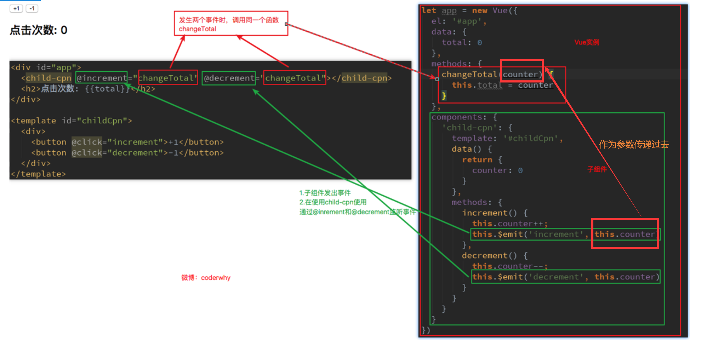

this.$emit("方法名"，参数)
方法名不能用驼峰标识(记住就好了)

使用标签创造组件对象中 @increment="increment"  此时传递的不是event事件对象，而是
this.counter

#### 父子相互通信案例

业务需求:
将父组件的值传入进子组件，通过子组件的input标签修改子组件data中的数据，在将这个值传给父组件，
从而修改之前父组件传进来的值，进而间接修改子组件中props中的内容

==子组件中的props不能直接修改，只能通过父组件传进来的值进行赋值==

```html
<!DOCTYPE html>
<html lang="en">

<head>
  <meta charset="UTF-8">
  <meta http-equiv="X-UA-Compatible" content="IE=edge">
  <meta name="viewport" content="width=device-width, initial-scale=1.0">
  <title>Document</title>
</head>

<body>
  <!-- 1.从父组件传num1，num2 进子组件 -->
  <!-- 2.在子组件的data中存储num1，num2的值并显示 -->
  <!-- 3.通过子组件的2个输入框 改变父组件中num1，num2的值 -->
  <!-- 4.num1的值显示永远是num2的值的 1/100 -->

  <div id="app">
    <cpn :number1="num1" :number2="num2" 
     @put1click="changeNum1"
     @put2click="changeNum2"></cpn>
  </div>
  <template id="cpn">
    <div>
      props:{{number1}}
      data:{{dnumber1}}
      <br />
      <input type="text" :value="dnumber1" @input="put1Click">
      <br />
      props:{{number2}}
      data:{{dnumber2}}
      <br />
      <input type="text" :value="dnumber2" @input="put2Click">
    </div>
  </template>
  <script src="../js/vue.js"></script>
  <script>
    const app = new Vue({
      //挂载元素
      el: "#app",
      data: {
        num1: 0,
        num2: 1,
      },
      // 函数
      methods:{
        changeNum1(num1){
          this.num1=Number(num1);
        },
        changeNum2(num2){
          this.num2=Number(num2);
        }
      },
      // 注册组件
      components: {
        cpn: {
          // html代码分离
          template: "#cpn",
          // 父传子通信
          props: {
            number1: Number,
            number2: Number,
          },
          data() {
            return {
              dnumber1:this.number1,
              dnumber2:this.number2,
            }
          },
          methods:{
            put1Click(event){
              this.dnumber1=event.target.value;
              this.$emit("put1click",this.dnumber1);
              this.dnumber2=this.dnumber1*100;
              this.$emit("put2click",this.dnumber2);
            },
            put2Click(event){
              this.dnumber2=event.target.value;
              this.$emit("put2click",this.dnumber2);
              this.dnumber1=this.dnumber2/100;
              this.$emit("put1click",this.dnumber1);
            },
          }
        }

      }
    })
  </script>
</body>

</html>
```

组件中的watch属性
监听某个变量的改变，并进行一些操作

```javascript
components:{
	template="",
	data(){
		return{
		age:18,
		}
	}
	watch:{
		age(newValue,oldValue){
		this.age ........
		}
	}
```

#### 父组件访问子组件

##### $children

一般不会用this.$children[index]去访问子组件
因为，一开始如果使用this.$children[2] 访问第三个子组件对象
当在DOM中又创建一个子组件对象时this.$children[2]和原先的已经不一样了，如果还要
使用原先的子组件对象，就需要手动修改索引，太麻烦了
如果不是为了获取所有子组件对象，是不会用到$children的

```html
<!DOCTYPE html>
<html lang="en">
<head>
  <meta charset="UTF-8">
  <meta http-equiv="X-UA-Compatible" content="IE=edge">
  <meta name="viewport" content="width=device-width, initial-scale=1.0">
  <title>Document</title>
</head>
<body>
  <div id="app">
    <cpn></cpn>
    <cpn></cpn>
    <cpn></cpn>
    <!-- 监听单击事件 -->
    <button @click="btnClick">按钮</button>
  </div>
  <!-- 子组件模板的分离 -->
  <template id="cpn">
    <div>
      <h1>hahahah</h1>
    </div>
  </template>
  <script src="../js/vue.js"></script>
  <script>
    const app=new Vue({
      el:"#app",
      methods:{
        btnClick(){
          // this.$children 显示的是所有子组件对象，然后通过下标索引访问
          console.log(this.$children[2].name);
          this.$children[2].showMessage();
        }
      },
      //注册子组件
      components:{
        cpn:{
          template:"#cpn",
          // 子组件data数据
          methods:{
            showMessage(){
              console.log("aaa");
            }
          },
          data(){
            return {
              name:"小红",
            }
          },
        },
      }
    })
  </script>
</body>
</html>
```

##### $refs

使用前需要给子组件对象添加ref属性
然后用this.$refs获取所有 拥有ref属性的子组件对象，
要访问指定子组件对象 this.$refs.ref属性值  就可以了

```html
<!DOCTYPE html>
<html lang="en">

<head>
  <meta charset="UTF-8">
  <meta http-equiv="X-UA-Compatible" content="IE=edge">
  <meta name="viewport" content="width=device-width, initial-scale=1.0">
  <title>Document</title>
</head>

<body>
  <div id="app">
    <!-- 添加ref属性 -->
    <cpn ref="c1"></cpn>
    <cpn ref="c2"></cpn>
    <cpn ref="c3"></cpn>
    <!-- 监听单击事件 -->
    <button @click="btnClick">按钮</button>
  </div>
  <!-- 子组件模板的分离 -->
  <template id="cpn">
    <div>
      <h1>hahahah</h1>
    </div>
  </template>
  <script src="../js/vue.js"></script>
  <script>
    const app = new Vue({
      el: "#app",
      methods: {
        btnClick() {
          // this.$refs 显示的是所有 拥有ref属性的子组件对象，然后通过ref的属性值访问
          console.log(this.$refs);
          //访问ref值为c1 的子组件对象
          console.log(this.$refs.c1);
        }
      },
      //注册子组件
      components: {
        cpn: {
          template: "#cpn",
          // 子组件data数据
          methods: {
            showMessage() {
              console.log("aaa");
            }
          },
          data() {
            return {
              name: "小红",
            }
          },
        },
      }
    })
  </script>
</body>

</html>
```

#### 子组件访问父组件

$parent和$root
$parent访问的是父组件
$root访问的是根组件(一般就是Vue实例了)

$parent用的很少，因为组件讲究的是一个复用性，使用this.$parent.属性 去访问当前父组件的属性时
可能会有效果，但是如果将这个组件放到另一个地方时，此时的父组件可能没有$parent要访问的属性
那么就会报错

```html
<!DOCTYPE html>
<html lang="en">

<head>
  <meta charset="UTF-8">
  <meta http-equiv="X-UA-Compatible" content="IE=edge">
  <meta name="viewport" content="width=device-width, initial-scale=1.0">
  <title>Document</title>
</head>

<body>
  <div id="app">
    <!-- 创造cpn组件对象 -->
    <cpn></cpn>
  </div>
  <!-- cpn组件模板 -->
  <template id="cpn">
    <div>
      <div>我是cpn组件</div>
      <!-- 创造ccpn组件对象 -->
      <ccpn></ccpn>
    </div>
  </template>
  <template id="ccpn">
    <div>
      <button @click=ccpnClick>点击</button>
    </div>
  </template>
  <script src="../js/vue.js"></script>
  <script>
    const app = new Vue({
      el: "#app",
      data:{
        name:"小明",
      },
      components: {
        // 注册cpn组件
        cpn: {
          // cpn内的数据
          data() {
            return {
              name: "小红",
            }
          },
          template: "#cpn",
          components: {
            ccpn: {
              // 注册ccpn组件
              template: "#ccpn",
              // ccpn组件内的函数
              methods: {
                ccpnClick() {
                  console.log(this.$parent.name);
                  console.log(this.$root.name);
                  
                },
              }
            }
          }
        },
      }
    })
  </script>
</body>

</html>
```

### 插槽

#### 注意

插槽替换时
组件的类名最终会 添加到模板下面的那个div里面


#### slot插槽的基本使用

1️⃣组件的插槽是为了让我封装的组件更加具有扩展性
2️⃣在组件模板中使用 \<slot>\</slot> 标签
	 而如何使用这个插槽取决于父组件如何使用

三种基本使用
1.\<slot>\</slot>
	DOM中的cpn标签内的 标签会取代掉 组件模板中的\<slot>\</slot>

```html

<!DOCTYPE html>
<html lang="en">
<head>
  <meta charset="UTF-8">
  <meta http-equiv="X-UA-Compatible" content="IE=edge">
  <meta name="viewport" content="width=device-width, initial-scale=1.0">
  <title>Document</title>
</head>
<body>
  <div id="app">
    <cpn>
      <a href="">超链接</a>
    </cpn>
    <cpn>
      <i>哈哈哈</i>
    </cpn>
    <cpn>
      <h2>h2标签</h2>
    </cpn>
  </div>
  <!-- 组件html代码分离 -->
  <template id="cpn">
    <div>
      <h2>我是cpn组件</h2>
      <slot></slot>
    </div>
  </template>
  <script src="../js/vue.js"></script>
  <script>
    const app=new Vue({
      el:"#app",
      //组件注册
      components:{
        cpn:{
          template:"#cpn",
        }
      }
    });
  </script>
</body>
</html>
```

2.插槽的默认值
	如果在dom 中cpn标签内有内容则 使用该内容 取代掉 模板内slot标签
	如果cpn标签内没有内容则使用 slot标签中的默认值

```html
<!DOCTYPE html>
<html lang="en">
<head>
  <meta charset="UTF-8">
  <meta http-equiv="X-UA-Compatible" content="IE=edge">
  <meta name="viewport" content="width=device-width, initial-scale=1.0">
  <title>Document</title>
</head>
<body>
  <div id="app">
    <!-- 由于此时<cpn></cpn>标签内没有内容，那么会使用slot标签内的默认值 -->
    <cpn></cpn>
    <!-- cpn标签内有内容，那么会取代掉slot标签内的内容 -->
    <cpn>
      <i>哈哈哈</i>
    </cpn>
    <cpn>
      <h2>h2标签</h2>
    </cpn>
  </div>
  <!-- 组件html代码分离 -->
  <template id="cpn">
    <div>
      <h2>我是cpn组件</h2>
      <slot><button>按钮</button></slot>
    </div>
  </template>
  <script src="../js/vue.js"></script>
  <script>
    const app=new Vue({
      el:"#app",
      //组件注册
      components:{
        cpn:{
          template:"#cpn",
        }
      }
    });
  </script>
</body>
</html>
```

3.如果有多个值同时放入到cpn标签内  则进行整体的替换，cpn标签内的所有内容替换掉slot标签

```html
<!DOCTYPE html>
<html lang="en">
<head>
  <meta charset="UTF-8">
  <meta http-equiv="X-UA-Compatible" content="IE=edge">
  <meta name="viewport" content="width=device-width, initial-scale=1.0">
  <title>Document</title>
</head>
<body>
  <div id="app">
    <!-- cpn标签中的内容 整体替换slot标签 -->
    <cpn>
      <i>aaaa</i>
      <a href="">超链接</a>
      <h2>嘿嘿</h2>
    </cpn>
    <cpn>
      <i>哈哈哈</i>
    </cpn>
    <cpn>
      <h2>h2标签</h2>
    </cpn>
  </div>
  <!-- 组件html代码分离 -->
  <template id="cpn">
    <div>
      <h2>我是cpn组件</h2>
      <slot><button>按钮</button></slot>
    </div>
  </template>
  <script src="../js/vue.js"></script>
  <script>
    const app=new Vue({
      el:"#app",
      //组件注册
      components:{
        cpn:{
          template:"#cpn",
        }
      }
    });
  </script>
</body>
</html>
```

#### 具名插槽

当子组件的功能复杂时，子组件的插槽可能并非是一个
	比如我们封装一个导航栏的子组件，可能就需要三个插槽，分别代表左边、中间、右边
	这时候我们要给插槽起一个名字,将指定内容插入到指定插槽
如何使用具名插槽呢？
	只要给slot元素一个name属性即可 
	\<slot name='myslot'>\</slot>
具体使用案例

```html

<!DOCTYPE html>
<html lang="en">
<head>
  <meta charset="UTF-8">
  <meta http-equiv="X-UA-Compatible" content="IE=edge">
  <meta name="viewport" content="width=device-width, initial-scale=1.0">
  <title>Document</title>
</head>

<body>
  <div id="app">
    <cpn>
      <!-- 指定具体的插槽，v-slot只能写在template标签中 
		   使用作用域插槽就好像不需要遵守了，具体看Vue官网-->
      <template v-slot:left>
        <button>按钮</button>
      </template>
      <!-- 第一种写法，这两种都会将没有name属性的slot标签替换成<i>标签-->
      <!-- <template v-slot:defalut>
        <i>默认</i>
      </template> -->
      <!-- 第二种写法 -->
      <i>默认</i>
    </cpn>
  </div>
  <!-- 组件html代码分离 -->
  <template id="cpn">
    <div>
      <slot name="left"><span>左边</span></slot>
      <slot><span>中间</span></slot>
      <slot><span>右边</span></slot>
    </div>
  </template>
  <script src="../js/vue.js"></script>
  <script>
    const app = new Vue({
      el: "#app",
      //组件注册
      components: {
        cpn: {
          template: "#cpn",
        }
      }
    });
  </script>
</body>

</html>
```

#### 编译作用域


子组件模板中的变量isShow找的是 子组件data中的数据
\<div id="app">\</div> 中的变量isShow找的是实例data中的数据

#### 作用域插槽

作用： 在父级的插槽中可用子组件内的data数据


```html
<!DOCTYPE html>
<html lang="en">

<head>
  <meta charset="UTF-8">
  <meta http-equiv="X-UA-Compatible" content="IE=edge">
  <meta name="viewport" content="width=device-width, initial-scale=1.0">
  <title>Document</title>
</head>

<body>
  <div id="app"> 
    <!-- 在父级的插槽中可用子组件内的data数据 -->

    <cpn>
      <!-- 2.使用带值的 v-slot 来定义我们提供的插槽 prop 的名字：可以随意起 -->
      <template v-slot:one="p">
        <span v-for="item in p.date">{{item}}</span>
      </template>
    </cpn>
    
  </div>
  <template id="cpn">
    <div>
      <!-- 1.将pLanguages作为slot元素的属性绑定上去 ，绑定在<slot> 
        元素上的属性被称为插槽 prop ,:date名字可以随便改      -->
      <slot :date="pLanguages" name="one">
        <ul>
          <li v-for="item in pLanguages">{{item}}</li>
        </ul>
      </slot>
      <slot :date="pLanguages">
        <ul>
          <li v-for="item in pLanguages">{{item}}</li>
        </ul>
      </slot>
      <slot >
        <ul>
          <li v-for="item in pLanguages">{{item}}</li>
        </ul>
      </slot>
    </div>
  </template>
  <script src="../js/vue.js"></script>
  <script>
    const app = new Vue({
      el: "#app",
      components: {
        cpn: {
          template: "#cpn",
          data() {
            return { pLanguages: ["javascript", "java", "c#", "c++", "python"] }
          }
        }
      }
    })
  </script>
</body>

</html>
```

## 模块化

==模块化的方式不能混着用==
AMD、CMD、CommonJS、ES6不要混在一起用

### CommonJS了解

模块化有两个核心：导出和导入

CommonJS的导出：


CommonJS的导入
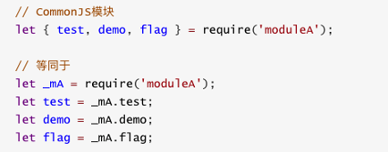

### ES6 export和import

目前只能用export和import进行模块化，因为这个浏览器可以做一些底层的支撑，可以实现

需要先在页面上进行引入文件操作比如
\<script src="./info.js" type="module">\</script>

**export**指令用于导出变量，比如下面的代码：

上面的代码还有另外一种写法：


下面通过index.html  one.js two.js 三个文件来演示导入导出

```html
<!--index.html-->
<!DOCTYPE html>
<html lang="en">
<head>
  <meta charset="UTF-8">
  <script src="./two.js" type="module"></script>
  <script src="./one.js" type="module"></script>
</body>
</html>
```

```javascript
//导出

let a=10;
let b=20;
function sum(a,b){
  return a+b;
}


// 导出方式一
export{a,b,sum}

// 导出方式二
export let c=30;
export let d=40;

//导出方式三 函数/类
export function mul(c,d){
  return c*d;
}

export class Person{
  run(){
    console.log("在跑步");
  }
}

// 导出方式四 默认导出,export default在同一个模块中 只允许存在一个
export default function(){
  return "我是默认导出";
}
```

```javascript
//导出
// 导入方式一
import { a,b,sum } from "./one.js"
console.log("方式一:"+sum(a,b));

//导入方式二 
import {c,d} from "./one.js"
console.log("方式二  "+"c:"+c+",d:"+d);

// 导入方式三
import {mul,Person} from "./one.js"
console.log("方式三 "+mul(c,d));
const man=new Person();
man.run();

// 导入方式四 ,fun这个名字 可以由导入者随便起
import fun from "./one.js"
console.log("方式四:"+fun())

// 导入方式五，将one.js中的所有信息都导入，当然前提是one.js需要导出来
// 通过*导入模块中所有的export变量
// 通常情况下我们需要给*起一个别名， obj的名字可以随便起
import * as obj from "./one.js"
console.log("方式五:"+obj.a);
```

### webpack

#### 概念

webpack是一个前端模块化打包工具
webpack中的模块化：
	进行模块化开发，并帮助我们处理模块间的依赖关系
	javascript文件，css，图片，json文件等等在webpack中都可以被当做模块来使用
webpack中的打包:
	将webpack中的各种资源模块进行打包合并成一个或多个包(Bundle)
	并且在打包的过程中，还可以对资源进行处理，比如压缩图片，将scss转成css，将ES6语法转成ES5语法，
	将TypeScript转成JavaScript等等操作

grunt/gulp和webpack的不同
	grunt/gulp更加强调的是前端流程的自动化，模块化不是它的核心。
	webpack更加强调模块化开发管理，而文件压缩合并、预处理等功能，是他附带的功能。

#### webpack和node和npm的关系


#### webpack安装

①先去node.js官网下载  .msi版本的
	安装的话，一路下一步就好了
②打开cmd
	先输入webpack --version 查看webpack是否有安装
	如果没有，那么再输入 npm install webpack@3.6.0 -g	 //-g是全局安装
	局部安装后续才需要	

#### webpack基本使用

目录暂时的基本情况


在vscode终端写代码
cd webpack起步 //反正就是要先cd进入项目文件下
webpack ./src/main.js ./dist/bundle.js   //使用webpack将main.js进行打包成bundle.js，这是webpack3.6.0的写法
这么做的意义是 浏览器能够加载bundle.js(打包后的main.js) ,不打包的话可能无法加载
webpack会将与main.js相关的文件都打包的，所以mathUtils.js也会被打包的，

最后在index.html的body标签内引入bundle.js(head标签内不知道为什么不行)

#### webpack.config.js和package.json的配置

此时文件夹的目录


这些文件都需要在webpack起步目录下，否则不能生效

为了方便打包，让我们可以在webpack起步目录的 终端下输入we bpack就可以完成打包，将文件放入dist文件夹
我们就需要配置webpack.config.js文件

```javascript
//webpack.config.js文件的配置
const path=require("path") //获取当前文件所在的文件
module.exports={
  entry:'./src/main.js',  //入口
  output:{                //出口
    path:path.resolve(__dirname,"dist"),//__dirname为当前文件所在的路径(webpack起步 文件在的路径)
    // path.resolve()这个函数是将两个路径进行一个拼接，path通常是一个绝对路径
    filename:"bundle.js"
  }
}
//一旦要使用node相关的一些东西的话 需要先进行初始化npm init
//任何一个项目如果想要单独依赖node环境的话，那么基本都需要package.json 一般都要要的
// 如果package.json 需要依赖一些东西的话就需要 输入npm install 
```

package.json的配置
在终端下执行 npm run bind  //将会找到package.json中scripts对象内的 bind属性，并执行里面的东西
//这么写可以在终端少打很多指令


一个项目往往依赖特定的webpack版本，全局的版本可能和这个项目的webpack版本不一致，导出打包出现问题
所以通常一个项目，都有自己局部的webpack

##### 局部webpack 

==所以项目中需要安装自己局部的webpack==
	①这里我们让局部安装webpack3.6.0
	②Vue CLI3中已经升级到webpack4，但是它将配置文件隐藏了起来，所以查看起来不是很方便
	
   --save-dev 是开发时依赖，项目打包后不需要继续使用的。
   --save 运行时依赖
	下载完以后使用 ./node_modules/.bin/webpack 使用局部webpack进行打包
	

==注意==
	在终端（cmd和vscode的终端）使用webpack 都是在使用全局webpack
	使用局部终端有两种方法
		① ./node_modules/.bin/webpack
		②上面的 npm run bind

#### loader的安装

##### css

前因后果:
	因为我们最终都是引入的bundle.js文件，所以我们要把normal.css文件引入到main.js文件，最后通过webpack
进行打包成bundle.js文件
	
	仅仅这样就直接打包会出现错误
	
	这个错误告诉我们：加载normal.css文件必须有对应的loader。

​	webpack来处理我们写的js代码，并且webpack会自动处理js之间相关的依赖。
​	但是，在开发中我们不仅仅有基本的js代码处理，我们也需要加载css、图片，也包括一些高级的将ES6转成ES5代	码，将TypeScript转成ES5代码，将scss、less转成css，将.jsx、.vue文件转成js文件等等。
​	对于webpack本身的能力来说，对于这些转化是不支持的。所以要给webpack扩展对应的loader
loader使用过程：
​	步骤一：通过npm安装需要使用的loader
​	步骤二：在webpack.config.js中的modules关键字下进行配置

首先：进入webpack官网
	

然后：下载style-loader和css-loader
	npm install --save-dev style-loader@0.23.1 （这两个都是老师的版本，自己改版本的话可能会报错，以后再说吧)	npm install --save-dev css-loader@2.0.2

最后：修改webpack.config.js中的内容
	

​	

##### less

和上述的css一样 也是要使用loader

第一步：写好less代码，在main.js中引入
			
第二步：进入官网找到 less-loader
第三步：在vscode终端 输入
			  npm install less@3.9.0 less-loader@4.1.0 --save-dev
			  less包是为了将less转换成css  而less-loader是为了加载
			  版本号是根据老师的来的
第四步：在webpack.config.js配置文件中添加
			

##### 图片资源

第一步：在css文件中使用url引入背景图片
			
第二步：进入官网
		
第三步：
		在vscode终端输入
		npm install --save-dev url-loader@1.1.2  //版本是老师上课的
第四步：在webpack.config.js配置文件中添加
		4.1 加载的图片大小  小于limit时
			
		4.2 加载的图片大小 大于limit时
			需要现在终端 输入npm install file-loader@3.0.1
			才能将大于limit的图片打包成一个图片
			由于此时打包的图片存入了dist文件夹，所以需要更改url路径从而显示图片（最后将html打包的时候要删除的)
			
			      

​					如果想要对图片进行相关的命名的话，并将打包的图片都放入一个文件
​	        夹内，需要在options中添加name属性				

​				

##### ES6转ES5

如果你仔细阅读webpack打包的js文件，发现写的ES6语法并没有转成ES5，
那么就意味着可能一些对ES6还不支持的浏览器没有办法很好的运行我们的代码。

如果希望将ES6的语法转成ES5，那么就需要使用babel
第一步：进入官网
		

第二步：终端输入
			 npm install --save-dev babel-loader@7.1.5 babel-core@6.26.3 babel-preset-es2015@6.24.1
第三步：webpack.config.js配置
			
第四步：运行
			运行后bundle.js内就没有es6的代码了					

#### vue的安装以及配置

①npm安装：
	在vscode输入 npm install vue@2.6.12 --save   
	//运行时依赖,此时vue会被安装在node_modules，就可以将vue当成一个模块
②引入vue:
	
③更改webpack.config.js配置
	vue在最终发行的时候有两类版本	
	版本一：runtime-only  //代码中，不可以有任何template模板，默认是这个所以需要更改配置
	版本二：runtime-compiler  //代码中，可以有template，所以我们选择这个版本
	

#### el和template的区别

一般情况下 我们都不会在去改index.html中的内容，不会在id=app的标签中放东西


#### 模板和js代码的分离

.vue 文件封装处理
只有处理了才能使用.vue文件，不然报错
第一步：终端输入
	npm install --save-dev vue-template-compiler@2.5.21 vue-loader@13.0.0
第二步：配置文件
		
第三步：实现分离

​	3.1在main.js中引入文件，并注册使用

​		

​	3.2在vue文件夹中 引入子组件文件，注册并使用

​		
​	3.3子组件css，js，模板的分离
​		

#### 关于后缀

​	如果想要在引入文件时不写后缀，需要更改配置
​	

#### plugin

plugin是插件的意思，通常是用于对某个现有的架构进行扩展
webpack中的插件，就是对webpack现有功能的各种扩展，比如打包优化，文件压缩等等。

loader和plugin区别
	①ploader主要用于转换某些类型的模块，它是一个转换器。
	②plugin是插件，它是对webpack本身的扩展，是一个扩展器。

plugin的使用过程：
	步骤一：通过npm安装需要使用的plugins(某些webpack已经内置的插件不需要安装)
	步骤二：在webpack.config.js中的plugins中配置插件。

##### 添加版权的plugin

​	该插件名字叫BannerPlugin，属于webpack自带的插件
​	1.修改webpack.config.js文件
​	

​	2.重新打包程序：查看bundle.js文件的头部
​	

	##### 打包html的plugin

目前，我们的index.html文件是存放在项目的根目录下的。
		我们知道，在真实发布项目时，发布的是dist文件夹中的内容，但是dist文件夹中
	如果没有index.html文件，那么打包的js等文件也就没有意义了。
		所以，我们需要将index.html文件打包到dist文件夹中，这个时候就可以使用HtmlWebpackPlugin插件

HtmlWebpackPlugin插件可以为我们做这些事情：
	自动生成一个index.html文件(可以指定模板来生成)
	将打包的js文件，自动通过script标签插入到body中

第一步：安装HtmlWebpackPlugin插件
	在vscode终端写 npm install html-webpack-plugin@3.2.0 --save-dev
第二步：修改配置
	

	- 这里的template表示根据什么模板来生成index.html，路径是根据当前配置文件所在的目录下寻找的
	- index.html中的<script></script>标签删除掉，因为插件会自动帮助我们插入的
	- 另外，我们需要删除之前在output中添加的publicPath属性，否则插入的script标签中的src可能会有问题
	- 否则插入的script标签中的src可能会有问题

最后index.html中的样子
    

##### js压缩的plugin

这里，我们就对打包的js文件进行压缩
我们使用一个第三方的插件uglifyjs-webpack-plugin，并且版本号指定1.1.1，和CLI2保持一致
第一步：在vscode终端写
		npm install uglifyjs-webpack-plugin@1.1.1 --save-dev
第二部：修改配置
		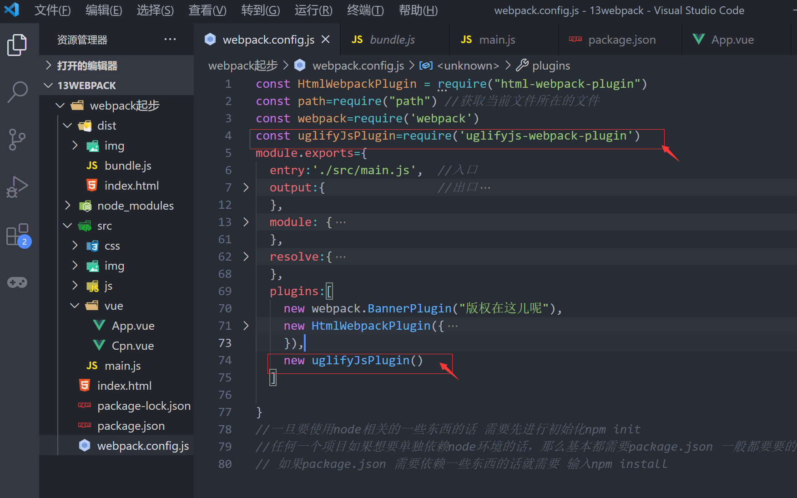

##### webpack-dev-server搭建本地服务器

webpack提供了一个可选的本地开发服务器，这个本地服务器基于node.js搭建，
内部使用express框架，可以实现我们想要的让浏览器自动刷新显示我们修改后的结果。

不过它是一个单独的模块，在webpack中使用之前需要先安装它
第一步：在终端输入
		npm install --save-dev webpack-dev-server@2.9.1
第二步：配置
		
		devserver也是作为webpack中的一个选项，选项本身可以设置如下属性：
				contentBase：为哪一个文件夹提供本地服务，默认是根文件夹，我们这里要填写./dist
				port：端口号
				inline：页面实时刷新
				historyApiFallback：在SPA页面中，依赖HTML5的history模式
				我们暂时只需要更改图片中的就好了

第三步：运行
		有两个方法，有个不好写
		就写一个吧
		在终端中敲命令默认会去全局中找，但是我们安装的插件之类的都是在局部安装的
		所以我们得修改package.json中得script代码 从而运行局部的命令
		
		最后在终端敲 npm run wrap  就可以了
		

​		需要注意的几点
​		
​		①跳出这个命令需要按ctrl+c
​		②最后完成项目还是要打包 npm run bind

	##### webpack配置文件的分离

​	将原先的webpack.config.js文件进行分离


第一步：终端下载
	npm install --save-dev webpack-merge@4.1.5
第二步：更改package.json
	使得终端输入命令时可以找到该执行的配置文件
	
第三步：修改base.config.js
	修改其中的output，使得可以在根目录下生成dist文件
	

注意：此时输入npm run wrap 是不会生成dist文件的 因为这个好像是映射到内存中的
					而npm run bind 会在内存中直接生成dist文件

## 脚手架

### 概念以及安装

Vue CLI
	CLI是Command-Line Interface, 翻译为命令行界面, 但是俗称脚手架
	Vue CLI是一个官方发布 vue.js 项目脚手架
	使用 vue-cli 可以快速搭建Vue开发环境以及对应的webpack配置.

**Vue** CLI 使用前提 **-** **Node**

 - 安装NodeJS 		
   官网：http://nodejs.cn/download/
 - 检测安装的版本
   默认情况下自动安装Node和NPM
   Node环境要求8.9以上或者更高版本
 - NPM
   NPM的全称是Node Package Manager
   是一个NodeJS包管理和分发工具，已经成为了非官方的发布Node模块（包）的标准。
   后续我们会经常使用NPM来安装一些开发过程中依赖包.

Vue CLI使用前提 - Webpack

- Vue.js官方脚手架工具就使用了webpack模板  
  对所有的资源会压缩等优化操作
- 它在开发过程中提供了一套完整的功能，能够使得我们开发过程中变得高效
- Webpack的全局安装
  npm install webpack -g


### cnpm的安装

cnpm安装
由于国内直接使用 npm 的官方镜像是非常慢的，这里推荐使用淘宝 NPM 镜像。
你可以使用淘宝定制的 cnpm (gzip 压缩支持) 命令行工具代替默认的 npm:
npm install -g cnpm --registry=https://registry.npm.taobao.org
这样就可以使用 cnpm 命令来安装模块了：
cnpm install [name]

### Vue CLI的使用

安装Vue脚手架
	npm install -g @vue/cli
	如果需要想按照Vue CLI2的方式初始化项目是不可以的，需要拉取2.x模板
拉取2.x模板


如果安装脚手架失败可以删除这个文件，然后再安装


#### Vue CLI2初始化项目

vue init webpack my-project //my-project指的是项目的名字
打完上述命令后，会有很多操作，先根据下面的来完成


如果想要关闭ESLint规范


改掉后再重新编译整个项目 npm run...

#####  目录结构的配置


##### runtime-compiler和runtime-only的区别

当我们把template传进vue以后会有这么一个过程
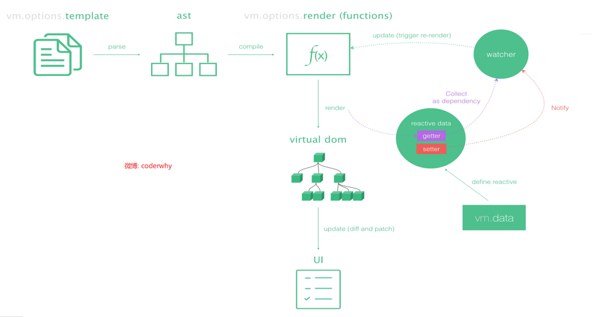

runtime-compiler的过程
		template -> ast -> render -> vdom ->ul
runtime-only 的过程(性能更好，包含的代码量更少)
		render -> vdom -> ul
ast指的是抽象语法树

##### render函数的用法

用法一：标签替换

​	基本用法
​		

进阶用法
		

用法二：传入一个组件
		
			.vue文件在加载得时候 ，template标签已经被vue-template-compiler解析成render函数，
		所以在import引用的时候App内不会包含任何template标签

##### npm run dev/build的过程

npm run dev


npm run build


##### 文件快速路径

第一步：修改配置，修改完以后需要重新编译


第二步：
 2.1修改DOM中的路径


2.2修改script标签内的路径


#### Vue CLI3初始化项目

vue-cli 3 与 2 版本有很大区别

- vue-cli 3 是基于 webpack 4 打造，vue-cli 2 还是 webapck 3
- vue-cli 3 的设计原则是“0配置”，移除的配置文件根目录下的，build和config等目录
- vue-cli 3 提供了 vue ui 命令，提供了可视化配置，更加人性化
- 移除了static文件夹，新增了public文件夹，并且index.html移动到public中

vue create my-project  //my-project就是项目的名字
打完上述命令后的操作


如果想要在Please pick a preset中删除之前保存的配置，进入下图文件夹


删除就好了


##### 目录结构的详解


##### render写法

两种写法是一样的


##### 修改的配置

如何修改配置(CLI3配置被隐藏起来了)
第一种：
		在终端输入 vue ui 启动配置服务器
			

第二种：node_modules包中寻找
		

第三种：
		

​		最后的时候会将我们修改的配置和之前隐藏起来的配置合并的

## 路由

url里面好像忽略大小写

 ### 认识路由

路由器提供了两种机制: 路由和转送

- 路由是决定数据包从来源到目的地的路径
- 转送将输入端的数据转移到合适的输出端

路由中有一个非常重要的概念叫路由表
      路由表本质上就是一个映射表, 决定了数据包的指向

### 后端渲染

拿jsp说把(c#和php都可以进行后端渲染)


**后端路由阶段**

- 早期的网站开发整个HTML页面是由服务器来渲染的
  \- 服务器直接生产渲染好对应的HTML页面, 返回给客户端进行展示

- 但是, 一个网站, 这么多页面服务器如何处理呢?

  \- 一个页面有自己对应的网址, 也就是URL
  \- URL会发送到服务器, 服务器会通过正则对该URL进行匹配, 并且最后交给一个Controller进行处理
  \- Controller进行各种处理, 最终生成HTML或者数据, 返回给前端
  \- 这就完成了一个IO操作

- 上面的这种操作, 就是后端路由.

  \- 当我们页面中需要请求不同的**路径**内容时, 交给服务器来进行处理, 服务器渲染好整个页面, 并且将页面返回给客户端
  \- 这种情况下渲染好的页面, 不需要单独加载任何的js和css, 可以直接交给浏览器展示, 这样也有利于SEO的优化

- 后端路由的缺点:
  \- 一种情况是整个页面的模块由后端人员来编写和维护的.
  \- 另一种情况是前端开发人员如果要开发页面, 需要通过PHP和Java等语言来编写页面代码.
  \- 而且通常情况下HTML代码和数据以及对应的逻辑会混在一起, 编写和维护都是非常糟糕的事情

### 前后端分离阶段

- 随着Ajax的出现, 有了前后端分离的开发模式
- 后端只提供API来返回数据, 前端通过Ajax获取数据, 并且可以通过JavaScript将数据渲染到页面中.
- 这样做最大的优点就是前后端责任的清晰, 后端专注于数据上, 前端专注于交互和可视化上.
- 并且当移动端(iOS/Android)出现后, 后端不需要进行任何处理, 依然使用之前的一套API即可.
- 目前很多的网站依然采用这种模式开发.


### 单页面富应用阶段

其实SPA最主要的特点就是在前后端分离的基础上加了一层前端路由.
也就是前端来维护一套路由规则.


前端路由的核心
        改变URL，但是页面不进行整体的刷新。

### 改变url页面不刷新

#### location.hash

URL的hash也就是锚点(#), 本质上是改变window.location的href属性
我们可以通过直接赋值location.hash来改变href, 但是页面不发生刷新


#### HTML5的history

history接口是HTML5新增的, 它有五种模式改变URL而不刷新页面

history.pushState()


history.replaceState()

此时不会产生记录，无法进行前进后退操作

history.go()


**补充说明：**

Ø上面只演示了三个方法

Ø因为 history.back() 等价于 history.go(-1)

Øhistory.forward() 则等价于 history.go(1)

Ø这三个方法等同于浏览器界面的前进后退。

### 什么是url

url的组成：
	协议：//主机:端口号/路径？查询
	scheme://host:port/path?query#fragment

### vue-router的安装和使用

一般情况下在安装脚手架的时候路由已经安装了
可以这么查看有没有安装


如果没有安装的话可以npm直接安装

##### 使用步骤

步骤一：安装vue-router
	npm install vue-router --save  //运行时依赖
步骤二：在模块化工程中使用它(因为是一个插件, 所以可以通过Vue.use()来安装路由功能)
	第一步：导入路由对象，并且调用 Vue.use(VueRouter),创建router实例
			

​	第二步：创建路由实例，并且传入路由映射配置
​	第三步：在Vue实例中挂载创建的路由实例
​			

##### 使用vue-router的步骤

第一步: 创建路由组件


第二步：配置组件和路径的映射关系


步骤三：使用路由


<router-link>: 该标签是一个vue-router中已经内置的组件, 它会被渲染成一个<a>标签.

<router-view>: 该标签会根据当前的路径, 动态渲染出不同的组件，只是做一个占位，后面会被要渲染的组件替换掉

Ø网页的其他内容, 比如顶部的标题/导航, 或者底部的一些版权信息等会和<router-view>处于同一个等级.

Ø在路由切换时, 切换的是<router-view>挂载的组件, 其他内容不会发生改变.

##### 细节处理

###### 路由的默认路径

我们这里还有一个不太好的实现:
		默认情况下, 进入网站的首页, 我们希望<router-view>渲染首页的内容.
		但是我们的实现中, 默认没有显示首页组件, 必须让用户点击才可以.
如何可以让路径默认跳到到首页, 并且<router-view>渲染首页组件呢?
		我们只需要配置多配置一个映射就可以了
		
配置解析:
		我们在routes中又配置了一个映射. 
		path配置的是根路径: /
		redirect是重定向, 也就是我们将根路径重定向到/home的路径下, 这样就可以得到我们想要的结果了.

###### html5的history模式

我们前面说过改变路径的方式有两种:
	URL的hash
	HTML5的history
	默认情况下, 路径的改变使用的URL的hash.
如果希望使用HTML5的history模式, 非常简单, 进行如下配置即可:
	

​	
​	
​	原本是hash的，如下图
​	

###### router-link的补充

<router-link>标签还有一些其他属性:
	to：
		用于指定跳转的路径
	tag: 
		tag可以指定<router-link>之后渲染成什么组件, 比如上面的代码会被渲染成一个<li>元素, 而不是<a>
	replace: 
		replace不会留下history记录, 所以指定replace的情况下, 后退键返回不能返回到上一个页面中
	active-class: 
		当<router-link>对应的路由匹配成功时, 会自动给当前元素设置一个router-link-active的class, 设置		active-		class可以修改默认的名称.
		在进行高亮显示的导航菜单或者底部tabbar时, 会使用到该类.
		但是通常不会修改类的属性, 会直接使用默认的router-link-active即可. 
			


可以在这个位置对默认的类名进行统一的修改


##### 路由代码跳转

有时候, 页面的跳转可能需要执行对应的JavaScript代码, 这个时候, 就可以使用第二种跳转方式了
比如, 我们将代码修改如下: 


##### 动态路由

在某些情况下，一个页面的path路径可能是不确定的，比如我们进入用户界面时，希望是如下的路径：

- /user/aaaa或/user/bbbb
- 除了有前面的/user之外，后面还跟上了用户的ID
- 这种path和Component的匹配关系，我们称之为动态路由(也是路由传递数据的一种方式)。

第一步：改path和component


第二步：改router-link标签中的to属性

第三步：如果想在User.vue文件中显示App.vue中的userId
App.vue中的userId 动态的赋给 index.js中的userId


##### 路由的懒加载

官方给出了解释:
	当打包构建应用时，Javascript 包会变得非常大，影响页面加载。
	如果我们能把不同路由对应的组件分割成不同的代码块，然后当路由被访问的时候才加载对应组件，这样就更加高效了

官方在说什么呢?
	首先, 我们知道路由中通常会定义很多不同的页面.
	这个页面最后被打包在哪里呢? 一般情况下, 是放在一个js文件中.
	但是, 页面这么多放在一个js文件中, 必然会造成这个页面非常的大.
	如果我们一次性从服务器请求下来这个页面, 可能需要花费一定的时间, 甚至用户的电脑上还出现了短暂空白的情况.
	如何避免这种情况呢? 使用路由懒加载就可以了.
路由懒加载做了什么?
	路由懒加载的主要作用就是将路由对应的组件打包成一个个的js代码块.
	只有在这个路由被访问到的时候, 才加载对应的组件

路由懒加载的效果
	没有用懒加载前
	
	
	

​	用了懒加载以后
​	
​			

##### 路由的嵌套

嵌套路由是一个很常见的功能
比如在home页面中, 我们希望通过/home/news和/home/message访问一些内容.
一个路径映射一个组件, 访问这两个路径也会分别渲染两个组件

步骤一：创建两个子组件


步骤二：添加路由


步骤三：在组件使用路由
在Home组件中使用路由


##### 传递参数的方式

###### params的类型

动态路由上面讲过

###### query的类型

配置路由格式: /router, 也就是普通配置
传递的方式: 对象中使用query的key作为传递方式
传递后形成的路径: /router?id=123, /router?id=abc

第一步：创建对应的组件
	

第二步：在router-link的to属性中添加对象


第三步：建立路由的映射关系


第四步：使用传递过来的数据


###### 代码跳转使用

只有App.vue这个地方不一样其他的和上述写法一样


##### $route和$router区别

$router为VueRouter实例，想要导航到不同URL，则使用$router.push方法
$route为当前router跳转对象里面可以获取name、path、query、params等 


==因为所有组件都继承自Vue类的原型==
而原型里有$router和$route属性，所有组件对象都可以使用这两个属性

$route.path.indexOf()

##### 导航守卫

vue-router提供的导航守卫主要用来监听监听路由的进入和离开的.
vue-router提供了beforeEach和afterEach的钩子函数, 它们会在路由即将改变前和改变后触发.

###### 切换路由时改变标题

我们可以利用beforeEach来完成标题的修改
	首先, 我们可以在钩子当中定义一些标题, 可以利用meta来定义
	其次, 利用导航守卫,修改我们的标题.

导航钩子的三个参数解析:
	to: 即将要进入的目标的路由对象.
	from: 当前导航即将要离开的路由对象.
	next: 调用该方法后, 才能进入下一个钩子.必须要写、

步骤一：在路由中添加meta属性


步骤二 router对象中改写beforeEach
			next()一定要加


步骤二增强版：上面的版本不好，有时候可能会变成undefined
	

###### 导航守卫的补充

​	补充一:如果是后置钩子, 也就是afterEach, 不需要主动调用next()函数.
​	补充二: 上面我们使用的导航守卫, 被称之为**全局守卫**.
​				 还有其他的一些守卫
​				 例如：路由独享的守卫
​							组件内的守卫
​				 可以到官网学习
​						https://router.vuejs.org/zh/guide/advanced/navigation-guards.html#%E8%B7%AF%E7%94%B1%E7%8B%AC%E4%BA%AB%E7%9A%84%E5%AE%88%E5%8D%AB

##### keep-alive和vue-router

每切换一次路由，就会造一个消亡一个组件，创造一个组件
router-view 也是一个组件，如果直接被包在 keep-alive 里面，所有路径匹配到的视图组件都会被缓存：


keep-alive 是 Vue 内置的一个组件，可以使被包含的组件保留状态，或避免重新渲染
	它们有两个非常重要的属性:
	include  - 字符串或正则表达，只有匹配的组件会被缓存
	exclude - 字符串或正则表达式，任何匹配的组件都不会被缓存

exclude的用法
步骤一：写exclude属性
步

步骤二：写name属性

	

##### 目前学到的生命周期函数

created(){
	console.log("组件创造时")；
}
destroyed() {
    console.log("组件销毁时");
 }
activated() {
	this.$router.push("组件活跃时")
 }
deactivated(){
	this.$router.push("组件销毁时")
}
activated()和deactivated()只有
<vue-router></vue-router>标签在<keep-alive></keep-alive>内才有用

beforeRouteLeave (to, from, next) {
	console.log("切换路由前")
    next();
  }

## Promise

### 介绍

Promise是异步编程的一种解决方案。

那什么时候我们会来处理异步事件呢？

- 一种很常见的场景应该就是网络请求了。
- 我们封装一个网络请求的函数，因为不能立即拿到结果，所以不能像简单的3+4=7一样将结果返回。
- 所以往往我们会传入另外一个函数，在数据请求成功时，将数据通过传入的函数回调出去。
- 如果只是一个简单的网络请求，那么这种方案不会给我们带来很大的麻烦

但是，当网络请求非常复杂时，就会出现回调地狱。
Promise可以以一种非常优雅的方式来解决这个问题。

### 基本使用

#### 数据请求成功


#### 请求数据失败


#### 另一种基本使用

数据请求成功或数据请求失败后的处理，都写在then里面


### Promise三种状态

首先, 当我们开发中有异步操作时, 就可以给异步操作包装一个Promise
异步操作之后会有三种状态
	pending：等待状态，比如正在进行网络请求，或者定时器没有到时间。
	fulfill：满足状态，当我们主动回调了resolve时，就处于该状态，并且会回调.then()
	reject：拒绝状态，当我们主动回调了reject时，就处于该状态，并且会回调.catch()


### Promise的链式调用

代码的目的， 1.第一次获取数据 aaa后进行第一次处理
					   2.将数据aaa+111 进行拼串 然后进行第二次处理
					   3.将数据aaa111+222进行拼串 然后进行第三次处理


第一次进行异步操作，然后处理数据，之后便不再进行异步操作，这是以下代码的定位

#### 数据请求成功


简写：

简写1：


再次简写：


#### 数据请求失败


简写


另一种简写，直接抛出异常


### Promise.all

某一次需求需要发送两次才能完成的话
意思就是 需要向后台发送两次请求才能获取到 两种数据，然后对数做出处理 


## Vuex

### 概念

官方解释：Vuex 是一个专为 Vue.js 应用程序开发的状态管理模式，是一个插件

- 它采用 集中式存储管理 应用的所有组件的状态，并以相应的规则保证状态以
  一种可预测的方式发生变化。
- Vuex 也集成到 Vue 的官方调试工具 devtools extension，提供了诸如零配置
  的 time-travel 调试、状态快照导入导出等高级调试功能。

状态管理到底是什么？

- 状态管理模式、集中式存储管理这些名词听起来就非常高大上，让人捉摸不透。
- 其实，你可以简单的将其看成把需要多个组件共享的变量全部存储在一个对象里面。
- 然后，将这个对象放在顶层的Vue实例中，让其他组件可以使用。
- 那么，多个组件是不是就可以共享这个对象中的所有变量属性了呢？

### 安装以及使用

#### 安装

终端输入命令 npm install vuex --save

#### 使用

第一步：创建文件


第二步：修改main.js代码


第三步：再组件中直接使用


#### 状态管理图


官方不推荐直接通过 Vue Components 去修改 State
就是直接操作 $store.state.counter 
==Devtools是浏览器里面的一个插件，需要安装==

### vuex-mutations的使用

使用mutations从而改变state中的值
Vuex的store状态的更新唯一方式：提交Mutation
mutations中的每个方法尽可能完成的事件比较单一一些，
这样方便在记录中寻找哪一个组件改变了state的值

#### Mutation的两个部分

- 字符串的事件类型（type）
- 一个回调函数（handler）,该回调函数的第一个参数就是state


#### 没有额外参数

第一步：在mutations中添加函数


第二步：在组件中使用mutations中的函数


#### 有额外参数

第一步：添加函数


第二步：在组件中使用mutations中的函数


#### 提交风格

##### 提交风格一


##### 提交风格二


#### Mutation的响应规则

Vuex的store中的state是响应式的, 当state中的数据发生改变时, Vue组件会自动更新
实现响应的一些规则：

- 提前在store中初始化好所需的属性.（就是属性已经在store中写好了的）
- 使用某些响应式的方法
     ①对于数组
         上边讲过数组的响应式，去翻把
     ②对于对象
         向对象中添加属性
         使用Vue.set(obj, 'newProp', 123)   //第一个是对象，第二个是属性名，第三个属性值
         删除对象中的属性
         使用Vue.delete(state.info，'age')  //第一个是对象，第二个是属性名  

组件的响应式规则也是和这个一样的

#### vue-mutations的类型常量

我们来考虑下面的问题:
	①在mutation中, 我们定义了很多事件类型(也就是其中的方法名称).
	②当我们的项目增大时, Vuex管理的状态越来越多, 需要更新状态的情况越来越多, 那么意味着Mutation中的方法越来越多.
	③方法过多, 使用者需要花费大量的经历去记住这些方法, 甚至是多个文件间来回切换, 查看方法名称, 甚至如果不是复制的时候, 可能还会出现写错的情况.

如何避免上述的问题呢?
	①在各种Flux实现中, 一种很常见的方案就是使用常量替代Mutation事件的类型.
	②我们可以将这些常量放在一个单独的文件中, 方便管理以及让整个app所有的事件类型一目了然.

具体怎么做呢?
	①我们可以创建一个文件: mutation-types.js, 并且在其中定义我们的常量.
	②定义常量时, 我们可以使用ES2015中的风格, 使用一个常量来作为函数的名称.

第一步：创建 mutation-types.js文件，定义常量名


第二步：vuex-mutations中作为函数名使用常量


第三步：


### vuex-state单一状态树

Vuex提出使用单一状态树, 什么是单一状态树呢？

- 英文名称是Single Source of Truth，也可以翻译成单一数据源。

这个和我们在应用开发中比较类似：

- 如果你的状态信息是保存到多个Store对象中的，那么之后的管理和维护等等都会变得特别困难。
- 所以Vuex也使用了单一状态树来管理应用层级的全部状态。
- 单一状态树能够让我们最直接的方式找到某个状态的片段，而且在之后的维护和调试过程中，也可以非常方便的管理和维护。

总的来说意思就是只有一个new Vuex.Store({}) 对象

### vuex-getters

与组件中的computerd计算属性的用法类似
它的用处是处理state中的数据，不对原数据进行改变(自己揣摩的)

第一步：向getters中添加函数


第二步：在组件中使用


### vuex-actions

我们强调, 不要在Mutation中进行异步操作.
	\- 但是某些情况, 我们确实希望在Vuex中进行一些异步操作, 比如网络请求, 必然是异步的. 这个时候怎么处理呢?
	\- Action类似于Mutation, 但是是用来代替Mutation进行异步操作的.

actions的基本使用
第一步：在vuex-actions中添加函数
context 相当于$store
	

第二步：在组件中使用


整体传输的图


### vuex-module

Module是模块的意思, 为什么在Vuex中我们要使用模块呢?
	①Vue使用单一状态树,那么也意味着很多状态都会交给Vuex来管理.
	②当应用变得非常复杂时,store对象就有可能变得相当臃肿.
	③为了解决这个问题, Vuex允许我们将store分割成模块(Module), 而每个模块拥有自己的state、
		mutations、actions、getters等
我们按照什么样的方式来组织模块呢? 
	

#### state的使用

第一步：写vuex-modules模块


第二步：直接在组件中使用


#### mutations的使用

mutations接收的第一个参数是局部状态对象

第一步：在模块的mutations内 写函数


第二步：在组件中使用


#### getters的使用

getters接收的第一个参数是局部状态对象

第一步：在模块的getters内 写函数
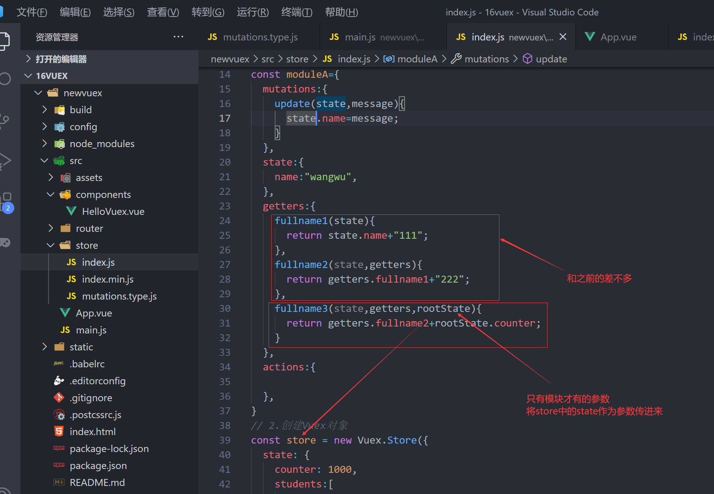

第二步：在组件中使用


#### actions的使用

第一步：在模块内写getters函数
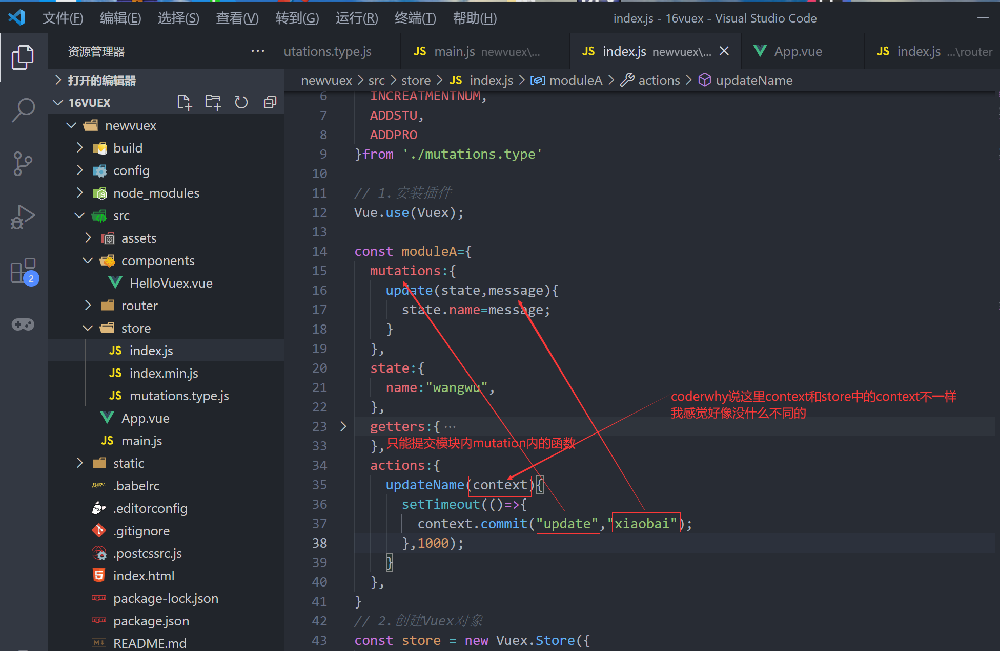

第二步：组件中使用


### 项目结构


## axios

### 功能特点

①在浏览器中发送 XMLHttpRequests 请求
②在 node.js 中发送 http请求
③支持 Promise API
④拦截请求和响应
⑤转换请求和响应数据
等等

### 安装

终端输入 npm install axios --save

httpbin.org 网络请求测试网址

### 基本使用

一


二


三：有参数需要拼接
下面两种方法最终的效果是一样的
方法一：


方法二：


### 多种请求方式

axios(config)
axios.request(config)
axios.get(url[, config])
axios.delete(url[, config])
axios.head(url[, config])
axios.post(url[, data[, config]])
axios.put(url[, data[, config]])
axios.patch(url[, data[, config]])

案例：


### axios发送并发请求


axios.all([]) 返回的结果是一个数组，使用 axios.spread 可将数组 [res1,res2] 
展开为 res1, res2


### 配置

#### 全局


#### 局部


### 常见的配置选项

请求地址
	url: '/user',

请求类型
	method: 'get',

请根路径
	baseURL: 'http://www.mt.com/api',

请求前的数据处理
	transformRequest:[function(data){}],

请求后的数据处理
	transformResponse: [function(data){}],

自定义的请求头
	headers:{'x-Requested-With':'XMLHttpRequest'},

URL查询对象
	params:{ id: 12 },  

查询对象序列化函数
	paramsSerializer: function(params){ }

request body
	data: { key: 'aa'},

超时设置s
	timeout: 1000,

跨域是否带Token
	withCredentials: false,

自定义请求处理
	adapter: function(resolve, reject, config){},

身份验证信息
	auth: { uname: '', pwd: '12'},

响应的数据格式 json / blob /document /arraybuffer / text / stream
	responseType: 'json',

### axios的实例

当我们从axios模块中导入对象时, 使用的实例是默认的实例.
当给该实例设置一些默认配置时, 这些配置就被固定下来了.
但是后续开发中, 某些配置可能会不太一样.
比如某些请求需要使用特定的baseURL或者timeout或者content-Type等.
这个时候, 我们就可以创建新的实例, 并且传入属于该实例的配置信息.

#### 创建以及使用


### 模块封装

第一步：在newwork文件里创建
然后进行模块的封装


第二步：使用


### 拦截器

#### 请求拦截

能做到的事情
①当发送网络请求时，在页面中添加一个loading组件，作为动画，就是等待过程中那个转圈圈
②某些请求要求用户必须登录，判断用户是否有token，如果没有token跳转到login页面
③对请求的参数进行序列化

请求拦截中错误拦截较少，通常都是配置相关的拦截
可能的错误比如请求超时，可以将页面跳转到一个错误页面中


#### 响应拦截

响应拦截中完成的事情：
	响应的成功拦截中，主要是对数据进行过滤。
	响应的失败拦截中，可以根据status判断报错的错误码，跳转到不同的错误提示页面。


## githup托管

### 方法一 

第一步：先在githup上建立远程仓库


第二步：本地克隆


vscode终端输入 git clone https://github.com/Logical-Ghost/supermall.git


第三步：


第四步：vscode 文件夹下的 终端输入命令
git add .
git commit -m "初始化项目"   //这是提交到本地
git push

由于node_modules没有复制进来，所以需要在终端输入  npm install 进行安装 

### 方法二

由当前文件夹直接上传，不需要进行文件夹的复制
第一步：创建远程仓库
第二步：vscode 文件夹下 打开终端
			输入   git remote add origin "远程仓库的地址"
					  git push -u origin master

## 项目

### 目录结构的划分


### css文件的引入


然后在App.vue文件的style标签中引入base.css文件

### 路径以及代码风格

路径


在css使用路径需要 ~@  不需要带双引号


代码风格


### 图标


### 文件夹和文件

文件夹一般小写，文件一般驼峰式

### 首页

#### 首页导航封装


#### 首页请求数据


#### 首页轮播图


#### 推荐表信息


#### 导航控制


#### 首页的数据请求

1.请求数据


2.处理请求到的数据


#### 商品数据的显示


#### BScroll的封装以及使用


##### better-scroll的安装以及使用

官网：https://better-scroll.github.io/docs/zh-CN/

###### 安装
作用：防止在移动端滑动滚动条时出现卡顿

终端输入 npm install better-scroll --save

###### 使用

第一步：将第三方的better-scroll进行封装


第二步：使用

组件的样式


##### 监听滚轮的位置

probeType的四种状态

```js
// 1. probeType 为 0，在任何时候都不派发 scroll 事件，
// 2. probeType 为 1，仅仅当手指按在滚动区域上，每隔 momentumLimitTime 毫秒派发一次 scroll 事件，
// 3. probeType 为 2，仅仅当手指按在滚动区域上，一直派发 scroll 事件，
// 4. probeType 为 3，任何时候都派发 scroll 事件，包括调用 scrollTo 或者触发 momentum 滚动动画
```


##### 上拉加载


##### 整体用法


#### 返回顶部

第一步：封装成一个组件


第二步：在home组件中注册使用


#### 返回顶部的显示和隐藏

第一步：改变scroll.vue


第二步：更改home.vue


#### 上拉加载更多

第一步:修改scroll.vue


第二步：home.vue


#### 滚动区域的bug解决

BUG分析


解决


真实代码解决
第一步：造事件总线


第二步：进行图片加载完毕的监听
			  并发射函数到事件总线 
            this.$bus.$emit("imgItemLoad",参数); //这边可以加参数的补充一下


第三步：在home.vue组件中进行监听
               this.$bus.$on("imgItemLoad",(参数)=>{})    //这个参数是接收从上面传过来参数


另一种解决的方法（可能会有其他问题，应该是网友的写法）


#### 防抖动函数


#### tab-control吸顶效果

第一步：获取tab-control位置
因为轮播图请求到数据并显示，有一段事件的间隔，直接获取offsetTop的话会出现问题
所以先要等轮播图加载出来以后再获取offsetTop


第二步：复制一个tab-control


第三步：两个tab-control同步 


#### 离开home时记录状态

第一步：使得离开home时不被销毁


第二步：使用钩子函数，对下拉的位置进行记录
			activated() 进入
			deactivated()  离开
先刷新，在滚动吧，网友推荐，写的时候再调下位置

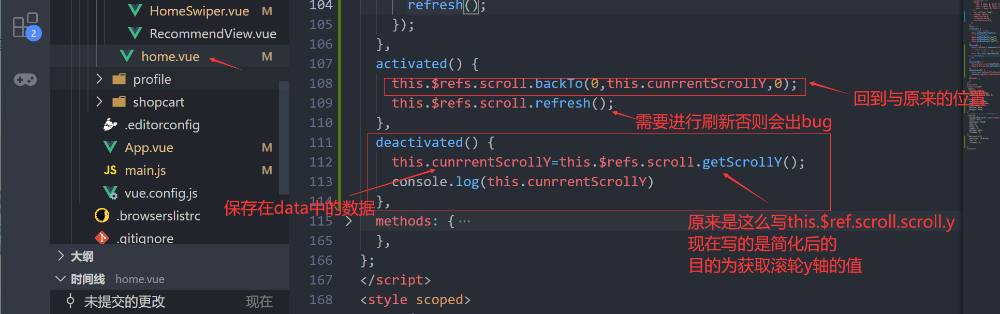

### 详情页面

#### 跳转到详情页面

第一步：创建详情视图


第二步：设置路由


第三步：点击商品并跳转详情页面


第四步：在详情页面中获取 iid


在详情页面中获取iid的第二种方法
使用query
跳转前的组件


跳转后的组件


#### 导航栏的封装

第一步：创建详情的导航子组件


第二步：在detail.vue中使用这个子组件


#### 轮播图的展示

第一步：请求数据
在network中新建detail.js文件夹，对数据请求再封装一层


再detail.vue中进行数据请求，并将数据传给子组件


第二步：子组件的创立


第三步：进行刷新，防止每一次只显示一张图片，


#### 基本信息的展示

由于组件需要的数据分布在很多地方，一个一个的请求到的数据传到子组件 会很麻烦，
也不方便使用，所以我们会将需要的数据整合到一个对象中，然后统一传给子组件进行展示

第一步：创建构造函数
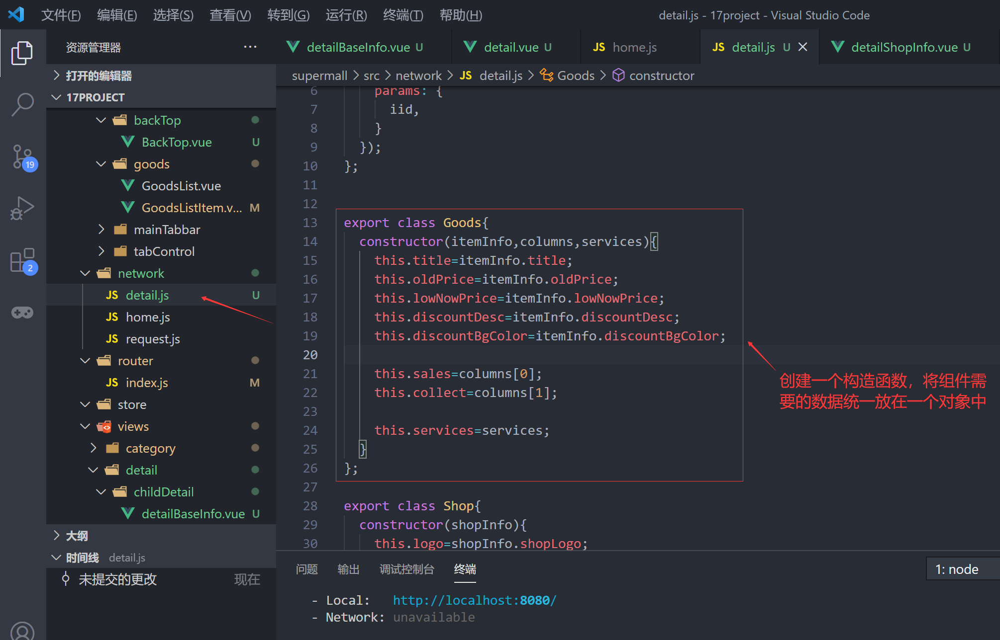

第二步：创建Goods实例，并将数据传给子组件


第三步：写detailBaseInfo.vue组件


#### 商家信息的展示

第一步：创建构造函数


第二步：创建Shop实例，并将数据传给子组件


第三步：写detailShopInfo.vue组件


#### 加入滚动效果

引入，注册，使用组件


css样式


#### 详情页面的展示

第一步：引入，注册，使用子组件


第二步：创建子组件detailGoodsInfo.vue


第三步：
	解决better-scroll的无法下拉的问题

​	第一种：最简单，不考虑性能的做法
​	1.在子组件中 监听图片的加载，每一张加载完都发送一次		2.每加载完一次进行一次刷新


第二种：

现在暂时只会用事件总线去实现防抖动函数

1.从子组件将事件发送到 事件总线

2.父组件接收 并使用


第三种：不使用事件总线实现防抖函数
第一步：使用mixins


第二步：在detail.vue中使用


**总结**：要想实现防抖函数的作用，那么每一次调用防抖函数必须是同一个，之前为了实现调用是同一个，我们用了闭包，现在做的是将要用的防抖函数保存在data()中，那么每次调用的时候
我们用的都是同一个防抖函数

#### 商品推荐数据的展示

第一步：在detail.js 中编写请求数据的函数


第二步：在detail.vue中获取并存储数据


第三步：引入组件，传递数据

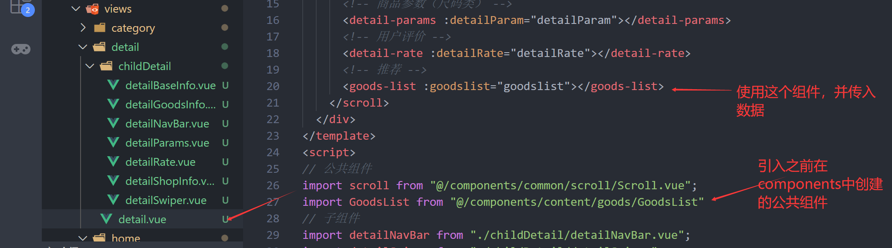

第四步：更改goodsListItem原先的代码


#### 取消全局事件的监听

由于home.vue和detail.vue两个组件都用了GoodsList组件，所以在detail.vue内图片加载完后home.vue也会跟着进行刷新，为了避免这种情况
第一步：离开 home.vue后取消对于图片加载的监听


第二步：销毁detail.vue后取消对于图片加载的监听


==注意==：有点小错误
	deactivated和destroyed里面  **this.$bus.off**  要换成 **this.$bus.$off** 不然报错
116行 this.$bus.off("imgItemLoad",itemImgLoad) 应该改成this.$bus.$off("imgItemLoad",this.itemImgLoad)

#### mixins

在两个组件的钩子函数中，如果有相同的代码剋提取到mixins.js文件中
Mixin钩子按照传入顺序依次调用，并在调用组件自身的钩子之前被调用

第一步：单独抽离成一个mixins.js文件


第二步：在组件中使用


==注意==：混入只能在一个mixins:[]中使用，使用第二个时会将前一个覆盖掉

#### 点击标题滚动到对应位置

第一步：在子组件中监听标题的点击，然后将事件传给父组件


第二步：在detail.vue组件中接收并执行函数


存储对应标题的组件的offsetTop值
获取这个offsetTop值得时候需要，在图片加载完以后再去获取，如果


执行函数跳转相应的位置


#### 滚动内容显示对应的标题

第一步：用之前写好的Scroll.vue中的 监听滚动，然后向父组件发出事件


第二步：在detail.vue中实现滚动到指定位置时 切换对应标题


#### 底部工具栏的封装

没什么好讲的，就是创建一个子组件 然后将html，css写写，然后在父组件中引入，注册，创建

#### 返回顶部的混入

以detail.vue为例子
第一步：将组件中相同的部分抽取到 mixins中


第二步：在detail.vue中混入


#### 将商品添加到购物车中

第一步：监听购物车的点击


第二步：在detail.vue中实现监听到的函数
将购物车中所需要的数据发送到vuex中，然后购物车再从vuex中拿数据


第三步：在vuex中判断是将商品数量+1 或者是 将商品添加到数组中


#### 对vuex中的代码进行重构


### 购物车页面

#### vuex新知识点

创建顶部导航时使用的这个知识点
第一步：在store中写好getters.js


第二步：在shopcart.vue中将 getters.js转成计算属性直接使用
   第一种写法：


第二种：自定义计算属性的名字
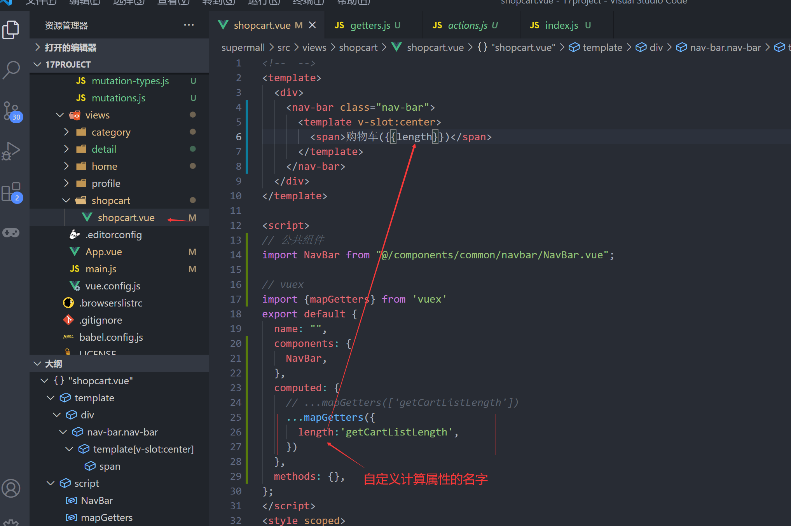

### 关于ref

ref如果是绑定在组件中的，那么通过this.$refs.ref属性值 获取到的是一个组件对象
从组件对象中获取它的根元素，this.$refs.ref属性值.$el
ref如果是绑定在普通的元素中，那么通过this.$refs.ref属性值 获取到的是一个元素对象

### 时间戳转字符串


第一步：写好时间戳转字符串的函数，放入工具类中


第二步：在组件中引入，并使用


### 遇到的问题

#### 路径

在dom和script不论用不用~都不行
现在暂时只知道用@是可以的

#### v-for

使用v-for时 需要使用:key  才能正常运行
<banner v-for="(value,key in imgs)" :key="key">

#### 父子通信还有些问题

子传父笔记做的不好，建议重新整理

#### 图标字体

图标字体不会用

