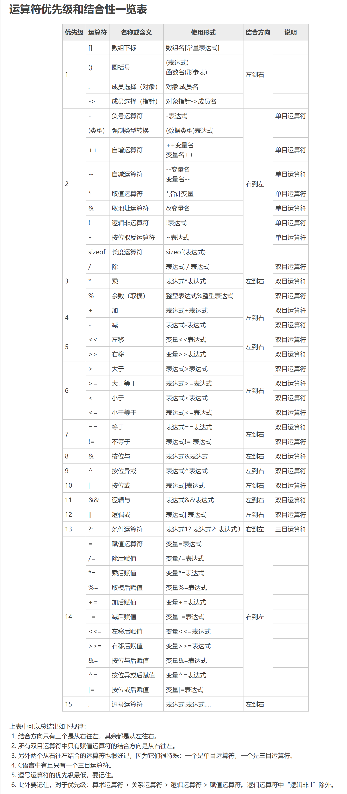

[toc]


## C面向过程的语言

### C语言程序的结构

### 数据类型及其运算

#### C的数据类型(基本类型、构造类型、指针类型、无值类型)及其定义方法

##### 基本类型

###### 整型

 short 短整型  2字节
 int 整型 4字节
 unsigned int 无符号整型 4字节
 long 长整型 4字节
 unsigned long 无符号长整型 4字节

​	十进制整数
​			数字前可带正负号：-21，+21，0
​	八进制整数
​			由数字0-7构成：以0为前缀，如015
​	十六进制整数
​			由数字0-9和字母A-F(a-f)构成，以0X或0x为前缀
​	整型常量后缀
​			整数后边加"L"或"l"表示长整型 158L,012L
​			整数后面加"U"或"u"表示是无符号整数，如33u,0x3Au

###### 浮点型

float 单精度浮点型 4字节
double 双精度浮点型 8字节 

实数也称为浮点数
	十进制小数形式
			.78等效于0.78  18.等效于18.0
	指数形式
			aen(a为十进制数，n为十进制整数，"e"或"E"来代表以十为底的指数)
			意思是：a*10^n
			1.1e5\=\=1.1\*10^5
	实型常量的后缀
			若数据后面加"f"或"F"表示该数为单精度浮点数，如3.6f
			==不加后缀的浮点数是double类型==

###### 字符型
**字符常量** 是用单引号括起来的一个字符
	例如：'a','A','8'
	转义字符是一种特殊的字符常量，以反斜线\开头，后跟一个或几个字符
**字符串常量** 是由一对双引号括起来的字符序列
	例如："hello"

字符常量和字符串常量之间的区别
①字符常量由单引号括起来,字符串常量由双引号括起来
②字符常量只能是单个字符，字符串常量则可以含一个或多个字符
③字符常量占1B（Byte字节）的内存空间。字符串常量占的内存字节数等于字符串中字符数加1。增加的一个字节存放字符'\0'(ASCII码为0)，这是字符串结束的标志。
字符串"HELLO"在内存中的显示
		
		它占内存6个字节，而不是5个字节。

##### 构造类型

构造类型主要有数组类型，结构体类型和共用体类型

#### C运算符的种类、运算优先级和结合性。



##### 算数运算符

- 左结合

​	+，-，*，/，%
​	/：
​		两个整数相除时，结果也为整数，7/3==2
​		若其中有一个为实数型，则结果为双精度实数型 7/2.0=3.5
​	%:
​		两边必须为为整数

##### 赋值运算符

- 右结合
- 赋值运算符的左边必须是一个变量

​    变量=表达式
​==赋值结果与类型转换==
​    赋值运算符两边的数据类型不相同，系统将自动进行类型转换，把赋值号右边的类型转换成左边                的类型
​    ①实型（包括单，双精度)赋给整型变量时，舍去实数的小数部分。
​    ②整型数据赋给实型，数值不变，但以浮点数形式存储到变量中
​    ③长度相同的有符号与无符号整型数之间，原样赋值(连原有的符号位也作为数值一起传送)

##### 逗号运算符

- 用逗号运算符把多个表达式连接起来组成一个表达式，称为逗号表达式

- 一般形式：表达式1，表达式2，....，表达式n	

  先求解表达式1，在求解表达式2，最后求解表达式n
  **整个表达式的值是表达式n的值**

- 例如：(a=3\*5,a\*4),a+5
  最终整个表达式值为15

##### 强制类型转换运算符

- 一般形式：
  (类型说明符)(表达式)
- 类型说明符的括号是必须的，表达式的括号不是必须的
- 例如：(float)a       (int)(x+y)
- ==无论是强制类型转换或是自动类型转换，都只是对变量的的数据进行临时转换，==
  ==不改变数据说明时对该变量定义的类型==

##### sizeof运算符

- 求类型说明符或表达式所表示的数据在内存中所占有的字节数
- 使用形式  ①sizeof(类型说明符);
                  ②sizeof(表达式);
- 例如:sizeof(char) //返回1
           sizeof(1.234) // 返回8

##### 自增自减运算

\+\+
\-\-
都会就不写了

##### 位运算符

位运算主要对二进制数位进行测试，抽取，设置或移位等操作。位运算只能是char型和int型的数据。

已知9的二进制表示为 00001001
	   5的二进制表示为 00000101

###### ~

含       义: 	按位取反
运算规则:	对参与运算的数的各二进制位按位求反
举	   例:	~9相当于~(00001001)
					结果为11110110

###### &

含       义: 	按位与
运算规则:	把参与运算的两个数的二进制位相与，只有对应的二进制位均为1时，结果
					的对应位才为1，否则为0
举	   例:	9&5 相当于 00001001&00000101
					结果为00000001 即9&5==1

###### | 

含       义: 	按位或
运算规则:	把参与运算的两个数的二进制位相或，只要对应的二进制位有一个1，结果
					的对应位就为1
举	   例:	9&5 相当于 00001001|00000101
					结果为00001101 即9|5==13

###### ^

含       义: 	按位异或
运算规则:	把参与运算的两个数的二进制位相异或，对应的二进制位上的数字不相同时，结果
					的对应位为1，否则为0
举	   例:	9&5 相当于 00001001|00000101
					结果为00001100 即9^5==12

###### <<

含       义: 	左移
运算规则:	把"<<"左边的运算数的各二进制向左移若干位，移动的位数即是"<<"
					右边的数字，高位丢弃，低位补0
举	   例:	若a=15   a<<2 指将a的二进制位左移2位，相当于a=00001111，左移两位
					得到00111100（十进制数为60)

###### >>

含       义: 	右移
运算规则:	把">>"左边的运算数的各二进制向右移若干位，移动的位数即是">>"
					右边的数字，高位补0(有时补1)，低位丢弃
举	   例:	若a=15   a>>2 指将a的二进制位右移2位，相当于a=00001111，右移两位
					得到00000011（十进制数为13)

##### 关系运算符

C语言提供六种关系运算符 < ，<=， >， >=，==，!=
前四种优先级高于后两种
**关系表达式的运算结果为1或0**

##### 逻辑运算符

三种逻辑运算符 &&，||，！
**逻辑表达式的运算结果为1或0**
==注意==
		①表达式1&&表达式2
			若表达式1的值为0则不会执行表达式2
		②表达式1||表达式2
			若表达式1的值为1则不会执行表达式2

#### 不同类型数据间的转换与运算

自动类型转换发生在不同数据类型的量混合运算时
自动类型转换遵循规则，如图


①左箭头为自动类型转换，char型数据参与运算时自动转换为int型
	float型数据参与运算时先自动转换成double型再做运算
②上箭头表示当运算对象为不同类型时转换的原则
	例如，int型和double型数据进行运算时，先把int型转换成double型
	然后两个double型的在做运算
	不同类型数据进行混合运算时，按照类型级别由低到高的顺序转换

### 控制结构

顺序结构、选择结构、循环结构

#### if语句

①if(单分支语句)
	if......
②if...else(双分支语句)
	if(表达式)
		语句一；
	else
		语句二；

#### 条件运算符

- ?:
- 表达式1?表达式2:表达式3；
- 自右向左结合
  例：a>b?b:c>d?c:d 相当于a>b?b:(c>d?c:d)

#### switch语句

- 一般格式：
  switch（表达式)
  {

  ​	case 常量1:
  ​					  语句序列1；
  ​					  break;

  ​	case 常量2:
  ​					  语句序列2；
  ​					  break;

  ​	.................

  ​	case 常量n:
  ​					  语句序列n；
  ​					  break;

  ​	default:
  ​					  语句序列n+1;

  }

- 注意点：
  ==switch后面的表达式，必须是整型或字符型==

  ==case后的常量类型和switch后面表达式的类型一致==

  ==case和default出现的次序不影响执行结果==

  ==case分支的常量的值必须互不相同==

  

#### while

while(表达式){
	循环体语句
}
表达式可以是任意数据类型的表达式
表达式的值非0则继续执行循环

#### do...while

do{
	循环体语句;
}while(表达式);

#### for循环

for(表达式1;表达式2;表达式3){
	}
for(循环变量赋值初始化;循环条件;循环变量增量){
	循环体语句;}
*注意*
		①for(;;)     表示不设置初始值，不判断条件(表达式2始终为真)，循环变量不变化
			就相当于无限循环了
		②它与while和do...while的区别
			for语句可以在表达式1里面实现循环变量的初始化
			而while和do...while循环，循环变量的初始化操作在循环前完成

#### break和continue语句

##### break
break语句通常用在 循环语句和switch语句，不能单独使用
在多重循环中，一个break语句只向外跳一层

##### continue

continue语句跳过当前正在执行的循环，接着执行下一次循环

### 数组

#### 一维数组的定义和引用

一维数组定义的一般形式:
		类型说明符 数组名[元素个数];
		元素个数只能是整型常量和符号常量
		例:int a[10];
			#define M 20
			char c[M];
==注意==
		数组的大小不能用变量来设定
		一维数组一旦定义，程序编译时就在内存中根据数组的大小占用连续的存储空间，其占用
		的空间大小是确定的，不会随着程序运行过程中变量的改变而改变

数组必须先定义，后使用

一维数组的引用形式为:
		数组名[下标]

#### 一维数组的初始化

①定义时给所有数组元素赋值
	int a[6]={1,2,3,4,5,6};
②部分数组元素赋初值
	当初始化数据个数少于数组元素个数时，剩下的数组元素被赋予0。在字符数组中，对于默认的	字符通常赋值为'\0'
	例
		int a[5]={1,2,3};
		那么 a[4]==0;

​		char b[5]={'s','u','n'};
​		那么 b[3]=='\0';
③对所有元素赋值，可以不指明数组长度
​	例：
​		int c[]={1,2,3,4,5}; 等价于 int [5]={1,2,3,4,5};
④使用赋值语句或输入函数对数组元素赋值
​	 例：
​		int a[5];
​		for(int i=0;i<5;i++)
​			scanf("%d",&a[i]);		

#### 二维数组的定义和引用

二维数组定义的一般形式为:
	类型说明符 数组名\[行数\]\[列数\]
	例:
		int a\[4\]\[5\];
二维数组元素的引用:
	数组名\[行下标\]\[列下标\]
二维数组各数组元素在内存中是按行优先方式在连续的存储空间进行存放的。
	int a\[2\]\[3\];
	二维数组a在内存中开辟6个连续的存储单元，a\[0\]\[0\] a\[0\]\[1\] a\[0\]\[2\] a\[1\]\[0\] a\[1\]\[1\] a\[1\]\[2\]

#### 二维数组的初始化

①按行赋初值
	int a\[2\]\[3\]={{1,2,3},{4,5,6}};

​	对于赋0值的元素，在其对应的初值数据位置上可缺省不写
​	int b\[2\]\[3\]={{1},{,,6}};
​	等价于 int b\[2\]\[3\]={{1,0,0},{0,0,6}};

②按数组在内存中的排列顺序赋初值
	int b\[2\]\[3\]={1,2,3,4,5,6};
	等价于 int b\[2\]\[3\]={{1,2,3},{4,5,6}};
③省略第一维的长度(即行数)
	在定义二维数组并进行初始化时，允许省略对第一维的长度的说明，这时第一维的长度由所
	赋初值的行数确定。例：
	int b\[\]\[3\]={{1,2,3},{4,5,6}};
	相当于 int b\[2\]\[3\]={{1,2,3},{4,5,6}};
④通过从循环语句从键盘输入数据赋值
	从键盘输入数据为二维数组元素赋值一般需要两重循环，外循环控制行，内循环控制列
	例：
	int b\[2\]\[3\],i,j;
	for(int i=0;i<2;i++){
		for(int j=0;j<3;j++){
			scanf("%d",&a\[i\]\[j\])；
			}
	}

#### 注意

​		感觉有点诡异
​		int b\[\]\[3\]={1,2,3,4,5,6};
​		b\[0\]\[3\]\=\=4;
​		b\[0\]\[4\]\=\=5

#### 字符串和字符数组

**字符串**

字符串是用双引号括起来的字符序列。c中没有专门的字符串类型，字符串的存储和处理只能
通过字符数组来进行。字符数组的一个元素对应于字符串中的一个字符，最后用转义字符'\0'作为字符串的结束标志。因此，对于字符个数为n的字符串，须占用n+1个字节的内存空间。

**字符数组的初始化**
	①
		char 字符数组名[元素个数]="字符串";
	②
		char 字符数组名[]="字符串";
		char str[]="blue";
		等价于 char str[]={'b','l','u','e','\0'};

#### 字符串处理函数

使用这些函数前必须在程序的开头添加预处理命令 #include"string.h"

##### ①gets()函数

​	作	   用：从终端输入一个字符串到字符数组中
​	调用格式：gets(数组名);
​	如果调用成功则返回数组的首地址，否则返回NULL
​	例：char str[10]; gets(str);
​		   从键盘输入hello，那么字符串数组str中存入hello
​	

##### ②puts()函数

​	作	   用：将一个字符串输出到终端，字符串的结束标志'\0' 不输出
​	调用格式：puts(字符数组名)；
​	例：char str[]="program";  执行puts(str); 语句后在屏幕上出现program
​	
​	gets()和puts()函数每次只能处理一个字符串

##### ③strlen()函数

​	作	   用：统计字符串所包含的实际字符的个数(不包括'\0');
​	调用格式：strlen(字符串数组名)
​	调用成功返回字符的实际个数
​	例：char str[]="abc";  printf("%d",strlen(str)); 输出结果为3

##### ④strcat()函数

​	作	   用：连接两个字符串数组中的字符串，将字符串2连接在
​					  字符串1后面称为一个新的字符串，并保存在字符串1
​					  中。注意，字符串1的长度要足够大 足以容纳新的字符串。
​	调用格式：strcat(字符串数组1,字符串数组2);
​	例：char str1[20]="abc";
​		   char str2[]="def";
​		   strcat(str1,str2);
​		   printf("%s",str1);   输出结果abcdef；

##### ⑤strcpy()函数

​	作	   用：将字符串数组2 复制到字符串数组1中
​					  字符串数组1中原有的字符串被覆盖
​	调用格式：strcpy(字符串数组1，字符串数组2)；
​	例：char str1[20]="abc"; 
​		   char str2[]="hhhh";
​		   puts(strcpy(str1,str2));
​		   输出结果为 hhhh

##### ⑥strcmp()函数

​	作	   用：比较两个字符串的大小
​	就是依次比较两个字符串中字符的ASCII码值。
​	调用格式：strcmp(字符串1，字符串2);
​	函数调用成功有三种返回值：
​				Ⅰ：返回值0，字符串1等于字符串2。
​				Ⅱ：返回值大于0，字符串1大于字符串2。
​				Ⅲ：返回值小于0，字符串1小于字符串2。
​	==c语言中不能直接用关系运算符比较两个字符串的大小==

##### ⑦strlwr()函数

​	作	   用：将字符串中所有大写字母转换为小写字母;
​	调用格式：strlwr(字符串数组名)；

##### ⑧strupr()函数

​	作	   用：将字符串中所有小写字母转换为大写字母;
​	调用格式：strupr(字符串数组名)；

##### gets()和scanf()函数的区别

gets()函数能够输入带空格的字符串，
而格式控制符%s 进行字符串输入的scanf()函数不能输入带空格的字符串，
空格作为一个字符串输入的结束控制。

### 函数

#### 函数的定义、类型和返回值

##### 函数的定义

①库函数
	也叫标准函数，由c语言系统提供，可以直接调用。
	例如printf(),scanf(),puts(),gets()
	但是需要#include命令将这些函数需要的头问包含到本文件中即可
②自定义函数
	一个函数中有且仅有一个main()函数，其他函数可有可无，所有函数都是
	独立定义的，不能定义在其他函数中
	定义函数的一般形式：
			返回值类型 函数名(类型1 形参变量1，类型2 形参变量2.... 类型n 形参变量n){
				语句；
				return 返回值；
			}

##### 返回值

​	Ⅰ：对于返回值
​			如果返回值类型不是void，那么return后的值(即函数的返回值)的类型必须是或能自动
​			转换为返回值类型。否则编译错误。
​	Ⅱ：函数名可以是任何合法的自定义标识符。
​	Ⅲ：一个函数可以由多条return语句，但函数每次执行只有一条return语句会执行，return语句执		   行完，函数结束。对于没有返回值的函数(返回值为void),也可以用一个空的"return;"语句立		   即结束函数。

##### 函数的声明

Ⅰ：如果一个函数在另一个函数定义之前需要使用该函数，根据C语言先定义后使用的原则，就需	   要进行函数的声明。
Ⅱ：函数声明也叫函数原型，主要作用就是告诉编译器有这样一个函数，但是定义在使用函数的位	   置后面。
Ⅲ：声明函数的一般形式为：
	   返回值类型 函数名(类型1 形参变量1，类型2 形参变量2......类型3 形参变量3);
	   可以简化成:函数名(类型1，类型2......，类型3);   省略形参变量
	

 #### 形式参数与实在参数，参数值传递

 注意点：
	Ⅰ：如果函数定义中没有实参，则调用函数时()内为空，但()绝不可省略。
	Ⅱ：实参必须是确定的值 包括常量、变量（初始化后的)、包含二者的表达式
		   实参和形参的个数和顺序上必须完全一致，且实参类型和形参兼容。
		   实参可以通过自动类型转换将值赋值的形参，但是如果无法转换则会产生编译错误

**数组名作函数参数**
	Ⅰ：用数组名作函数参数，应该在调用函数和被调用函数中分别定义数组，且数据类型必须一致
	Ⅱ：地址传递方式，实参与形参共用地址，相当于同一对象的不同名字，C编译系统对形参大小不做		   检查，所以形参数组可以不指定大小。

``` c
#include"stdio.h"
void fun(int arr[]);
int main(void){
    int num[10]={1,2,3,4,5,6};
    fun(num);
}
void fun(int arr[]){
}
```


#### 函数的调用、嵌套调用、递归调用

##### 函数的调用

调用函数的一般形式:
函数名(实际参数1，实际参数2...，实际参数3);
注意点：
	Ⅰ：如果函数定义中没有实参，则调用函数时()内为空，但()绝不可省略。
	Ⅱ：实参必须是确定的值 包括常量、变量（初始化后的)、包含二者的表达式
		   实参和形参的个数和顺序上必须完全一致，且实参类型和形参兼容。
		   实参可以通过自动类型转换将值赋值的形参，但是如果无法转换则会产生编译错误

##### 递归调用

①间接递归
	在一个函数中调用了其他函数，而在其他函数中又调用了本函数
	例：
		void fun1(){
			...
			fun2();
			...
		}
		void fun2(){
			...
			fun1();
			...
		}
②直接递归
	在一个函数中调用自身
	例：
		void fun(){
			...
			fun();
			...
		}

递归函数内必须有递归出口，常用的办法是加条件判断，满足某种条件就继续递归
或满足某种条件就不再递归

递归的特点：函数看似调用自身，但每次调用规模都变小(通常是参数改变)，直到规模小到函数能够直接
					  求解不用再递归的程度。		

#### 局部变量和全局变量，变量的存储类别，变量的作用域和生存期

##### **局部变量**
​		在一个函数内定义的变量(包括形参)是局部变量，它只在该函数体内这个局部范围可以访问。
​		如果一个局部变量定义在函数某个符合语句内，则其作用域也只在该复合语句内。
##### **全局变量**
​		与局部变量相反，全局变量不定义在任何函数中，也不属于任何一个函数，它的作用域是从
​		定义位置到所在源文件结束。
 注意：	
​		Ⅰ：局部变量可以和全局变量同名，在局部变量的作用域内，全局变量将被屏蔽而无法访问。
​		Ⅱ：类似于函数的声明，如果函数要使用一个定义在函数之后的全局变量，需要在函数内声明
​			   该变量。
​			   格式：
​						extern 类型 全局变量名；
​		Ⅲ：全局变量能被定义位置后的全部函数访问与修改，所以可以作为多个函数共享与传递的数据。
​			   但是降低了程序了可读性和可靠性。
​			   所以尽量减少使用全局变量。

##### 变量的存储类别

从变量值存在时间(即生存期)的角度来分，变量可以分为静态存储方式和动态存储方式。
简单地说，静态和动态是指是否一直占据某一片内存空间，程序运行时一直存在的变量
是静态变量，只有某个函数被调用时才存在的变量是动态变量。

全局变量的存储方式:
		全局变量是静态变量
局部变量的存储方式:
		局部变量只能在定义该变量的函数内访问。局部变量的默认存储方式是动态存储。
		局部变量的生存期 就是函数被调用期间，每次函数调用结束，变量的空间被回收，
		变量失效，下次调用重新为变量分配空间。
		==局部变量实现静态存储==：
				static 数据类型 变量名；
				局部静态变量只能在函数内部访问，函数调用结束不释放其内存空间，变量
				的值在每次函数结束时得以保留，下次函数被调用时不再重新执行初始化，
				其值可以继续使用。
				总的来说就是，静态变量只执行一次初始化，每次调用函数开始时，变量仍是
				是上次调用结束的值。

#### 函数与带参数的宏

宏 可以将一个标识符替换为确定的字符串
像函数带有参数一样，C语言也支持宏带有参数，不仅替换文本，也替换文本中的参数
定义带参数宏的格式：
	#define 宏名(参数列表) （带参数的字符串)
字符串可以不带括号，但是为字符串替换后产生运算符优先级的问题，此处最好加上括号
与函数定义不同的是，宏名没有类型，参数列表中多个参数也没有类型，只需用逗号分隔开。

宏的调用：
	宏名(参数列表)

```c
#include<stdio.h>
#include<math.h>
#define PI (asin(1)*2)   //无参数宏
#define area(a,b) (PI*a*b)     //带参数宏
int main(vodi){
	double m,n,s;
	scanf("%lf lf%",&m,&n);
	s=area(m,n);
	printf("%lf",s);
	return 0;
}
```


就是用PI\*a\*b代替掉 area(a,b) 标识符
结果就是area(a,b) 被替换成（(asin(1)\*2)\*m\*n)

如果宏的参数是表达式
例： area(1+1,1)
		那么宏会被替换成 (asin(1)\*2)\*1+1\*1) 这是由于计算优先级的问题
为了避免这类问题，在定义宏时，将字符串中的参数也加上括号。
如：#define area(a,b)  (PI\*(a)\*(b))

### 指针

#### 地址与指针变量的概念，地址运算符与间址运算符。

##### 概念

内存单元：内存中一个或相邻的多个字节，内存单元的大小取决于它所存储的数据类型。

计算机一般都是按字节对内存进行编址的。
当某个数据(char)的内存单元占用一个内存字节时，该数据内存单元的地址就是所占用字节的地址。
当某个数据(int、float)的内存单元占用多个相邻字节时，一般取这多个字节地址中最小的字节地址
作为整个内存单元的地址。

**指针**：通常为内存单元的地址。内存单元的指针和内存单元的地址是同义词
		   但是它们和内存单元的内容不同。

对于一个内存单元来说，单元的地址即为指针，其中存放的数据才是该单元的内容。c语言中，
允许用一个变量来存放指针，这种变量称为**指针变量**。
因此，一个指针变量的值就是某个内存单元的地址或称为某内存单元的指针。

严格地说，一个指针是一个地址，是一个常量。而一个指针变量却可以被赋予不同地指针值，
是变量。但常把指针变量简称为指针。

##### 指针变量的定义

定义地一般形式：
		基类型 * 指针变量名；
Ⅰ：\* 表示定义的是一个指针变量；
Ⅱ："基类型" 表示本指针变量所指向变量的数据类型；
Ⅲ：指针变量名需符合自定义标识符的命名规则；

例：int *p1;
一个指针变量只能指向与其基类型相同类型的数据，如p1只能指向整型数据。

##### 指针变量的引用

&：取地址运算符
\* ：指针运算符(或称"间接访问"运算符)
c语言中提供取地址运算符 & ,用来获取变量的地址
其一般形式为:
	& 变量名;
&和\*运算符同时出现在一起时，他们都可以相互抵消。

##### 指针变量的赋值

Ⅰ：定义指针变量时对其初始化
	   int a;
	   int *p=&a;
Ⅱ：先定义指针变量，后对其赋值
	   int a;
	   int *p;
	   p=&a;

#### 指针与数组

数组名代表数组的首地址，所谓数组指针就是整个数组的起始地址，数组元素的指针
就是各个数组元素所占内存单元的地址。

​	int a[10];
​	int *p;
​	p=&a[0];
​	因为数组名代表数组的首地址，就是第0号单元的地址
​	所以 p=a 等价于 p=&a[0]

注意：下标运算符"[]"的运算方式
	a\[i\]      等价于 \*(a+i)
	a\[i\]\[j\]   等价于 \*(\*(a+i)+j)

##### 通过指针引用数组元素

``` c
float f[10];
float *p;
p=f+5;
```

此时p==&f[5];
假设数组f的内存起始地址为2004H；
由于每个float类型数据占4个字节，所以数组f中任何两个相邻的单元的地址值之差为4。
由于f+5为数组中f[5]单元的地址，因此p的值为2018H。
C语言规定：当指针变量p指向数组中的某个元素时，表达式p+1的值为同一数组中
					 下一个元素的地址。

如果指针变量p的初值&a[0],则有以下结论

``` c
int a[10];
int *p=&a[0];
```

①p+i和a+i就是a[i]的地址，或者说他们指向a数组的第i个元素
②\*(p+i)或\*(a+i)就是p+i或a+i所指向的数组元素，a[i];
	例:
		\*(p+5)或\*(a+5) 就是a[5]
③由于方括号"[]"本身就是下标运算符，因此指向数组的指针变量也可以带下标
	例:
		p[i]和*(p+i)等价

综上所述，引用一个数组元素可以用以下方法
Ⅰ：下标法，即用a[i]的形式访问数组元素。在前面介绍数组时都是采用这种方法。
Ⅱ：指针法，即采用\*(a+i)或\*(p+i)或p[i]的形式，用间接访问的方法来访问数组元素
	   其中a是数组名，p是指向数组的指针变量

#### 指针与数组名作为参数

指针与数组名都可以用作函数的实参和形参
emmmm 不想写了 好麻烦
C程序设计教程与实验P174

#### 指针与字符串

C语言中，可以用两种方法访问一个字符串
①用字符数组存放一个字符串，然后输出该字符串
②用字符指针指向一个字符串

```c
//字符指针指向一个字符串
#include<stdio.h>
int main(void){
    char *str="i love you";
	printf("%s\n",str);
    return 0;
}
```

指向字符串的指针变量str的定义与指向字符型数据的指针变量定义是相同的
两者之间区别只能按对指针变量的赋值不同来区别。
		对指向字符串的指针变量应赋予一个字符串
		对指向字符变量的指针变量应赋予相应字符型数据的地址
		例:
				char c,*p=&c;
				表示p是一个指向字符变量c的指针变量
				char *str="i love you";
				表示str是一个指向字符串的指针变量，实际上是把字符串
				的首地址赋予str，千万不能理解为将整个字符串赋值给指针变量str。
				字符串"i love you"存储在一块没有名字的静态区域

对于字符串的指针变量，可以先定义，然后再把字符串的首地址赋予指针变量：
	char *ps="i love you";
	等价于：
	char *ps;
	ps="i love you";
但是对于字符数组而言，这样做是不是允许的。
例：
	char str[11];
	str="i love you"; //str是数组名，是常量，c语言不允许对其赋值

#### 指针与函数

##### 指针作为函数参数

函数的参数不仅可以是整型，实型，字符型等数据，还可以是指针类型

##### 返回指针值的函数

函数类型就是指函数返回值的类型。C语言中允许一个函数的返回值是一个指针，这种
函数一般称为指针函数。
指针函数的一般定义形式为:
		类型说明符 *函数名(形参列表){
					函数体	
		}
		\*                 ：表示函数的返回值是一个指针类型
		类型说明符：返回的指针值所指向的数据类型。    

##### 指向函数的指针

指向函数的指针变量称为**函数指针变量**。一个函数总是占用一段连续的内存区，而函数名就是该函数所
占内存区的首地址。可以把函数的这个首地址(也称入口地址)赋给一个指针变量，使用指针变量指向该
函数，然后通过变量就可以找到并调用这个函数。
函数指针变量定义的一般形式为:
		类型说明符 （*指针变量名)(形参类型列表);
		类型说明符 	 ：指函数返回值的类型
		\(\* 指针变量名\) ：\*后面的变量是定义的指针变量
		最后的()		   :	该指针变量所指的是一个函数，括号中应依次给出被指函数中各个形参的类型。
		例:
		int (\*fp)();
		指针变量fp所指的函数的返回值是整型，并且该函数没有形式参数。
		float (\*fq)(float,int,char)
		指针变量fq所指函数的返回值是float型，并且该函数有三个形式参数。

用指针变量调用函数的一般形式为:
		\(\*指针变量名\)(实参列表);
		使用函数指针变量还应注意以下两点:
		①函数指针变量不能进行算数运算，这与数组指针变量是不同的。数组指针变量加或减一个整数
			可使指针移动到指向后面或前面的数组元素，而函数指针的移动是毫无意义的。
		②函数调用中(\*指针变量)两边的括号必不可少。

#### 多级指针

##### 指向指针的指针

​		A 指针
​		B 指针
​		C 一般数据类型变量或存放这些数据的数组元素
​		A指向B，B指向C
​		则：
​			B是普通的指针，称为一级指针，用于存放一级指针的变量称为一级指针变量
​			A是指向指针的指针，称为二级指针，用于存放二级指针的变量称为二级指针变量
​			根据B的情况不同，二级指针又分为三种指向指针的指针，指向指针数组的指针，指向
​			多为数组的指针。

一般来说，定义指针变量时，变量名前面又几个*，这个指针变量就是几级指针。
例：
		int d;
		int \*p,\*\*q,\*\*\*r;
		p=&d;
		q=&p;
		r=&q;
C语言对指针的级别有比较严格的规定，任何指针只能指向相应比它低一级的指针，即
二级指针只能指向一级指针，三级指针只能指向二级指针。

##### 指针数组

指针数组是一组有序指针的集合，即指针数组的所有元素都是指向相同数据类型的指针。
定义指针数组的一般形式：
		类型说明符 *数组名[数组长度];
		类型说明符：为所有数组元素的基类型；
		\*				 :  说明数组中的所有元素都是指针类型；
		数组长度	：即数组中的元素个数
由于任何数组的数组名代表着该数组的起始地址，而指针数组的每个元素都是指针，
所以指针数组的数组名就是指针的指针，它属于二级指针。

##### 指向多维数组行的指针

①二维数组的地址
	二维数组可以看作是特殊的一维数组
	例：
		int a\[3\]\[4\];
		可以分解看作是3个一维数组a[0],a[1],a[2];
	从二维数组的角度来看，a是二维数组名，它代表整个二维数组的首地址
	也是二维数组第0行的首地址(&a[0])
	从一维数组的角度来看，a[0]是一维数组名，它代表整个一维数组的首地址，
	也是一维数组第0行0列的首地址(&a\[0\]\[0\])

二维数组中各种表示形式的含义	

②指向二维数组行的指针变量
	行指针变量定义的一般形式为:
		类型说明符 (*指针变量名)[所指一维数组长度]
		类型说明符：为数组中元素的数据类型；
		\*				 :  说明数组中的所有元素都是指针类型；
		数组长度	：表示二维数组分解为多个一维数组时，每个一维数组的长度	
		注意：（\*指针变量\)两边的括号不可少，缺少括号则表示的是指针数组，意义完全不同

​	例：
​		int a\[2\]\[4\];
​		int (*q)[4];
​		q=a;
​		q(&a\[0\])是二级指针 指向 一维数组a\[0\]，即&a\[0\]\[0\]是个一级指针
​		由于指针变量q的基类型可以看作包含4个整型元素的一维数组类型，因此当q++时，q中
​		保存的地址值加上4个整型单元的大小。q=q+1；相当于(q=&a[0]+1)==&a[1];
​	**注意**
​		int \(\*q\)[4];
​		int \*p；
​		虽然两者的定义形式相差很大，但q和p一样都是指针变量，它们在内存中都是占4个字节
​		的存储空间，都只能保存一个地址值。q和p唯一的不同的是，他们的基类型不同，即对他
​		们进行加1或减1操作时，他们保存的地址值实际加减的字节数不同。千万不能将q理解为数
​		组名或指向函数的指针。
​		指针数组和二维数组指针变量的区别。这两者虽然都可以用来指向二维数组，但是其表示
​		方法和意义是不同的。二维数组的行指针变量是个单量，而指针数组表示的是多个指针(一组有序指		针)
​		例:
​				int \(\*p1\)[3];
​				p1是一个指向二维数组的行指针变量。它指向长度为3的整型一维数组；
​				int *p2[3];
​				p2是一个指针数组，数组中有三个下标变量p2[0],p2[1],p2[2]均为指针变量，这3个指针均
​				指向整型数据。

### 结构体和共同体

构造数据类型——结构体

#### 结构体的定义和初始化

定义结构体变量有以下三种方法
①先定义结构体类型，再定义结构体变量
	struct stu{				//struct是定义结构体类型的关键字
		char num[10];
		char name[20];
		char sex;
		int age;
		float score;
	};							//定义结构体类型
	定义好结构体类型 struct stu后，就可以定义结构体类型的变量，其定义形式为:
	struct stu boy1,boy2;   //定义了两个结构体类型的变量boy1,boy2
②在定义结构体类型的同时定义结构体变量
	例：
	struct stu{				
		char num[10];
		char name[20];
		char sex;
		int age;
		float score;
	}boy1，boy2；
	这种定义的一般形式为:
	struct 结构体类型名
	{
		成员表列;
	}变量名表列;
③直接定义结构体变量
	例：
	struct{
		char num[10];
		char name[20];
		char sex;
		int age;
		float score;
	}boy1,boy2;
	这种定义的一般形式为:
	struct{
		成员表列;
	}变量名表列;

结构体变量的成员也可以是另一个结构体变量，即构成嵌套的结构体。
例:
	struct date{
		int month;
		int day;
		int year;
	};
	struct{
		char num[10];
		char name[20];
		char sex;
		struct date birthday;
		float score;
	}boy1,boy2;

结构体列类型的成员名由于在结构体变量内部，因此可与程序中的其他变量同名，互不干扰。
和其他类型的变量一样，对结构体变量也可以在定义时进行初始化赋值。

#### 结构体成员的引用

在程序中使用结构体变量时，往往不把它作为一个整体来使用。在ANSIC中除了允许具有
相同类型的结构体变量相互赋值以外，一般对结构体变量的使用，包括赋值，输入，输出，
运算等，它们都是通过结构体变量的成员来实现的。
引用结构体变量成员的一般形式如下:
	结构体变量名.成员名
	例：
		boy1.num  //第一个人的学号
		boy2.sex	//第二个人的性别
	如果成员本身又是一个结构体，则必须逐级找到最低级的成员才能使用
	例：
		boy1.birthday.month
. 称为成员运算符

```c
//定义结构体变量的同时对其进行初始化
#include<stdio.h>
int main(void){
	struct stu{		//定义结构体类型
		char num[10];
		char name[20];	
    }boy1,boy2={"00001","XiaoMing"};
	boy1=boy2;		//结构体变量的整体赋值
}
```


```c
//结构体变量的赋值就是给各个成员赋值。可用输入函数(gets())或者赋值语句(scanf())完成。
#include<stdio.h>
struct stu{
    char num[10];
	char name[20];
}boy1,boy2;			//此时boy1,boy2为全局变量
int main(void){
	gets(boy1.num);
	gets(boy1.name);
	scanf("%s",&boy2.num);
	scanf("%s",&boy2.name);
}
```

#### 结构体数组

结构体数组的定义方法和结构体变量相似，只需说明它为数组类型即可

```c
//结构体数组的定义
struct stu{
	char num[10];
	char name[10];
}boy[5];

//结构体数组也可以在定义时初始化
struct stu{
	char num[10];
	char name[10];
}boy[5]={
		{"001","xiaoming"},
         {"002","xiaohong"},
         {"003","xiaozhang"},
         {"004","xiaobai"},
         {"005","xiaotian"}
	};

//和普通数组一样，当对全部数组元素作初始化赋值时，也可以不给出数组长度
struct stu{
	char num[10];
	char name[10];
}boy[]={
		{"001","xiaoming"},
         {"002","xiaohong"},
         {"003","xiaozhang"},
         {"004","xiaobai"},
         {"005","xiaotian"}
	};

```

#### 指向结构体的指针

当一个指针变量用来指向一个结构体变量时，称之为结构体指针变量。结构体指针变量中的值
是所指向的结构体变量的首地址。通过结构体指针即可访问该结构体变量的所有成员，这与数组
指针和函数指针的情况是相同的。
	结构体指针变量定义的一般形式为:
	struct 结构体类型名 *结构体指针变量名;

```c
struct stu{
    char name[10];
}boy;
int main(void){
	struct stu *pstu; //定义结构体指针变量，当然也可在定义struct stu结构体类型的同时定义pstu
	pstu=&boy; 		 //将结构体变量boy的地址赋予pstu指针
	
}
//结构体指针变量的赋值是把结构体变量的地址赋予该指针变量，不能把结构体类型名赋予该指针变量
```

结构体类型名和结构体变量是两个不同的概念，不能混淆。结构体类型名只能表示一个结构体的型式，
编译系统并不对它分配内存空间。只有当某变量被定义为这种类型的结构体时，才对该变量分配存储
空间。

通过结构体指针变量，来访问结构体变量的各个成员。
一般型式:
	(\*结构体指针变量).成员名;
	或
	结构体指针变量->成员名;
	例：
		(*pstu).name;
		pstu\-\>name;
	这里的"->"称为指向运算符。(\*pstu)两侧的括号不可少，因为成员运算符"."的优先级高于"\*"。

```c
//结构体指针变量的具体定义和使用方法
#include<stdio.h>
struct stu{			//定义结构体类型struct stu
	char num[10];
}boy1={"001"},*pstu;	//定义结构体变量并初始化，定义一个指向struct stu类型的结构体指针变量
int main(void){
	printf("%s",boy1.num);		//以下三种引用结构体成员的型式是等效的
    printf("%s",(*pstu).num);
    printf("%s",pstu->num);
	
}
```

#### 结构体与函数

在ANSIC标准中允许用结构体变量作为函数参数进行整个结构体数据的传送。但是
这种传送要将全部成员逐个传送，特别是成员为数组时，将会使数据传送得时间和
空间开销都很大，**大大降低程序的执行效率**。因此最好的办法就是使用指针，即用
指针变量作为函数参数进行传送。这时由实参传向形参的只是结构体数据的地址，
该地址仅有4个字节，远远低于一般结构体数据的大小，从而减少了函数结构体参数
数据大量传递引起的时间和空间开销。

#### 链表

链表是和顺序表(即数组)相对的一种数据结构，它是通过结构体和指针的联合使用来实现的

##### 动态内存管理

C语言中使用变量作为数组的长度是错误的，但实际编程中所需的内存空间取决于实际输入的
数据，而无法预先确定。为解决上述问题，C语言提供了一些内存管理函数。
1️⃣：开辟内存空间函数malloc()
		该函数的原型为:
			void *malloc（unsigned size）；
		一般调用型式如下:
			(类型说明符 *)malloc(size);
		功能:
			在内存的动态存储区中开辟一块长度为size字节的连续区域，size是一个正整数。
			malloc()函数的返回值为开辟内存区域的首地址，该地址值为"void *"类型，即不确定
			的指针类型。
		"类型说明符"表示开辟的内存区域将用于存储的数据类型。"(类型说明符 *)"表示把malloc()函数
		的返回值，即返回的那个"void *"型的指针值，强制转换为指定类型的指针，以便该指针能够赋值
		给相应的指针变量。

```c
char *pc;
pc=(char *)malloc(100);
/*
表示开辟100B的内存空间，该空间用于存储char类型的数据，为了能够将开辟空间的首地址赋值给指针变量
pc，所以需要malloc()函数的返回值由"void *"型强制转换为"char *"型,函数的返回值为开辟空间的首地址，经过强制类型转换后把该地址赋给指针变量pc将不会再有语法错误

*/
```

应注意一点:malloc()函数并不能初始化所分配的内存空间，也就是说，通过malloc()函数开辟的内存空间中
一般都是随机数。

2️⃣开辟内存空间函数calloc()
	calloc()函数也用于分配内存空间，其函数原型为:
	void *calloc(unsigned n,unsigned size);
	功能:
			在内存动态存储区中分配n块长度为size字节的连续内存区域。函数的返回值
			为该区域的首地址，（类型说明符 *）用于函数返回值的强制类型转换。
	calloc()函数和malloc()函数的区别在于calloc()一次可以分配n块区域，每块区域的长度都为size个字节
	例:
		ps=(struct stu\*)calloc(2,sizeof(struct stu));
	其中，sizeof(struct stu)是求struct stu型结构体数据的长度。以上语句的功能是:按struct stu的长度
	分配两块连续的内存区域，并将该内存区域的首地址强制转换为struct stu结构体指针类型，并将
	该地址赋给指针变量ps。

​	calloc()和malloc()函数的另一个主要区别是:
​		calloc()函数会将所开辟内存空间中的每一位都初始化为零
​		Ⅰ：也就是说，如果用户是为字符类型或整数类型的元素分配内存，
​				那么这些元素将保证会被初始化为0；
​		Ⅱ：如果用户是为指针类型的元素分配内存，那么这些元素通常会被初始化为空指针；
​		Ⅲ：如果用户是为实型数据分配内存，则这些元素会被初始化为浮点型的零。
​		而malloc()函数并不能初始化所分配的内存空间

3️⃣释放内存空间函数free()
	该函数的调用型式如下:
	free(ptr);
	功能:
			释放ptr所指向的一块内存空间，ptr是一个任意类型的指针变量，它指向被释放内存空间的首地址
			被释放的内存应是由malloc()或calloc()函数所开辟的空间。

##### 链表的概述

动态内存分配函数为一个结构体分配了内存空间。
一个结构体空间可用来存放一个学生的数据，对于这样的一个结构体空间，一般称为结点。
用数组实现的顺序存储方法要求所有结点必须占用一整块连续的内存区域，而使用动态内存
分配时，结点与结点之间可以是不连续的(结点内的各个成员间是连续的)，结点之间的联系则
可以用指针实现，即通过在结点结构体中多定义一个成员项用来存放下一结点的地址，这个用于
存放下一结点地址的成员，常被称为==指针域==。

可在第一个结点的指针域中存入第二个结点的地址，在第二个结点的指针域内存放第三个结点的地址，
如此串连下去直到最后一个结点。最后一个结点因为没有后续结点，其指针域可赋为NULL（即整数0）。
这种连接方式在数据结构中被称为"单向链表"，简称"链表"。

每个结点都分为两个域，一个是数据域，存放各种实际的数据
另一个为指针域，存放下一结点的地址。链表中的每一个结点都是同一种类型。

```c
//结点结构体可定义如下
struct StuNode{
	char num[10];
	char name[20];
	int age;
	struct StuNode *next;		//指针域

}

//struct StuNode类型的结点中除指针域next之外，结构体中的其他所有成员共同构成了节点数据域
```

##### 链表的相关操作

1️⃣：建立链表
		 建立链表时应先定义一个头指针变量head，并设置其初始值为NULL(即表示链表为空)。
		 定义一个指向新结点的指针变量s，利用内存分配函数malloc()在内存中开辟一个结点空间
		 用s指向，并通过s想开辟空间中存入数据，即构造好一个新结点；最后将构造好的新结点插入到
		 head所指向的链表中，即完成一个结点的插入。通过循环操作不断开辟空间构造新结点，每次
		 构造好新结点之后都从链表的头部或尾部将其插入到链表中，直到所有数据都存入链表中为止，
		 这时就建立好了一个链表。
		 **注意**：
				构造的链表还可以是带头结点的，如果是带头结点的链表，则头指针head应指向头结点，
				头结点的数据域一般不存有效数据，头结点的指针域为空则说明整个链表为空
				(即head->next=NULL)。另外，插入新结点到链表中时，一般有从头部插入和从尾部插入
				两种方法。因此，根据链表是否带有头结点和新结点的头尾插入位置两两组之后，
				建立链表时应有如下四种情况。
    

2️⃣输出整个链表
	 输出整个链表即从链表的头指针开始，按顺序依次访问链表中的各个数据结点，每访问到一个数据
	 结点时就将该结点数据域中的内容输出。当访问到链表中的最后一个结点时，由于其指针域为空，所以
	 可依此作为条件结束输出。
3️⃣结点的查找与输出
	 查找某个结点即从链表的头指针开始，按顺序依次访问链表中的各个数据结点，每访问到一个数据结点，	 就将查找关键字与当前结点数据域中的对应内容进行比较，如果相等则说明查找成功，可将当前结点数据	 域中的内容全部输出；如果不等则移动指针继续查看下一个结点。如果访问到链表中的最后一个结点时仍	 未发现任何结点的数据域内容和待查关键字相等，则结束查找过程并给出查找不成功的提示，说明链表中
	 不存在要查找的结点。
4️⃣插入一个新结点
	 

5️⃣删除一个已有结点


6️⃣销毁整个链表


#### 共同体

##### 概念
​			共同体与结构体类型一样，也是一种构造类型的数据结构，也包含多个不同数据类型的成员。但与结			构体变量不同的是，共同体变量所占用内存空间的字节数并不是它的各个成员所需内存空间的总和，
​			而是把它的所有成员单独占用内存空间所需的最大字节数作为整个共同体变量所需内存空间的大小。
​			在任何时候，共同体变量至多只能存放它所包含的一个成员，即他所包含的各个成员项只能分时共享
​			一块存储空间。

##### 共用体变量的定义和初始化

```c
//公用体类型及变量的定义和使用，类似于结构体。
//一个简单共用体定义为:
union data1{
    int i;
	char ch;
    double f;
}a1,b1;
//对应的结构体定义为
struct data2{
	int i;
    char ch;
    double f;
}a2,b2;
```

共用体类型及变量的一般定义型式：
		union 共用体名
		{
				成员列表；
		}变量列表；		

==注意==：
		1️⃣和结构体变量不同的另外一点是，对共用体变量不能在定义的同时赋初值，而只能在定义之后
			 给其某个成员赋值。
		2️⃣共用体一般用于对一个给定内存块需要多个应用的场合。结构体的成员允许是共用体或其他结构体类型
			 而共同体的成员也可以是结构体或者其他共同体类型。

##### 		共用体变量的引用

```c
union data{
	int i;
	char ch;
	float f;
}a,b,c;
/*不能直接引用共同体变量，而只能引用共同变量中的成员*/

```

**注意**：
		a.i
		a.ch
		a.f
		这三个成员是不能同时引用的，因为共用体中的这三个成员是共用同一块内存空间的，这块空间在每个
		时刻都只能存储一个数据，他们是分时使用这块内存空间的。
		例：
			对a.i赋值，然后对a.f赋值那么就会覆盖之前的a.i内的数据，

```c
//共用体变量的引用
#include<stdio.h>
struct DoubleWord{
     char c1;
     char c2;
     char c3;
     char c4;
};
union share{
    struct DoubleWord tag;
    unsigned long date;
}
int main(void){
    union share dt;
	dt.data=0x4c495350;
    printf("%c%c%c%c\n",dt.tag.c4,dt.tag.c3,dt.tag.c2,dt.tag.c1);
    printf("%c-->%xH\n",dt.tag.c1,dt.tag.c1);
    printf("%c-->%xH\n",dt.tag.c2,dt.tag.c2);
    printf("%c-->%xH\n",dt.tag.c3,dt.tag.c3);
    printf("%c-->%xH\n",dt.tag.c4,dt.tag.c4);
}
/*
运行结果
	LISP
	P-->50H
	S-->53H
	I-->49H
	L-->4cH

*/
```

共用体的几点说明如下:
1️⃣:
	同一个内存块可以用来存放几种不同类型的成员，但是在每一时刻只能存放其中的一种，
	而不是同时存放几种。换句话说，每一时刻只有一个成员起作用，其他的成员不起作用，
	即共用体的所有成员不是同时存在和起作用的
2️⃣：
	共用体变量中起作用的成员是最后一次存放的成员，在存入一个新成员后，原有成员就失
	去作用。
3️⃣：
	共用体变量的地址和它的各个成员的地址都是同一地址。
4️⃣：
	不能对共用体变量名赋值，也不能企图引用变量名来得到一个值，并且，不能在定义共用体
	变量时对它进行初始化。
5️⃣：
	不能把共用体变量作为函数参数，也不能使用函数带回共用体变量，但可以使用指向共用体
	变量的指针。
6️⃣:
	共用体类型可以出现在结构体类型的定义中，也可以定义共用体数组；结构体也可以出现在
	共用体类型的定义中，数组也可以作为共用体的成员。

##### 类型定义符typedef

​	typedef关键字的作用是为一种已有数据类型定义一个新名字，也就是说允许用户通过typedef为
已有数据类型起"别名"。这里已有数据类型包括保准数据类型(int、char、float等)和构造的数据类型(
结构体和共用体等)
​	使用typedef的目的一般有2个，一个是给变量起一个易记且意义明确的新名字，另一个是简化一些
比较复杂的类型声明。

typedef给已有类型起别名的一般形式为:
	typedef 原类型名 新类型名;
其中，原类型名中可以含有定义部分，新类型名一般用大写字母表示，以便于区别。

对普通变量或数组建立一个类型别名的主要步骤如下：
	1️⃣：先按定义变量的方法写出定义体
	2️⃣：将定义体中的变量名换成新类型名
	3️⃣：在定义体最前面加上关键字typedef
	4️⃣：然后用新类型名直接去定义变量
	下面以定义数组类型为例来进行说明
	1️⃣：先按一般的数组定义型式书写：char str[20];
	2️⃣：将数组名换作自己指定的类型名：char NAME[20];
	3️⃣：在定义体最前面加上typedef关键字：typedef char NAME[20]
	4️⃣：用新类型名来定义数组:NAME str。
	typedef定义结构体类型

```c
typedef struct Student
{
	int a;
}Stu;
//在声明变量的时候可以这么写:  struct Student stu1 或 Stu stu1


typedef struct
{
	int a;
}Stu;
//如果不写Student，声明变量只能 Stu stu1
```


关于typedef关键字的几点说明
	1️⃣：typedef可以给各种已有类型起别名，但是不能用来定义变量
	2️⃣：typedef只是给已有类型起一个别名，它并没有创造新的类型。
	3️⃣：有时也可用宏定义来代替typedef的功能，但是宏定义是由预处理完成的，而typedef则是在编译时完成的。
			 通常typedef比#define要好，特别是在有指针的场合，typedef往往更为灵活。
			 例：
				typedef char *pStr1;
				#define pStr2 char *   //注意宏定义命令不是语句，最后没有分号
				pStr1 s1,s2;
				pStr2 s3,s4;
				在上述的变量定义中，s1,s2,s3都被定义为char*型，而s4则定义成了char型，并不是所有预期的指针变量
					根本原因就在于#define只是简单的字符串替换，而typedef则是为一个类型起一个新的名字
				因此,最后一条语句必须写成"pStr2 s3,\* s4;",这样才能将s4变量定义为指针变量。
	4️⃣：当多个源文件中用到同一类型数据时，通常用typedef给这些类型起好别名，并放在一个独立文件中，然后在
			 需要用到这些类型的文件中用#include命令把这个独立文件包含进来。
	5️⃣：使用typedef有利于程序的通用和移植

### 文件

#### 概念

​	“文件”是指存储在外存储器上的数据的集合，是按字节数顺序排列的数据序列。
根据数据的存储方式，c语言中的文件可以分为文本文件和二进制文件两种。以
ASCII码字符形式存储的文件称为文本文件，即文件在磁盘中存放时每个字符对应
一个字节，用于存放对应的ASCII码，故称为ASCII码文件。以二进制的编码方式
存储的文件称为二进制文件。例如，一个十进制整数4765，若以ASCII文件存储,
则相当于连续存储四个字符4、7、6、5，共占用4个字节。其存储型式为：
​				

​	若将十进制数4765以二进制文件存储，化成二进制为00010010 10011101，只占
两个字节，所以，对于同样的数据文件，以ASCII码文件存储需要占用较大的内存空间
但ASCII码文件可以在屏幕上按字符显示，因此用户能读懂文件的内容。
​	一般ASCII码文件常用于存储需要浏览、编辑和修改的TXT文件或源程序文件，而可执行
文件、声音文件或图形图像文件则以二进制文件存储。无论是ASCII码文件还是二进制文件，
都以字节为存储单位。
​	在C程序中对文件进行操作，就是指从文件中读取数据或向文件中写入数据，一般包括
三个步骤：
​	①建立或打开文件。
​	②从文件中读取数据(读文件)或向文件中写入数据(写文件)
​	③关闭文件
​	在对文件进行读/写操作时，必须知道文件的一些属性，比如文件名、文件的状态及文件当前
的位置等。文件的这些属性存放在一个由系统定义的结构体类型变量中，该结构体类型名为"FILE"。
在对文件进行读/写的过程中，用户与该结构体变量并不发生直接的联系，而是通过一个指向结构体
变量的指针变量实现文件的读/写操作。该指针变量被称为FILE类型（文件类型）的指针变量。
​	每一个FILE类型的结构体变量只能存放一个文件的属性，如果要对多个文件进行读/写操作就必须
有多个FILE类型的结构体变量与每一个文件对应。在用户程序中必须为每一个文件定义一个FILE类型
的指针变量。
​	FILE类型指针变量的定义形式为:
​	FILE *指针变量名;
​	例:
​		FILE *fp;
​	其中，fp是指向FILE结构的指针变量，表示通过fp即可找到存放某个文件信息的结构体变量，然后
按结构体变量提供的信息找到该文件，实现对文件的操作。通常称fp为文件指针，指向一个文件。注意
在定义时FILE必须大写。

#### 常用文件操作函数

​	对文件进行读/写操作之前，必须先执行打开文件的操作；在读/写操作结束之后，必须执行关闭文件
的操作。
​	fopen()函数用于打开文件,fclose()函数用于关闭文件。
​	在C语言中，调用fopen()函数的格式为:
​	FILE *fp; 	//定义指向该文件的FILE类型的指针变量
​	**fp=fopen(文件名，使用文件方式)；**
​	如果调用成功，将返回相应文件的指针；否则，返回空值NULL。函数参数中的
使用文件方式如下：
​	


​	在C语言中，调用fclose()函数的格式为:
​	fclose(文件指针变量);
​	如果调用fclose()函数能正常完成关闭文件操作，则返回值为0；否则返回值非0值。
调用fclose()函数后，原来的FILE类型的指针变量不再指向该文件，程序将无法再通过
该指针变量访问文件。如果在进行文件读写后不执行关闭文件的操作，可能导致相关
数据的丢失。
​	在C语言程序中使用fopen()函数打开文件时，必须考虑由于某种原因可能导致打开文件
失败的情况，并及时做出响应以避免死机。因此，C语言对文件的操作通常用以下形式:

```c
#include<stdio.h>
#include<stdlib.h>  //使用exit()函数前必须包含进来
FILE * fp;
if((fp=fopen("myfile","r"))==NULL){
	exit(0);	//关闭所有文件，中止正在运行的程序
}else{
	...			//按要求读/写文件的内容
	fclose(fp);
}

```

##### 文件的读/写

由于文件数据的组织方式不同，所以读/写文本文件和读/写二进制文件所使用的函数也不同。

###### 字符读写函数

①fgetc()函数
	fgetc()函数的功能是从指定文件中读一个字符，其调用格式为：
	ch=fgetc(fp);
	其中，参数ch为接收所读入字符的字符变量，fp为指向文件的指针变量。
	如果调用成功，将返回读入的字符；否则，返回EOF(EOF是一个符号常量，在stdio.h中定义为-1)
②fputc()函数
	fputc()函数的功能是把一个字符写入文件指针变量所指向文件的当前位置处，然后将该文件的位置
	指示器移到下一个位置，其调用格式为:
	fputs(ch,fp);
	其中，参数ch为待输出的字符变量，也可以是字符常量；fp为指向文件的指针变量。
	如果调用成功，则将字符ch写入fp所指向的文件中，返回值为ch字符；否则返回EOF。

###### 字符串读写函数

①fgets()函数
	fgets()函数的功能是从文件读入n-1个字符，并在最后加上一个\0字符，存放到字符数组中。
	如果在字符串的第n-1个字符之前出现换行符或文件结束符EOF(一个非0值)，则读入结束。
	其调用格式为:
	fgets(str,n,fp);
	其中，参数str为接收所读入字符串的字符数组的指针；fp为指向文件的指针变量。
	如果调用成功，将返回字符数组的指针str；否则，返回NULL。
②fputs()函数
	fputs()函数的功能是向文件输出一个字符串，其调用格式为:
	fputs(str,fp);
	其中，参数str为待输出的字符串的指针(也可以是字符串常量);fp为指向文件的指针变量。
	如果调用成功，将返回0；否则，返回非0值

###### 数据块读写函数

①fread()函数
	fread()函数的功能是从指定文件读入若干数据块的数据，其调用格式为：
	fread(buffer,size,count,fp);
	其中，buffer是一个指针，是读入数据块后，这些数据存储区的首地址；
			   size为一个数据块所占的字节数；
			   count为要读入的数据块的个数；
			   fp为指向文件的指针变量。
	如果调用成功，将返回实际从文件读出的数据块的个数；若遇文件结束或出错，返回0。
②fwrite()函数
	fwrite()函数的功能是向文件输出若干数据块的数据，其调用格式为：
	fwrite(buffer,size,count,fp);
	其中，buffer是一个指针，是需要输出的数据存储区的首地址；
			   size为一个数据块所占的字节数
			   count为要输出的数据块的个数
			   fp为指向文件的指针变量
	如果调用成功，将返回实际写入文件的数据块的个数。

fread()函数和fwrite()函数一般用于二进制文件的输入输出，因为它们的长度是按数据块的长度来处理
输入输出的，所以文件使用方式是"wb"方式和"rb"方式。

###### 格式化读写函数

①fscanf()函数
	fscanf()函数的调用格式为:
	fscanf(文件指针，格式字符串，输入列表)；
	从调用格式看，fscanf()函数参数中比scanf()函数多了一个文件指针参数，其他参数的含义基本相同。
scanf()函数是从键盘按指定格式逐个输入信息到指定的变量。而fscanf()函数是从文件指针指向的文本
文件中按指定格式逐个输入信息到指定的变量。
②fprintf()函数
	fprintf()函数的调用格式为:
	fprintf(文件指针，格式字符串，输出列表);
	从调用格式看，fprintf()函数参数中比printf()函数多了一个文件指针参数，其他参数的含义基本相同。
fprintf()函数的作用是将"输出列表"按指定"格式字符串"输出到文件指针所指向的文本文件中。

rand()函数 随机生成0 ~ RAND_MAX 之间的整数。
这是个伪随机数。这个函数被声明在stdlib.h头文件中

###### 文件的定位

​	前面介绍的对文件的读/写方式都是从头开始按顺序读/写数据的方式。如果要读/写文件的某个指定部分，
需要移动文件内部的位置指针，然后再从位置指针的位置开始读/写文件数据，这种按要求对文件指针的移动
称为文件的定位；这种读/写方式称为随机读/写方式。

1️⃣：fseek()函数
		 fseek()函数的功能是使文件指针指向文件中指定的位置，其调用格式为:
		 fseek(文件类型指针变量名，位移量，起始点);
		 其中，文件类型指针变量名为指向该文件的指针变量。
		 位移量以字节数表示，如果其大于0，表示从文件头部向文件尾部的方向计字节数；
		 否则，按从文件尾部向文件的头部方向计字节数。要求位移量是long长整型数据。
		 起始点用数字表示。
		 		0：文件首
		 		1：当前位置
		 		2：文件尾
		如果调用fseek()函数成功，返回值为0，否则返回非0值。
		例：
			fseek(fp,10L,0);  //将文件的位置指针从文件首向前移动10B
			fseek(fp,-30L,1);  //将文件的位置指针从当前位置向后移动30B
2️⃣：rewind()函数
		 rewind()函数的功能是使文件指针重新指向文件首，其调用格式为:
	     rewind(文件类型指针变量名);
		 其中，文件类型指针变量名为指向该文件的指针变量。
		 rewind()函数调用后无返回值
3️⃣：ftell()函数
		 ftell()函数的功能是检测文件指针变量的当前指向，其调用格式为:
		 ftell(文件类型指针变量名);
		 其中，文件类型指针变量名为指向该文件的指针变量。
		 如果调用ftell()函数成功，返回文件指针变量当前的指向相对于起始位置的位移量，以字节数表示
		 否则返回-1。

###### 文件读写中的检测

1️⃣：feof()函数
		 feof()函数的功能是判断文件是否处于文件结束位置，若文件结束，则返回值为非0值，否则返回值为0。
		 feof()函数的调用格式为:
				feof(文件类型指针变量名)
		 其中，文件类型指针变量名为指向该文件的指针变量
2️⃣：ferror()函数
		 ferror()函数的功能是检测文件在使用读/写函数进行读/写操作时是否出错，如果ferror()的返回值为0，表示
		 调用读/写函数成功，否则表示出错。
		 ferror()函数的调用格式为:
					ferror(文件类型指针变量名);
		 其中，文件类型指针变量名为指向该文件的指针变量		 
3️⃣：clearerr()函数
		 clearerr()函数的功能是使文件错误标志和文件结束标志置为0。假设在调用读/写函数时出错，ferror()函数值
		 为非0值，调用clearerr()函数后，值变为0。
		 clearerr()函数的调用格式为：
					clearerr(文件类型指针变量名)；

